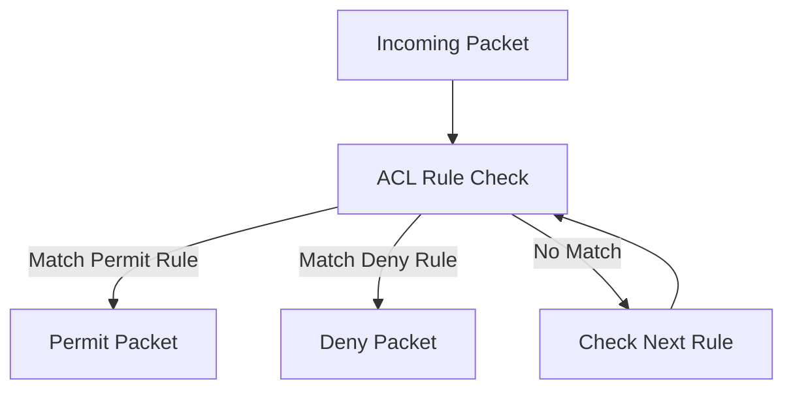

# What is an Access Control List (ACL)?

An Access Control List (ACL) is a set of permission rules that defines which users, systems, or roles are allowed to access a resource and what actions they can perform.

ACLs are used to assign access rights, restrict unauthorized activity, and enforce security policies across operating systems, applications, routers, switches, and firewalls.

Depending on the environment, ACLs can:

- grant or deny user permissions
- define role-based access control
- control access to files and applications
- filter network traffic based on IP addresses, protocols, or ports

## **How ACLs Work in Networking**

ACLs inspect packets and compare them against a list of rules configured on a network device.

A typical ACL evaluation process works like this:

1. A packet arrives at a router, firewall, or switch
2. The device compares the packet headers against ACL rules in sequence
3. Each rule checks parameters such as:
   - Source IP address
   - Destination IP address
   - Protocol
   - Port number
4. The first matching rule is applied
5. The packet is either permitted or denied

Most ACLs follow a top-down evaluation process, meaning rule order is important.

*Figure: ACL workflow showing how incoming packets are evaluated against ordered rules before being permitted or denied.*

## **Types of ACLs**

### Standard ACL

Standard ACLs filter traffic primarily using source IP addresses.

These ACLs are commonly used in Cisco networking environments for basic traffic filtering and access control.

### Extended ACL

Extended ACLs can filter traffic using:
- Source and destination IP addresses
- Protocols
- Port numbers
- Traffic direction

Extended ACLs provide more precise traffic control. Extended ACLs are widely used in Cisco-based networks to enforce detailed traffic and security policies.

### Network ACL

Network ACLs are commonly used in cloud and virtualized environments to control subnet-level traffic.
For example, cloud providers such as AWS use Network ACLs to filter inbound and outbound traffic at the subnet level.

### Stateless ACL

Stateless ACLs evaluate packets individually without tracking connection state. This behavior is commonly seen in many traditional and cloud-based ACL implementations.

## **Why ACLs Matter**

ACLs help network and security teams:

- Restrict unauthorized network access
- Control traffic between systems and network segments
- Protect sensitive systems and services
- Limit administrative or management access
- Reduce unwanted or unauthorized traffic
- Enforce network security policies

## **Common Operational Use Cases**

### Blocking Unauthorized Subnets

Prevent traffic from untrusted or restricted networks.

### Restricting Administrative Access

Allow SSH, RDP, or management traffic only from approved hosts.

### Inter-VLAN Traffic Control

Limit communication between internal network segments.

### ISP Edge Filtering

Filter suspicious or invalid traffic at the network edge.

### Reducing Lateral Movement

Prevent compromised systems from reaching sensitive assets.

## **ACL vs Firewall**

| Feature | ACL | Firewall |
|---|---|---|
| Primary Function | Rule-based traffic filtering | Network security enforcement |
| Filtering Criteria| IP addresses, protocols, ports| Traffic, sessions, applications, threats|
| Stateful Inspection | Usually stateless| Often stateful|
| Application Awareness | Limited | More advanced |
| Common Deployment | Routers, switches, cloud networks | Dedicated security devices and platforms |

## **How Trisul Helps Monitor ACL Activity**

Trisul helps network and security teams analyze traffic patterns affected by ACL policies by monitoring allowed, blocked, and redirected traffic flows across the network.

Flow analysis and packet investigation can help identify unexpected traffic behavior, denied communication attempts, routing anomalies, and segmentation issues related to ACL configurations.

Trisul can also help investigate:
- East-west traffic movement
- Suspicious connection attempts
- Sudden traffic drops after ACL changes
- Unauthorized communication between segments

## **Related Terms**

- [Flow Analysis](/glossary/flow-analysis)
- [Traffic Investigation](/glossary/traffic-investigation)
- [Packet Capture](/glossary/packet-capture)
- [East-West Traffic](/glossary/east-west-traffic)
- [Network Security Monitoring](/glossary/network-security-monitoring)

---

## **FAQ**

### What does an ACL do?

An ACL controls network traffic by permitting or denying packets using rules based on IP addresses, protocols, and port numbers.

### What's the difference between an ACL and a firewall?

ACLs perform basic packet filtering, while firewalls provide deeper inspection, state tracking, logging, and application-level security features.

### Are ACLs stateful or stateless?

Most traditional ACLs are stateless, meaning they evaluate packets individually without tracking active connections.

### Can ACLs block specific applications?

Extended ACLs can block traffic associated with specific ports or protocols, but they typically lack deep application awareness.

### How do ACLs affect network traffic?

ACLs can allow, restrict, redirect, or block traffic flows depending on configured rules and policies.