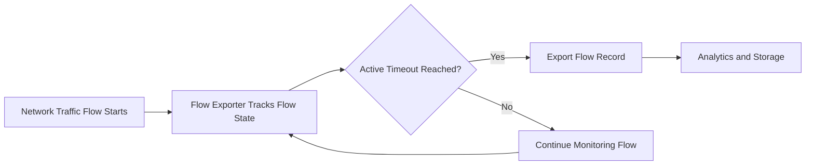

# What is Active Flow Timeout?

An **active flow timeout** is the interval, typically configured on a flow‑exporting device (such as a router, switch, or firewall generating NetFlow, IPFIX, or similar telemetry), after which an *ongoing* flow is exported to a collector even if the flow has not yet ended. 

## **How Active Flow Timeout Works**

- For “active” flows (those that are still exchanging packets), the exporter periodically sends updated flow records at intervals equal to or based on the active flow timeout. 

- This periodic export ensures that collectors and analytics platforms see the current state of long‑running flows (for example, large file transfers, streaming sessions, or persistent tunnels) without waiting for the connection to terminate. 

- The actual export interval may be quantized (e.g., rounded up to the next 60‑second boundary) depending on the vendor implementation.

## Why Active Flow Timeout Matters

- In **NOC operations**, a well‑configured active flow timeout helps operators detect ongoing congestion or bandwidth‑hogging sessions before they saturate links, because flow data is refreshed at regular intervals. 

- In **SOC and traffic‑analytics** workflows, this interval affects how quickly dashboards and detection rules can react to sustained high‑volume traffic that may indicate DDoS, exfiltration, or misbehaving services. 

---

## Active Flow Timeout vs Inactive Flow Timeout

| Active Flow Timeout | Inactive Flow Timeout |
|---|---|
| It governs the refresh cadence of still‑active flows and is usually set longer (e.g., minutes).  | It controls when a flow that has stopped sending packets is exported or aged out and is typically much shorter |

---

## Common Operational Use Cases

- Setting the active flow timeout too low can increase the number of exported flow records and raise collector load, while setting it too high can delay visibility into ongoing high‑volume or malicious traffic.

- In practice, teams balance this parameter against the available collector resources, network scale, and required detection latency for capacity and security monitoring. 

---

## How Trisul Uses Active Flow Timeout Data

- Trisul receives flow telemetry (including NetFlow/IPFIX) from routers, switches, and other sources and uses these records to generate flow‑level dashboards, top‑K traffic views, and baselines. 

- The effective resolution and timeliness of **active flow timeout** i.e.driven flow updates can help Trisul investigate long‑running or sustained traffic patterns, correlate flows with application‑level events, and support traffic‑baselining and anomaly‑detection workflows.

---

## Related Terms

- Flow Timeout
- Flow Analysis
- NetFlow
- IPFIX
- Flow Collector
- Traffic Investigation

---

## FAQ

### **What is the difference between active flow timeout and inactive flow timeout?**    
The **active flow timeout** controls how often an ongoing flow is exported before it ends, while the **inactive flow timeout** controls how long the exporter waits after a flow stops sending packets before exporting or discarding it.

### **Does Trisul control the active flow timeout?**    
No; the active flow timeout is typically configured on the exporting device (router, switch, firewall, or flow sensor), not within Trisul itself. Trisul acts as a flow collector and analytics platform that consumes the resulting flow records.  
 
### **How does active flow timeout affect DDoS detection?**    
A shorter active flow timeout can help Trisul detect sustained high‑rate traffic more quickly, since flow records are refreshed at shorter intervals, improving the timeliness of DDoS and anomaly‑monitoring workflows. 

### **Can Trisul help tune active and inactive flow timeout values?**    
Trisul itself does not adjust exporter‑side timeouts, but its traffic‑analysis and top‑K dashboards can help teams observe how flow‑export intervals and flow‑lifetime patterns affect visibility, enabling empirical tuning of active and inactive flow timeouts on the source devices. 