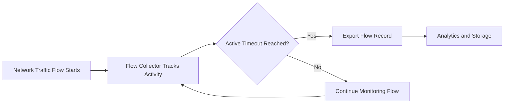

# What is Active Flow Timeout?

Active Flow Timeout is a flow monitoring setting that determines how long an active network flow can remain open before it is exported by a NetFlow, IPFIX, or sFlow exporter.

Instead of waiting for a connection to fully end, the exporter periodically sends flow records for long-running traffic sessions. This improves traffic visibility and enables near real-time network monitoring.

Active Flow Timeout is commonly configured on routers, switches, firewalls, and flow exporters.

## How Active Flow Timeout Works

Flow exporters continuously track network conversations based on attributes such as:

- Source IP address
- Destination IP address
- Protocol
- Source and destination ports

When a flow remains active for longer than the configured timeout value, the exporter sends the current flow statistics to a [Flow Collector](/glossary/flow-collector) or [NetFlow Analyzer](/glossary/netflow-analyzer).

The exporter then:
- resets counters for that exported record
- continues monitoring the same traffic session
- exports updated statistics again after the next timeout interval

For example:

1. A file transfer session remains active for 20 minutes
2. Active Flow Timeout is configured for 60 seconds
3. The exporter sends updated flow records every 60 seconds
4. Monitoring tools receive continuous visibility into the session

*Figure: Active Flow Timeout workflow showing how long-running flows are periodically exported while traffic monitoring continues.*

## Why Active Flow Timeout Matters

Without Active Flow Timeout, long-lived traffic sessions may remain invisible until the connection fully closes.

This can delay:
- traffic visibility
- bandwidth analysis
- anomaly detection
- security monitoring
- operational troubleshooting

Proper timeout settings improve:
- near real-time monitoring
- traffic analytics accuracy
- DDoS visibility
- long-duration flow tracking
- operational responsiveness

Active Flow Timeout is especially important in:
- ISP networks
- data centers
- high-bandwidth environments
- long-lived application sessions
- streaming traffic analysis

## Active Flow Timeout vs Inactive Flow Timeout

| Feature | Active Flow Timeout | Inactive Flow Timeout |
|---|---|---|
| Trigger Condition | Flow remains active too long | Traffic stops for a period |
| Purpose | Periodic export of ongoing traffic | Export completed/inactive flows |
| Used For | Long-running sessions | Idle or completed sessions |
| Visibility Impact | Near real-time visibility | Session completion tracking |

Active and Inactive Flow Timeout settings are usually configured together for balanced flow visibility.

## Common Operational Use Cases

### Real-Time Traffic Monitoring

Improve visibility into ongoing traffic flows instead of waiting for sessions to close.

### DDoS Detection

Export continuous flow updates during high-volume attacks for faster analysis and mitigation.

### ISP Traffic Analytics

Track subscriber and backbone traffic behavior in near real time.

### Long-Lived Session Visibility

Monitor streaming applications, VPN tunnels, and large file transfers.

### Traffic Investigation

Provide continuous updates for [Traffic Investigation](/glossary/traffic-investigation) and [Flow Analysis](/glossary/flow-analysis) workflows.

## How Trisul Handles Active Flow Timeout

Trisul continuously analyzes exported flow records generated through Active Flow Timeout settings to improve traffic visibility and operational awareness.

Combined with features such as:
- Flow Stitchingᵀ
- Long-Term Traffic Retention
- Top-K Analyticsᵀ
- Retro Analysisᵀ

Trisul helps network teams:
- investigate long-running sessions
- monitor bandwidth trends
- detect traffic anomalies
- analyze subscriber behavior
- troubleshoot traffic spikes

Trisul can also correlate periodic flow exports with [Packet Capture](/glossary/packet-capture) workflows for deeper investigation.

## Related Terms

- [Flow Timeout](/glossary/flow-timeout)
- [Flow Analysis](/glossary/flow-analysis)
- [NetFlow](/glossary/netflow)
- [IPFIX](/glossary/ipfix)
- [Flow Collector](/glossary/flow-collector)
- [Traffic Investigation](/glossary/traffic-investigation)

---

## FAQ

### What does Active Flow Timeout do?

Active Flow Timeout forces long-running network flows to be exported periodically instead of waiting for the session to end.

### Why is Active Flow Timeout important?

It improves near real-time traffic visibility and helps monitoring systems analyze ongoing traffic sessions.

### What's a typical Active Flow Timeout value?

Common configurations range from 30 seconds to 5 minutes depending on traffic volume and monitoring requirements.

### What's the difference between Active and Inactive Flow Timeout?

Active Flow Timeout exports ongoing flows periodically, while Inactive Flow Timeout exports flows after traffic becomes idle.

### Can Active Flow Timeout affect performance?

Very low timeout values can increase flow export volume and processing load on collectors and analyzers.