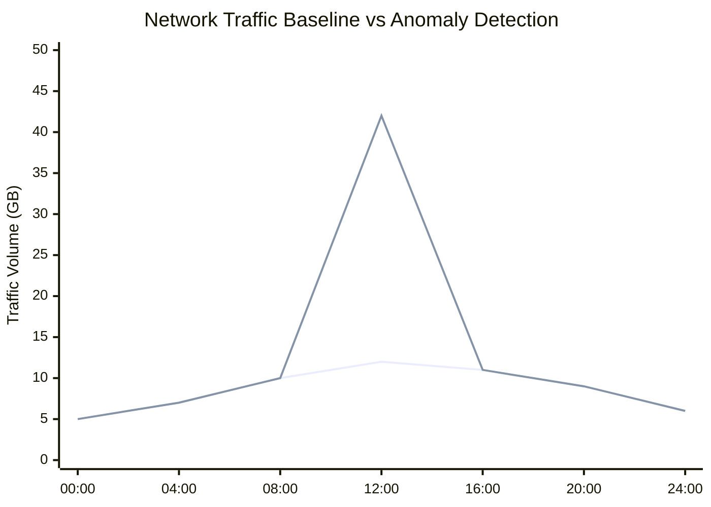

# What is Anomaly Detection?

Anomaly Detection is the process of identifying unusual or unexpected network behavior that deviates from normal traffic patterns.

In network monitoring and security analytics, anomaly detection helps identify traffic spikes, suspicious connections, abnormal bandwidth usage, latency changes, scanning activity, and other behaviors that may indicate security threats or operational issues.

Anomaly detection is widely used in [Network Security Monitoring](/glossary/network-security-monitoring-nsm), [Flow Analysis](/glossary/flow-analysis), and [Traffic Investigation](/glossary/traffic-investigation) workflows.

## How Anomaly Detection Works

Anomaly detection systems analyze network traffic and compare current activity against established baselines or expected behavior patterns.

These systems monitor factors such as:

- Traffic volume
- Connection frequency
- Protocol distribution
- Bandwidth utilization
- Geographic traffic patterns
- Flow behavior
- Packet rates
- Application activity

When traffic deviates significantly from expected behavior, the system generates alerts or flags the activity for investigation.

For example:

1. A server normally transfers 2 GB of traffic per hour
2. Traffic suddenly spikes to 40 GB
3. The monitoring platform detects the deviation
4. The activity is flagged as anomalous

*Figure: Traffic anomaly detection comparing normal baseline behavior against a sudden abnormal traffic spike.*

## Why Anomaly Detection Matters

Traditional rule-based monitoring only detects known conditions or predefined signatures.

Anomaly detection helps identify:
- unknown threats
- zero-day activity
- insider threats
- unusual user behavior
- operational failures
- traffic misconfigurations

It improves visibility into:
- unexpected traffic changes
- network abuse
- lateral movement
- data exfiltration
- DDoS activity
- performance degradation

Anomaly detection is especially important in:
- ISP networks
- enterprise environments
- SOC operations
- cloud infrastructure
- high-volume traffic environments

## Types of Network Anomalies

### Traffic Volume Anomalies

Unexpected spikes or drops in bandwidth usage or packet rates.

### Behavioral Anomalies

Traffic patterns that differ from normal user or device behavior.

### Protocol Anomalies

Unexpected protocol usage or abnormal application behavior.

### Geographic Anomalies

Traffic originating from unusual locations or regions.

### Security Anomalies

Indicators of scanning, malware communication, brute-force attempts, or suspicious outbound traffic.

## Common Operational Use Cases

### DDoS Detection

Identify abnormal traffic floods and sudden traffic surges.

### Insider Threat Detection

Detect unusual internal communication or unauthorized access behavior.

### Data Exfiltration Monitoring

Identify large or suspicious outbound traffic transfers.

### Network Performance Troubleshooting

Detect unexpected latency, congestion, or routing anomalies.

### Baseline Deviation Monitoring

Compare current traffic against historical traffic behavior.

## Anomaly Detection vs Signature-Based Detection

| Feature | Anomaly Detection | Signature-Based Detection |
|---|---|---|
| Detection Method | Behavioral deviation | Known attack signatures |
| Unknown Threat Detection | Strong | Limited |
| False Positives | Higher possibility | Lower |
| Adaptability | Dynamic | Static |
| Traffic Awareness | Baseline-driven | Rule-driven |

Anomaly detection helps identify behaviors that traditional signature-based systems may miss.

## How Trisul Handles Anomaly Detection

Trisul uses flow analytics, behavioral monitoring, and long-term traffic visibility to help network teams identify anomalous activity across enterprise and ISP environments.

Combined with:
- Top-K Analyticsᵀ
- Multigraph Analyticsᵀ
- Retro Analysisᵀ
- Flow Taggerᵀ
- Flow Stitchingᵀ

Trisul helps detect:
- unusual bandwidth spikes
- traffic floods
- suspicious east-west traffic
- subscriber anomalies
- protocol misuse
- abnormal traffic distribution

Trisul can also correlate anomalous flow behavior with [Packet Capture](/glossary/packet-capture) and [PCAP Analysis](/glossary/pcap-analysis) workflows for deeper investigation.

## Related Terms

- [Flow Analysis](/glossary/flow-analysis)
- [Traffic Investigation](/glossary/traffic-investigation)
- [Network Security Monitoring](/glossary/network-security-monitoring-nsm)
- [DDoS Detection](/glossary/ddos-detection)
- [Packet Capture](/glossary/packet-capture)
- [Behavioral Analytics](/glossary/behavioral-analytics)

---

## FAQ

### What is anomaly detection in networking?

Anomaly detection identifies unusual traffic behavior that deviates from normal network activity.

### Why is anomaly detection important?

It helps detect security threats, operational issues, and abnormal traffic patterns that traditional rule-based systems may miss.

### Can anomaly detection identify cyberattacks?

Yes. Anomaly detection is commonly used to identify DDoS attacks, scanning activity, malware communication, and suspicious outbound traffic.

### What's the difference between anomaly detection and signature detection?

Anomaly detection identifies behavioral deviations, while signature detection matches known attack patterns.

### Does anomaly detection generate false positives?

Yes. Behavioral systems can sometimes flag legitimate but unusual traffic activity as suspicious.

### Is anomaly detection used in NetFlow analysis?

Yes. NetFlow and IPFIX data are widely used for anomaly detection and traffic behavior analysis.