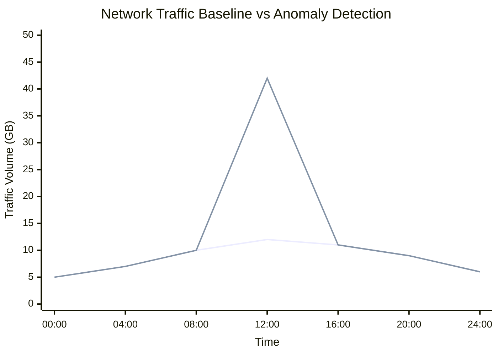

# What is Anomaly Detection?

**Anomaly detection** in networking refers to the process of identifying traffic or behavior patterns that deviate significantly from an established baseline of “normal” network activity.

## **How Anomaly Detection Works**

- Anomaly detection typically compares current traffic metrics (such as volume, rate, protocol composition, or session duration) against historical baselines or rule‑driven thresholds.

- It can be implemented using statistical methods, rule‑based thresholds, or, in some platforms, machine‑learning‑based models that learn “normal” behavior over time.

- In practice, network teams apply anomaly detection to flows, packet traces, or performance metrics to surface issues such as DDoS, exfiltration, scanning, or configuration errors.

For example:

1. A server normally transfers 2 GB of traffic per hour.  
2. Traffic suddenly increases to 40 GB.  
3. The monitoring platform identifies the deviation from the normal baseline.  
4. The traffic activity is flagged as anomalous.

*Figure: Traffic anomaly detection comparing normal baseline behavior against a sudden abnormal traffic spike.*

## Why Anomaly Detection Matters

- In **NOC environments**, anomaly detection helps operators spot unplanned traffic surges, misrouted traffic, or capacity‑stealing workloads before they cause performance degradation.

- In **SOC workflows**, it supports identification of suspicious behavior that may not match known signatures, such as unusual data‑exfiltration patterns, lateral movement, or encrypted‑channel abuse.

- Because it is often *non‑signature‑based*, anomaly detection can help find previously unseen or evolving threats, complementing signature‑based IDS/IPS and SIEM rules.

---

## Common Operational Use Cases

- Setting thresholds too low can generate excessive noise and false positives; setting them too high can miss subtle but impactful anomalies. Tuning is usually iterative and traffic‑pattern‑dependent.

- Large or bursty environments (for example, ISPs, video‑centric networks, or cloud‑edge links) often require separate baselines and thresholds per segment or application.

---

## Anomaly Detection vs Signature-Based Detection

| Feature | Anomaly Detection | Signature-Based Detection |
|---|---|---|
| Detection Method | Behavioral deviation | Known traffic or attack signatures |
| Unknown Threat Detection | More effective | Limited to known patterns |
| False Positives | More likely | Usually lower |
| Adaptability | Dynamic | Static |
| Analysis Method | Baseline-driven | Rule-driven |

Anomaly detection can help identify traffic behavior that signature-based systems may not recognize.

---

## How Trisul Supports Anomaly Analysis

Trisul uses flow analytics, traffic baselining, and long-term traffic retention to help network teams investigate anomalous network behavior across enterprise and ISP environments.

Combined with features such as:

- Top-K Analyticsᵀ  
- Multigraph Analyticsᵀ  
- Retro Analysisᵀ  
- Flow Taggerᵀ  
- Flow Stitch/Packet Stitchingᵀ  

Trisul supports analysis of:

- unusual bandwidth spikes  
- traffic floods  
- abnormal east-west traffic behavior  
- subscriber traffic anomalies  
- protocol distribution changes  
- unexpected traffic patterns  

Trisul can also correlate anomalous flow behavior with Packet Capture and PCAP Analysis workflows for deeper traffic investigation.

---

## Related Terms

- Flow Analysis  
- Traffic Investigation  
- Network Security Monitoring  
- DDoS Detection  
- Packet Capture  
- Behavioral Analytics  

---

## FAQ

### What is anomaly detection in networking?

Anomaly detection identifies network behavior that deviates from expected or normal traffic activity.

### Why is anomaly detection important?

It helps network teams identify unusual traffic behavior, operational issues, and abnormal communication patterns that may require investigation.

### Can anomaly detection identify cyberattacks?

Anomaly detection can help identify unusual traffic behavior associated with DDoS activity, scanning behavior, malware communication, or suspicious outbound traffic.

### What's the difference between anomaly detection and signature detection?

Anomaly detection identifies deviations from expected behavior, while signature-based detection matches known traffic or attack patterns.

### Does anomaly detection generate false positives?

Yes. Legitimate but unusual traffic activity can sometimes be identified as anomalous behavior.

### Is anomaly detection used in NetFlow analysis?

Yes. NetFlow and IPFIX data are commonly used for anomaly detection and traffic behavior analysis.