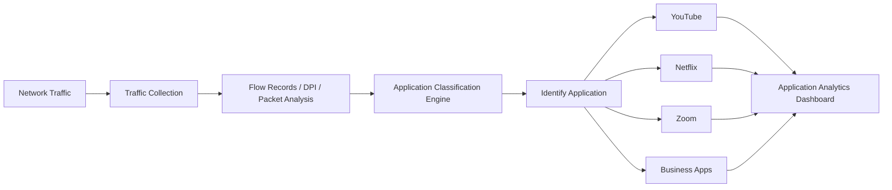

# What is Application Visibility?

Application Visibility is the ability to identify, monitor, and analyze application traffic flowing across a network.

It helps network and security teams understand which applications are consuming bandwidth, how applications behave, and how users interact with network services.

Application visibility is commonly used in [Flow Analysis](/glossary/flow-analysis), [Traffic Investigation](/glossary/traffic-investigation), and [Network Security Monitoring](/glossary/network-security-monitoring-nsm) environments.

## **How Application Visibility Works**

Application visibility platforms analyze traffic metadata, protocols, ports, packet behavior, and application signatures to identify traffic generated by specific applications.

Depending on the monitoring method, visibility can come from:

- NetFlow or IPFIX records
- Deep Packet Inspection (DPI)
- Layer 7 analysis
- Packet Capture
- Protocol decoding
- Behavioral analytics

For example:

1. A monitoring platform receives flow records from a router
2. The analyzer identifies traffic patterns associated with video streaming
3. The application is classified as YouTube, Netflix, or another service
4. Traffic statistics are grouped by application

*Figure: Application visibility workflow showing how network traffic is analyzed and classified into identifiable applications for monitoring and analytics.*

## **Why Application Visibility Matters**

Traditional network monitoring only shows IP addresses, ports, and bandwidth usage.

Application visibility adds operational context by showing:
- which applications generate traffic
- which users consume bandwidth
- which services affect performance
- which applications create security risks

This improves:
- bandwidth management
- troubleshooting
- traffic prioritization
- security monitoring
- user experience analysis

Application visibility is especially important in:
- enterprise networks
- ISP environments
- hybrid cloud deployments
- remote work environments
- SaaS-heavy infrastructures

## **Types of Application Visibility**

### Layer 7 Visibility

Identifies traffic based on application-layer protocols and behavior.

### Flow-Based Visibility

Uses [NetFlow](/glossary/netflow), [IPFIX](/glossary/ipfix), or [sFlow](/glossary/sflow) metadata to classify applications.

### DPI-Based Visibility

Uses packet inspection to identify applications with greater accuracy.

### Behavioral Visibility

Detects applications based on traffic patterns and communication behavior.

## **Common Operational Use Cases**

### Bandwidth Monitoring

Identify bandwidth-heavy applications and top consumers.

### SaaS Monitoring

Monitor cloud application usage across enterprise networks.

### Security Monitoring

Detect unauthorized or suspicious applications communicating on the network.

### QoS Optimization

Prioritize critical business applications over non-essential traffic.

### ISP Traffic Analytics

Analyze subscriber application usage and traffic distribution patterns.

## **Application Visibility vs Network Visibility**

| Feature | Application Visibility | Network Visibility |
|---|---|---|
| Focus | Application behavior | Overall network traffic |
| Visibility Level | Layer 7 / application-aware | Infrastructure and traffic flows |
| Primary Goal | Understand application usage | Monitor network activity |
| Traffic Context | Application-specific | Traffic-wide |
| Common Data Sources | DPI, Flow Analysis, PCAP | SNMP, NetFlow, packet data |

Application visibility is a subset of broader network visibility focused specifically on application behavior and usage patterns.

## **How Trisul Handles Application Visibility**

Trisul provides application-aware traffic visibility using flow analytics, protocol analysis, and packet investigation workflows.

Combined with:
- Flow Taggerᵀ
- Top-K Analyticsᵀ
- Multigraph Analyticsᵀ
- Retro Analysisᵀ
- Full Packet Capture

Trisul helps teams:
- identify bandwidth-heavy applications
- analyze Layer 7 traffic behavior
- investigate suspicious application activity
- monitor SaaS usage
- troubleshoot application performance issues

Trisul can also correlate [Packet Capture](/glossary/packet-capture) data with [Flow Analysis](/glossary/flow-analysis) workflows for deeper application-level visibility.

## **Related Terms**

- [Layer 7 Visibility](/glossary/layer-7-visibility)
- [Flow Analysis](/glossary/flow-analysis)
- [Packet Capture](/glossary/packet-capture)
- [Deep Packet Inspection](/glossary/deep-packet-inspection-dpi)
- [Traffic Investigation](/glossary/traffic-investigation)
- [NetFlow](/glossary/netflow)

---

## **FAQ**

### What is application visibility in networking?

Application visibility is the ability to identify and monitor application traffic across a network.

### Why is application visibility important?

It helps organizations understand application usage, troubleshoot performance issues, manage bandwidth, and detect suspicious activity.

### How is application visibility achieved?

Application visibility is commonly achieved using NetFlow, IPFIX, DPI, packet analysis, and Layer 7 traffic inspection.

### What's the difference between application visibility and network visibility?

Application visibility focuses on application behavior, while network visibility covers overall traffic, devices, and infrastructure activity.

### Can NetFlow provide application visibility?

Yes. Modern NetFlow and IPFIX implementations can export application-aware traffic metadata.

### Is application visibility useful for security monitoring?

Yes. It helps identify unauthorized applications, suspicious communication patterns, and abnormal application behavior.