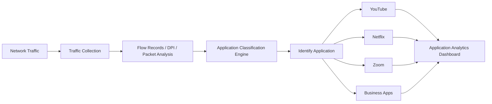

# What is Application Visibility?

**Application visibility** is the ability to identify, monitor, and analyze application‑level traffic flowing across a network.  

It helps network and security teams understand which applications are consuming bandwidth, how those applications behave, and how users interact with network services.  

Application visibility is commonly used in **[Flow Analysis](/glossary/flow-analysis)**, **[Traffic Investigation](/glossary/traffic-investigation)**, and **[Network Security Monitoring](/glossary/network-security-monitoring-nsm)** environments.

## **How Application Visibility Works**

Application visibility platforms analyze traffic metadata, ports, protocols, packet behavior, and application‑level signatures to classify traffic by application or service class.  

Depending on the monitoring method, visibility can come from:

- NetFlow or IPFIX records  
- Deep Packet Inspection (DPI)  
- Layer 7 analysis  
- Packet Capture  
- Protocol decoding  
- Behavioral analytics  

For example:

1. A monitoring platform receives flow records from a router.  
2. The analyzer identifies traffic patterns associated with video streaming.  
3. The application is classified as YouTube, Netflix, or a similar service.  
4. Traffic statistics are grouped by application.  

*Figure: Application visibility workflow showing how network traffic is analyzed and classified into identifiable applications for monitoring and analytics.*

## **Why Application Visibility Matters**

Traditional network monitoring typically shows IP addresses, ports, and bandwidth usage.  

Application visibility adds operational context by showing:
- which applications generate traffic  
- which users or segments consume bandwidth  
- which services affect performance  
- which applications introduce security or policy‑compliance risks  

This improves:
- bandwidth management  
- troubleshooting  
- traffic prioritization  
- security monitoring  
- user experience analysis  

Application visibility is especially important in:
- enterprise networks  
- ISP environments  
- hybrid cloud deployments  
- remote and branch‑office environments  
- SaaS‑heavy infrastructures  

## **Types of Application Visibility**

### Layer 7 Visibility

Identifies traffic based on application‑layer protocols, session behavior, and content‑level characteristics.  

### Flow-Based Visibility

Uses **[NetFlow](/glossary/netflow)**, **[IPFIX](/glossary/ipfix)**, or **[sFlow](/glossary/sflow)** metadata (for example, ports, protocol, and application‑specific fields) to classify traffic into application categories.  

### DPI-Based Visibility

Uses packet‑level inspection and protocol decoding to classify applications with higher accuracy, including encrypted or port‑agnostic services when inspection is supported.  

### Behavioral Visibility

Detects and classifies applications based on communication patterns such as connection‑rate, session duration, and traffic‑volume behavior, even when protocol signatures are ambiguous.  

## **Common Operational Use Cases**

### Bandwidth Monitoring

Identify bandwidth‑heavy applications and top‑consuming hosts or segments.  

### SaaS Monitoring

Monitor cloud application usage across enterprise or ISP networks to understand capacity and policy‑compliance needs.  

### Security Monitoring

Detect unauthorized or suspicious applications communicating on the network, such as consumer‑grade file‑sharing tools or shadow‑IT services.  

### QoS Optimization

Prioritize critical business applications over non‑essential traffic by classifying traffic at the application level.  

### ISP Traffic Analytics

Analyze subscriber application usage and traffic distribution patterns to support capacity planning, peering, and service‑tier reporting.  

## **Application Visibility vs Network Visibility**

| Feature | Application Visibility | Network Visibility |
|---|---|---|
| Focus | Application behavior and usage | Overall network traffic and infrastructure |
| Visibility Level | Layer 7 / application‑aware | Layer 3–4 flows, devices, and interfaces |
| Primary Goal | Understand application‑level usage and risk | Monitor end‑to‑end traffic and health |
| Traffic Context | Application‑specific and user‑driven | Network‑wide and device‑oriented |
| Common Data Sources | DPI, flow analysis, PCAP, Layer 7 analysis | SNMP, NetFlow, IPFIX, packet data, logs |

Application visibility is a specialized subset of broader network visibility, focused specifically on application behavior and usage patterns rather than general infrastructure telemetry.

## **How Trisul Handles Application Visibility**

Trisul provides application‑aware traffic visibility by combining flow analytics, protocol‑level analysis, and packet‑level investigation workflows.  

Combined with:
- Flow Taggerᵀ  
- Top-K Analyticsᵀ  
- Multigraph Analyticsᵀ  
- Retro Analysisᵀ  
- Full Packet Capture  

Trisul helps teams:
- identify bandwidth‑heavy applications and their top generators  
- analyze Layer 7 traffic behavior at the flow and time‑series level  
- investigate suspicious or anomalous application‑level activity  
- monitor SaaS and cloud‑application usage across segments  
- troubleshoot application performance issues by correlating flows with packet captures  

Trisul can also correlate **[Packet Capture](/glossary/packet-capture)** data with **[Flow Analysis](/glossary/flow-analysis)** workflows for deeper application‑level visibility and retro‑analysis.

## **Related Terms**

- [Layer 7 Visibility](/glossary/layer-7-visibility)  
- [Flow Analysis](/glossary/flow-analysis)  
- [Packet Capture](/glossary/packet-capture)  
- [Deep Packet Inspection](/glossary/deep-packet-inspection-dpi)  
- [Traffic Investigation](/glossary/traffic-investigation)  
- [NetFlow](/glossary/netflow)  

---

## **FAQ**

### What is application visibility in networking?

Application visibility is the ability to identify and monitor application‑level traffic across a network, including which services and users are generating traffic.  

### Why is application visibility important?

It helps organizations understand application usage, troubleshoot performance issues, manage bandwidth, prioritize traffic, and detect suspicious or non‑compliant application behavior.  

### How is application visibility achieved?

Application visibility is commonly achieved using NetFlow, IPFIX, DPI, packet analysis, and Layer 7 traffic inspection, often combined with behavioral analytics and classification engines.  

### What's the difference between application visibility and network visibility?

Application visibility focuses on application‑level behavior and usage, while network visibility covers overall traffic flows, devices, and infrastructure‑level metrics.  

### Can NetFlow provide application visibility?

Yes. Modern NetFlow and IPFIX implementations can export application‑aware metadata (for example, application IDs, protocol‑specific fields, or port‑based application hints), which can be used to classify and track application‑level traffic.  

### Is application visibility useful for security monitoring?

Yes. It helps identify unauthorized applications, suspicious communication patterns, unexpected protocol usage, and abnormal application‑level behavior that may indicate policy violations or security incidents.  