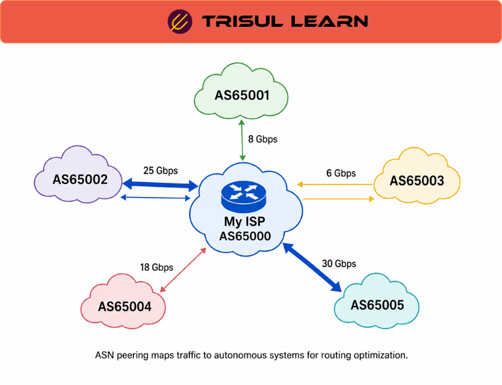

export const jsonLd = {
  "@context": "https://schema.org",
  "@type": "FAQPage",
  "mainEntity": [
    {
      "@type": "Question",
      "name": "What are the requirements for ASN peering?",
      "acceptedAnswer": {
        "@type": "Answer",
        "text": "Peering requirements include: a publicly routable ASN, dual-stack IPv4 and IPv6 support, at least one publicly routable /24 prefix, registration in a public Internet Routing Registry (IRR), a complete current peeringdbl.com profile, and 24x7x365 operational contact with escalation matrix. Interconnection must have sufficient capacity to exchange traffic without congestion."
      }
    },
    {
      "@type": "Question",
      "name": "What is the difference between settlement-free and paid peering?",
      "acceptedAnswer": {
        "@type": "Answer",
        "text": "Settlement-free peering exchanges traffic between ASes without payment, typically when traffic ratios are roughly balanced. Paid peering involves one party paying the other, typically when traffic is asymmetric. Peering is generally settlement-free when both parties benefit from direct traffic exchange."
      }
    },
    {
      "@type": "Question",
      "name": "What is public vs private peering?",
      "acceptedAnswer": {
        "@type": "Answer",
        "text": "Public peering occurs at Internet Exchange Points (IXPs) where multiple networks connect to a shared switch and exchange routes via route servers. Private peering is a direct connection between two networks, typically at a colocation facility. Private peering offers more control but requires dedicated infrastructure."
      }
    },
    {
      "@type": "Question",
      "name": "How does ASN peering improve performance?",
      "acceptedAnswer": {
        "@type": "Answer",
        "text": "ASN peering improves performance by reducing the number of hops traffic must traverse, eliminating intermediary transit providers. Direct BGP peering reduces latency, improves throughput, and avoids congestion on transit links. Traffic stays on the direct path between the two ASes."
      }
    }
  ]
};

# What is ASN peering?

ASN peering establishes BGP peering relationships between two Autonomous Systems to exchange routing information and traffic directly. It reduces transit costs, lowers latency, and improves performance by avoiding intermediary transit providers. ASNs must be publicly routable and registered in a public Internet Routing Registry.

---

## How it works

Peering requires a publicly routable ASN, dual-stack IPv4 and IPv6 support, and at least one /24 prefix. ASes exchange routes via eBGP, with each announcing its prefixes to the peer. Traffic flows directly between the two networks based on the advertised routes.

---

## In network operations

- **NOC:** Monitor BGP peering session status and route count to detect peering failures.
- **ISP:** Use settlement-free peering to reduce transit costs when traffic ratios are balanced.
- **Traffic Engineering:** Optimize exit selection by analyzing traffic flows to specific peer ASes.

---

## Peering types

| Type | Description | Best for |
|---|---|---|
| Settlement-free | No payment, balanced traffic | Equal-sized networks |
| Paid peering | One party pays the other | Asymmetric traffic |
| Public peering | At Internet Exchange (IX) | Multiple peers |
| Private peering | Direct connection | Two specific peers |

---

## How Trisul handles it

Trisul provides ASN peering analytics by enriching flow records with source and destination ASN from BGP data. Peering dashboards show traffic per peer AS, per prefix, and per peering interface. BGP peering EEG analytics enables real-time monitoring of active route topology. Full documentation is at https://www.trisul.org/solutions/peering-analytics/.

---

## Related terms

- [What is BGP?](/docs/glossary/bgp)
- [What is ASN?](/docs/glossary/asn)
- [What is BGP peering analytics?](/docs/glossary/bgp-peering-analytics)

---

## Frequently asked questions

### What are the requirements for ASN peering?

Peering requirements include: a publicly routable ASN, dual-stack IPv4 and IPv6 support, at least one publicly routable /24 prefix, registration in a public Internet Routing Registry (IRR), a complete current peeringdb.com profile, and 24x7x365 operational contact with escalation matrix. Interconnection must have sufficient capacity to exchange traffic without congestion.

### What is the difference between settlement-free and paid peering?

Settlement-free peering exchanges traffic between ASes without payment, typically when traffic ratios are roughly balanced. Paid peering involves one party paying the other, typically when traffic is asymmetric. Peering is generally settlement-free when both parties benefit from direct traffic exchange.

### What is public vs private peering?

Public peering occurs at Internet Exchange Points (IXPs) where multiple networks connect to a shared switch and exchange routes via route servers. Private peering is a direct connection between two networks, typically at a colocation facility. Private peering offers more control but requires dedicated infrastructure.

### How does ASN peering improve performance?

ASN peering improves performance by reducing the number of hops traffic must traverse, eliminating intermediary transit providers. Direct BGP peering reduces latency, improves throughput, and avoids congestion on transit links. Traffic stays on the direct path between the two ASes.