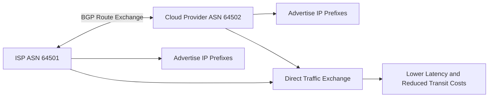

# What is ASN Peering?

ASN Peering is the process where two Autonomous Systems (ASNs) establish a direct routing relationship to exchange internet traffic using Border Gateway Protocol (BGP).

Peering allows networks such as ISPs, cloud providers, enterprises, and content delivery networks to exchange traffic efficiently without relying entirely on upstream transit providers.

ASN peering is a foundational part of internet routing and traffic engineering.

## How ASN Peering Works

Each network participating in internet routing operates as an Autonomous System identified by an [ASN](/glossary/asn).

When two ASNs peer:

1. They establish a BGP session
2. They exchange route advertisements
3. Each network learns reachable IP prefixes
4. Traffic is exchanged directly between networks

Peering can happen:
- at internet exchange points (IXPs)
- through private interconnects
- within data centers
- across cloud connectivity environments

For example:

- ISP A peers with Cloud Provider B
- Traffic between their users flows directly
- Latency and transit costs are reduced

*Figure: ASN peering workflow showing two autonomous systems exchanging BGP routes and directly forwarding traffic between networks.*

## Why ASN Peering Matters

ASN peering improves:
- routing efficiency
- traffic performance
- bandwidth utilization
- redundancy
- internet scalability

It also helps reduce:
- transit provider dependency
- routing latency
- congestion
- operational costs

Peering visibility is especially important in:
- ISP operations
- large enterprise networks
- CDN environments
- cloud networking
- internet exchange infrastructure

## Types of ASN Peering

### Public Peering

Multiple ASNs exchange traffic through a shared internet exchange point (IXP).

### Private Peering

Two networks establish a dedicated direct interconnection.

### Transit Relationships

One ASN pays another provider for internet connectivity instead of directly peering.

### Settlement-Free Peering

Two networks exchange traffic without financial settlement when traffic exchange is mutually beneficial.

## Common Operational Use Cases

### ISP Traffic Optimization

Improve traffic routing efficiency between providers.

### BGP Route Visibility

Monitor routing paths and ASN relationships.

### Traffic Engineering

Optimize latency, throughput, and path selection.

### DDoS Mitigation

Analyze attack traffic sources and upstream ASN paths.

### CDN Connectivity

Improve content delivery performance through direct peering relationships.

## ASN Peering vs Transit

| Feature | ASN Peering | Transit |
|---|---|---|
| Traffic Exchange | Direct between ASNs | Through upstream provider |
| Cost Model | Often lower cost | Paid connectivity |
| Routing Efficiency | Higher | Depends on provider path |
| Latency | Lower | Potentially higher |
| Dependency | Reduced upstream reliance | Higher upstream reliance |

Peering improves direct connectivity, while transit provides broader internet reachability.

## How Trisul Handles ASN Peering Visibility

Trisul provides ASN-aware traffic analytics and BGP visibility for monitoring peering relationships and internet traffic behavior.

Combined with:
- BGP Peering Analytics
- GeoIP Enrichment
- Top-K Analyticsᵀ
- Multigraph Analyticsᵀ
- Traffic Investigation

Trisul helps teams:
- analyze peering traffic distribution
- identify top ASN conversations
- monitor upstream and downstream traffic
- detect routing anomalies
- investigate peering congestion
- visualize ASN communication patterns

Trisul can also correlate [NetFlow](/glossary/netflow), [IPFIX](/glossary/ipfix), and [Packet Capture](/glossary/packet-capture) data with ASN metadata for deeper routing analysis.

## Related Terms

- [ASN](/glossary/asn)
- [BGP](/glossary/bgp)
- [BGP Peering Analytics](/glossary/bgp-peering-analytics)
- [Peering Traffic Analysis](/glossary/peering-traffic-analysis)
- [NetFlow](/glossary/netflow)
- [Traffic Investigation](/glossary/traffic-investigation)

---

## FAQ

### What is ASN peering?

ASN peering is a direct routing relationship between two autonomous systems that exchange traffic using BGP.

### Why is ASN peering important?

Peering improves routing efficiency, reduces latency, lowers transit costs, and improves internet traffic performance.

### What's the difference between peering and transit?

Peering exchanges traffic directly between ASNs, while transit provides internet connectivity through an upstream provider.

### Where does ASN peering happen?

Peering commonly occurs at internet exchange points (IXPs), private interconnects, and data center environments.

### How does BGP relate to ASN peering?

BGP is the routing protocol used to exchange route information between peering ASNs.

### Why do ISPs monitor ASN peering traffic?

ISPs monitor peering traffic to optimize routing, manage congestion, troubleshoot performance issues, and analyze traffic flows.