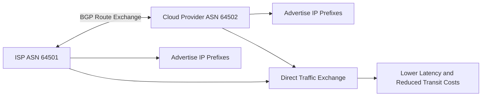

# What is ASN Peering?

**ASN peering** is the process by which two Autonomous Systems (ASNs) establish a direct routing relationship to exchange internet traffic using the Border Gateway Protocol (BGP).  

Peering allows networks such as ISPs, cloud providers, enterprises, and content delivery networks to exchange traffic efficiently without relying entirely on upstream transit providers.  

ASN peering is a foundational element of internet‑scale routing and traffic engineering.

## **How ASN Peering Works**

Each network participating in global internet routing operates as an Autonomous System identified by a unique **[ASN](/glossary/asn)**.  

When two ASNs peer:

1. They establish a BGP session between their edge routers.  
2. They exchange route advertisements (announcements of IP prefixes they are willing to carry).  
3. Each network learns which IP prefixes are reachable via the other AS.  
4. Traffic between those prefixes is forwarded directly between the peering ASNs, rather than traversing an upstream provider.  

Peering can happen:
- at internet exchange points (IXPs)  
- through private interconnects or point‑to‑point links  
- within data centers  
- across cloud‑connectivity connections  

For example:

- ISP A peers with Cloud Provider B.  
- Traffic between ISP‑A users and Cloud‑B services flows directly over the peering link.  
- Latency and transit costs are reduced compared to sending traffic through a third‑party transit provider.  

*Figure: ASN peering workflow showing two autonomous systems exchanging BGP routes and directly forwarding traffic between networks.*

## **Why ASN Peering Matters**

ASN peering improves:
- routing efficiency  
- traffic performance  
- bandwidth utilization  
- redundancy  
- internet scalability  

It also helps reduce:
- dependence on upstream transit providers  
- routing latency  
- cross‑network congestion  
- operational and transit costs  

Peering visibility is especially important in:
- ISP operations  
- large enterprise networks  
- CDN environments  
- cloud networking  
- internet exchange infrastructure  

## **Types of ASN Peering**

### Public Peering

Multiple ASNs exchange traffic through a shared internet exchange point (IXP), typically using a common switching fabric.  

### Private Peering

Two networks establish a dedicated, private interconnection (often a direct link or cross‑connect) to avoid the shared IXP fabric.  

### Transit Relationships

One ASN purchases connectivity from an upstream provider to reach the broader internet, rather than relying solely on bilateral peering.  

### Settlement‑Free Peering

Two networks exchange traffic without financial settlement when traffic is roughly balanced and mutually beneficial.  

## **Common Operational Use Cases**

### ISP Traffic Optimization

Improve traffic routing efficiency between providers and reduce reliance on costly transit paths.  

### BGP Route Visibility

Monitor routing paths, ASN sequences, and peering relationships to understand how traffic traverses between networks.  

### Traffic Engineering

Optimize latency, throughput, and path selection by adjusting local‑pref, communities, and route‑advertisement policies.  

### DDoS Mitigation

Analyze attack‑traffic sources and upstream ASN paths to identify peering or transit links carrying volumetric attacks.  

### CDN Connectivity

Improve content‑delivery performance and resilience by establishing direct peering relationships with CDNs and major content providers.  

## **ASN Peering vs Transit**

| Feature | ASN Peering | Transit |
|---|---|---|
| Traffic Exchange | Direct between ASNs | Through an upstream provider |
| Cost Model | Often lower or settlement‑free | Paid connectivity |
| Routing Efficiency | Higher, closer paths | Depends on provider path |
| Latency | Lower, fewer hops | Potentially higher |
| Dependency | Reduced reliance on upstream | Stronger upstream reliance |

Peering improves direct connectivity and locality, while transit provides broader internet reachability and simple “one‑to‑many” connectivity.

## **How Trisul Handles ASN Peering Visibility**

Trisul provides ASN‑aware traffic analytics and BGP‑related visibility for monitoring peering relationships and internet traffic behavior.  

Using features such as:
- BGP Peering Analytics  
- GeoIP and ASN‑based enrichment  
- Top-K Analyticsᵀ  
- Multigraph Analyticsᵀ  
- Traffic Investigation  

Trisul helps teams:
- analyze peering‑path traffic distribution between ASNs  
- identify top ASN conversations and peering‑pair volumes  
- monitor upstream and downstream peering traffic at the ASN level  
- detect routing or path anomalies that may indicate changes in peering behavior  
- investigate peering‑segment congestion or utilization spikes  
- visualize ASN‑to‑ASN communication patterns over time  

Trisul can also correlate **[NetFlow](/glossary/netflow)**, **[IPFIX](/glossary/ipfix)**, and **[Packet Capture](/glossary/packet-capture)** data with ASN metadata for deeper routing‑path and traffic‑analysis workflows.

## **Related Terms**

- [ASN](/glossary/asn)  
- [BGP](/glossary/bgp)  
- [BGP Peering Analytics](/glossary/bgp-peering-analytics)  
- [Peering Traffic Analysis](/glossary/peering-traffic-analysis)  
- [NetFlow](/glossary/netflow)  
- [Traffic Investigation](/glossary/traffic-investigation)  

---

## **FAQ**

### What is ASN peering?

ASN peering is a direct routing relationship between two autonomous systems that exchange traffic using BGP, without relying on a third‑party upstream provider for that traffic.  

### Why is ASN peering important?

ASN peering improves routing efficiency, reduces latency, lowers transit costs, and improves overall internet traffic performance by enabling direct paths between networks.  

### What's the difference between peering and transit?

Peering exchanges traffic directly between ASNs over a bilateral relationship, while transit provides internet connectivity through an upstream provider that reaches multiple networks on behalf of the customer.  

### Where does ASN peering happen?

ASN peering commonly occurs at internet exchange points (IXPs), over private interconnects, within data centers, and across cloud‑connectivity links.  

### How does BGP relate to ASN peering?

BGP is the routing protocol used to exchange routing information (prefixes and paths) between peering ASNs, enabling them to establish and maintain direct traffic paths.  

### Why do ISPs monitor ASN peering traffic?

ISPs monitor ASN peering traffic to optimize routing policies, manage congestion, troubleshoot performance issues, validate peering agreements, and analyze traffic flows between partners and upstream providers.  