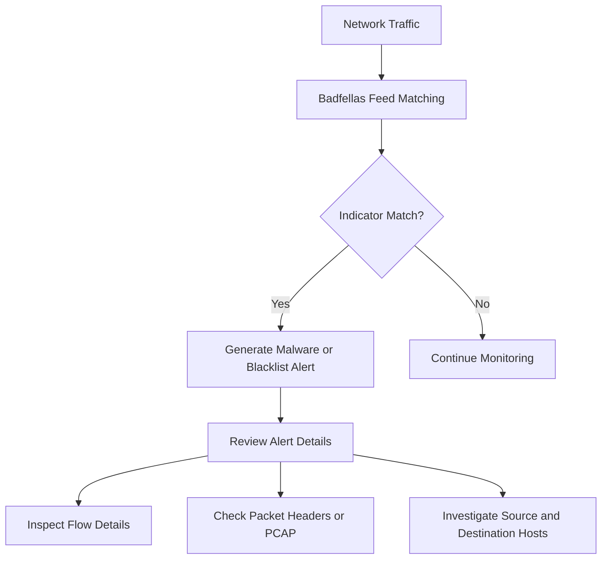

# What is Badfellasᵀ?

Badfellasᵀ is a Trisul plugin for threat monitoring that checks network traffic against threat intelligence indicators to identify potentially malicious activity.
It can match observed traffic against indicators such as IP addresses, domains, HTTP hosts, URLs, SSL Server Name Indication (SNI), and SSL certificate fingerprints.

For NOC and SOC teams, Badfellasᵀ helps surface suspicious communications that warrant investigation, especially when traffic interacts with known malicious infrastructure or blacklisted destinations.
## **How Badfellasᵀ Works**

Badfellasᵀ analyzes network traffic for matches against continuously updated threat intelligence feeds distributed from the Trisul Hub to probe nodes.

Detection can involve:
- blacklisted IP address matches.
- malicious domain lookups, including DNS-based matches.
- HTTP host and URL matches.
- SSL SNI and certificate fingerprint matches.
- custom indicator feeds added by the operator.

For example:

1. A host connects to an IP address or domain present in a Badfellasᵀ feed.
2. Trisul generates malware or blacklist-related alerts tied to the observed traffic.
3. Analysts review alert details, associated flows, packet headers, and PCAP when available.
4. The activity is investigated to determine whether the host is compromised, scanning, or communicating with malicious infrastructure.

*Figure: Badfellasᵀ workflow showing indicator-based traffic matching, alert generation, and investigation steps.*

## **Why Badfellasᵀ Matters**

Modern networks generate more traffic than teams can inspect manually, so indicator-driven monitoring helps prioritize activity that is more likely to be malicious.

Badfellasᵀ helps teams:
- identify communications with known malicious IPs, domains, and URLs.
- reduce investigation time by linking alerts to flows and packet evidence.
- improve visibility into malware retrieval, phishing access, and suspicious DNS activity.
- support enterprise and ISP monitoring workflows with continuously refreshed feeds.

It improves visibility into:
- malware-related communications.
- phishing destinations.
- suspicious DNS queries.
- blacklisted SSL certificates and hosts.
- known bad external infrastructure.

Badfellasᵀ is especially useful in:
- SOC operations.
- enterprise security monitoring.
- ISP traffic analytics where reputation-based visibility matters.
- incident investigation workflows that require alert-to-flow drilldown.

## **Common Operational Use Cases**

### Malware Detection

Identify hosts communicating with known malicious IPs, URLs, or domains referenced by Badfellasᵀ feeds.

### Traffic Investigation

Use alert drilldowns to review flow details, packet headers, and downloadable PCAP associated with suspicious traffic.[page:3]

### Phishing and Malicious URL Monitoring

Detect user or host access to phishing sites and malware delivery URLs.

### Suspicious DNS Activity

Flag DNS lookups for known malicious domains, including cases where the domain appears in requests even before a successful response is returned.

### Custom Threat Feed Integration

Add organization-specific IOC feeds in TSV format and distribute them through the Trisul feed framework to probes for monitoring.

## **Badfellasᵀ vs Traditional Alerting**

| Feature | Badfellasᵀ | Traditional Alerts |
|---|---|---|
| Detection Method | Threat intelligence indicator matching across observed traffic. | Often based on static signatures, thresholds, or event rules. |
| Traffic Context | Can be investigated through alerts, flows, packet headers, and PCAP when available. | May provide less packet and flow context depending on the tool. |
| Suspicious Host Identification | Highlights hosts communicating with known malicious infrastructure.| Often requires separate correlation. |
| Feed Updates | Uses centrally managed and refreshable feeds from the Hub.| Varies by platform. |
| Investigation Visibility | Supports drilldown into related traffic artifacts.| Varies by platform. |

Badfellasᵀ is best understood as an indicator-driven threat monitoring capability rather than a generic behavioral analytics engine.

## **How Trisul Uses Badfellasᵀ**

In Trisul, Badfellasᵀ is packaged as the `trisul-badfellas` plugin and adds threat monitoring based on blacklist and threat intelligence feeds.

Combined with:
- flow analysis and flow drilldowns.
- packet capture review, when PCAP is available.
- Retro Analysis for re-examining relevant time windows after suspicious activity is identified.
- custom feed ingestion for internal or third-party indicators.

Trisul can help teams:
- identify hosts communicating with known malicious infrastructure.
- investigate suspicious traffic using alert details, flows, and packets.
- monitor blacklist hits across probes and time ranges.
- extend detection coverage with custom IOC feeds.

Trisul can also support related workflows involving [Packet Capture](/glossary/packet-capture), [Traffic Investigation](/glossary/traffic-investigation), and [Flow Analysis](/glossary/flow-analysis) for deeper investigation of Badfellasᵀ alerts.

## **Related Terms**

- [Anomaly Detection](/glossary/anomaly-detection)
- [Traffic Investigation](/glossary/traffic-investigation)
- [Network Security Monitoring](/glossary/network-security-monitoring-nsm)
- [Packet Capture](/glossary/packet-capture)
- [Flow Analysis](/glossary/flow-analysis)
- [East-West Traffic](/glossary/east-west-traffic)

---

## **FAQ**

### What is Badfellasᵀ in Trisul?

Badfellasᵀ is a Trisul threat monitoring plugin that checks traffic against threat intelligence and blacklist indicators.

### What types of threats can Badfellasᵀ detect?

It can help identify communications involving malicious IPs, domains, phishing destinations, malware URLs, suspicious DNS lookups, and blacklisted SSL-related indicators.

### How does Badfellasᵀ identify suspicious hosts?

It identifies hosts by matching observed traffic artifacts such as IPs, domains, URLs, HTTP hosts, SNI, and certificate fingerprints against Badfellasᵀ feeds.

### Is Badfellasᵀ signature-based?

It is primarily indicator and blacklist driven based on threat intelligence feed matching, not a pure behavioral analytics system.

### Can Badfellasᵀ help with incident response?

Yes. Analysts can review alert details, associated flows, packet headers, and PCAP where available to support investigation and scoping.

### Does Badfellasᵀ work with flow analytics?

Yes. Badfellasᵀ alerts can be investigated alongside flow details and related traffic records in Trisul.