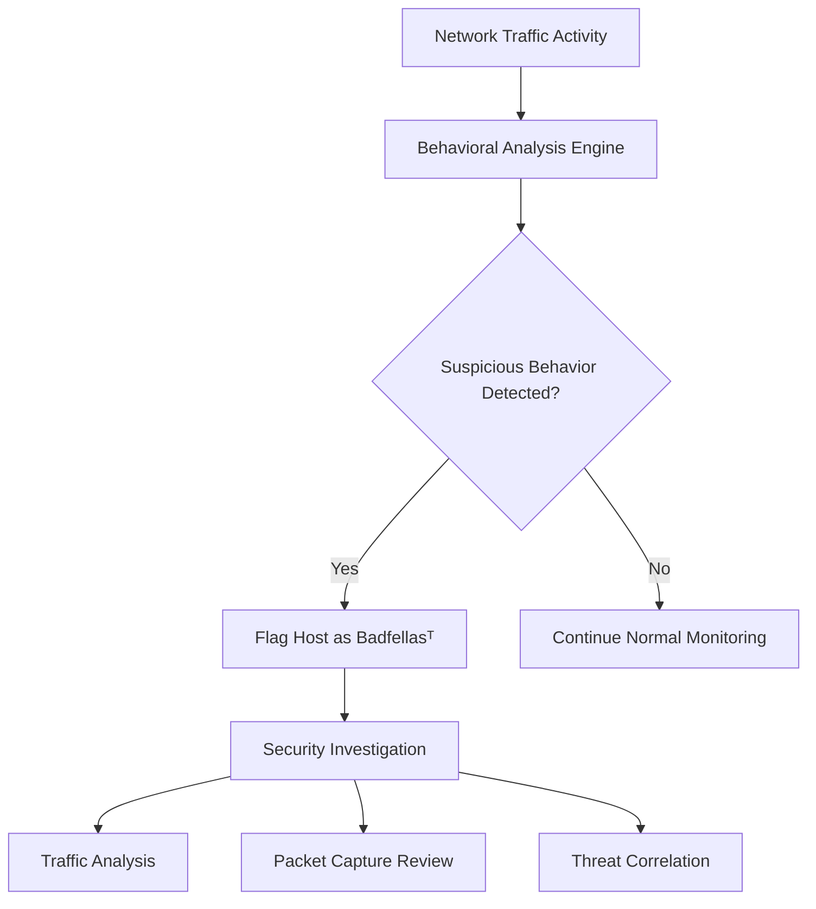

# What is Badfellasᵀ?

Badfellasᵀ is a Trisul Network Analytics feature that identifies suspicious, malicious, or high-risk hosts based on abnormal traffic behavior, threat intelligence indicators, and network activity patterns.

It helps network and security teams quickly detect systems involved in suspicious communication, scanning activity, traffic floods, malware behavior, or unauthorized network access.

Badfellasᵀ improves visibility into potentially compromised devices and risky network behavior across enterprise and ISP environments.

## **How Badfellasᵀ Works**

Badfellasᵀ continuously analyzes traffic flows, packet behavior, and network activity patterns to identify hosts that exhibit suspicious characteristics.

Detection can involve:
- unusual traffic patterns
- abnormal connection behavior
- threat intelligence matches
- excessive scanning activity
- suspicious outbound communication
- protocol anomalies
- DDoS-related behavior

For example:

1. A device begins communicating with multiple external IPs unusually fast
2. Traffic patterns deviate from established baselines
3. The host triggers multiple suspicious indicators
4. The system is flagged as a Badfellasᵀ entity for investigation

*Figure: Badfellasᵀ workflow showing how suspicious traffic behavior is analyzed, flagged, and escalated for investigation.*

## **Why Badfellasᵀ Matters**

Modern networks generate massive volumes of traffic, making manual threat detection difficult.

Badfellasᵀ helps teams:
- identify suspicious hosts faster
- reduce investigation time
- improve threat visibility
- prioritize incident response
- detect abnormal communication patterns
- investigate compromised systems

It improves visibility into:
- malware communication
- scanning activity
- lateral movement
- botnet behavior
- outbound threat traffic
- internal reconnaissance attempts

Badfellasᵀ is especially useful in:
- SOC operations
- enterprise security monitoring
- ISP traffic analytics
- incident response workflows
- threat hunting environments

## **Common Operational Use Cases**

### Malware Detection

Identify infected systems communicating with suspicious external hosts.

### Traffic Investigation

Investigate abnormal traffic behavior and unusual communication patterns.

### DDoS Analysis

Detect systems generating excessive traffic floods or scanning behavior.

### Insider Threat Detection

Identify unauthorized internal communication or suspicious user activity.

### Threat Hunting

Correlate anomalous traffic behavior with suspicious hosts and events.

## **Badfellasᵀ vs Traditional Alerting**

| Feature | Badfellasᵀ | Traditional Alerts |
|---|---|---|
| Detection Method | Behavioral and traffic-based | Static rule-based |
| Traffic Context | Rich network visibility | Often isolated events |
| Suspicious Host Identification | Built-in | Limited |
| Behavioral Correlation | Strong | Basic |
| Investigation Visibility | High | Moderate |

Badfellasᵀ focuses on suspicious network behavior and contextual visibility rather than isolated alert conditions.

## **How Trisul Uses Badfellasᵀ**

Badfellasᵀ works alongside Trisul’s traffic analytics and security visibility features to improve threat detection and investigation workflows.

Combined with:
- Flow Analysis
- Top-K Analyticsᵀ
- Retro Analysisᵀ
- Flow Taggerᵀ
- Multigraph Analyticsᵀ
- Packet Capture

Trisul helps teams:
- identify high-risk hosts
- visualize suspicious communication
- investigate anomalous traffic behavior
- correlate traffic patterns with security events
- analyze east-west traffic movement
- monitor abnormal outbound communication

Trisul can also correlate [Packet Capture](/glossary/packet-capture), [Traffic Investigation](/glossary/traffic-investigation), and [Anomaly Detection](/glossary/anomaly-detection) workflows for deeper threat analysis.

## **Related Terms**

- [Anomaly Detection](/glossary/anomaly-detection)
- [Traffic Investigation](/glossary/traffic-investigation)
- [Network Security Monitoring](/glossary/network-security-monitoring-nsm)
- [Packet Capture](/glossary/packet-capture)
- [Flow Analysis](/glossary/flow-analysis)
- [East-West Traffic](/glossary/east-west-traffic)

---

## **FAQ**

### What is Badfellasᵀ in Trisul?

Badfellasᵀ is a Trisul feature that identifies suspicious or high-risk hosts based on abnormal network behavior and traffic analysis.

### What types of threats can Badfellasᵀ detect?

It can help identify malware communication, scanning activity, DDoS-related behavior, suspicious outbound traffic, and lateral movement.

### How does Badfellasᵀ identify suspicious hosts?

It analyzes traffic patterns, communication behavior, anomalies, and security indicators across network traffic flows.

### Is Badfellasᵀ signature-based?

Badfellasᵀ primarily focuses on behavioral traffic analysis and contextual network visibility rather than only static signatures.

### Can Badfellasᵀ help with incident response?

Yes. It helps security teams prioritize investigations and identify potentially compromised systems quickly.

### Does Badfellasᵀ work with flow analytics?

Yes. Badfellasᵀ integrates with flow analysis, packet capture, and traffic investigation workflows in Trisul.