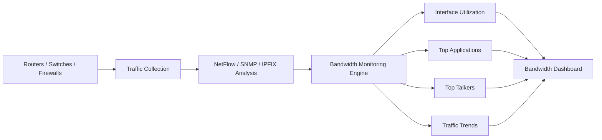

# What is Bandwidth Monitoring?

Bandwidth Monitoring is the process of measuring, analyzing, and tracking network bandwidth usage across devices, interfaces, applications, users, and traffic flows.

It helps network teams understand how network capacity is being used, identify congestion, detect abnormal traffic behavior, and troubleshoot performance issues.

Bandwidth monitoring is widely used in [Flow Analysis](/glossary/flow-analysis), [Traffic Investigation](/glossary/traffic-investigation), and [Network Security Monitoring](/glossary/network-security-monitoring-nsm) environments.

## How Bandwidth Monitoring Works

Bandwidth monitoring platforms collect traffic statistics from routers, switches, firewalls, and network devices using technologies such as:

- NetFlow
- IPFIX
- sFlow
- SNMP
- Packet Capture
- Interface counters

These systems measure:
- bandwidth utilization
- traffic volume
- packet rates
- protocol distribution
- application traffic
- top talkers
- inbound and outbound traffic

For example:

1. A router exports NetFlow records
2. The monitoring platform analyzes traffic flows
3. Bandwidth usage is grouped by application, interface, or user
4. Network teams identify high-usage patterns or congestion

*Figure: Bandwidth monitoring workflow showing how network traffic data is collected, analyzed, and visualized through monitoring dashboards and traffic analytics.*

## Why Bandwidth Monitoring Matters

Without bandwidth visibility, network congestion and abnormal traffic patterns can remain unnoticed until users experience performance problems.

Bandwidth monitoring helps organizations:
- identify network bottlenecks
- detect traffic spikes
- prevent link saturation
- optimize capacity planning
- troubleshoot performance issues
- monitor ISP traffic usage
- detect suspicious traffic behavior

It is especially important in:
- enterprise networks
- ISP infrastructures
- cloud environments
- data centers
- WAN and SD-WAN deployments

## Types of Bandwidth Monitoring

### Interface Bandwidth Monitoring

Tracks traffic usage on physical or virtual network interfaces.

### Application Bandwidth Monitoring

Measures bandwidth consumed by specific applications or services.

### Flow-Based Monitoring

Uses [NetFlow](/glossary/netflow), [IPFIX](/glossary/ipfix), or [sFlow](/glossary/sflow) records to analyze traffic behavior.

### Real-Time Bandwidth Monitoring

Provides live traffic visibility and near real-time bandwidth analysis.

### Historical Bandwidth Monitoring

Analyzes long-term traffic trends and usage patterns.

## Common Operational Use Cases

### Capacity Planning

Analyze long-term bandwidth trends to plan network upgrades.

### Congestion Detection

Identify overloaded interfaces or saturated links.

### ISP Traffic Analytics

Monitor subscriber usage and backbone traffic distribution.

### Application Performance Monitoring

Identify applications consuming excessive bandwidth.

### Security Monitoring

Detect unusual traffic spikes, scanning activity, or DDoS traffic floods.

## Bandwidth Monitoring vs Traffic Monitoring

| Feature | Bandwidth Monitoring | Traffic Monitoring |
|---|---|---|
| Primary Focus | Bandwidth usage and utilization | Overall network traffic behavior |
| Key Metrics | Throughput, utilization, rates | Flows, packets, protocols, sessions |
| Common Goal | Prevent congestion | Improve visibility and analysis |
| Typical Data Sources | SNMP, Flow data | NetFlow, IPFIX, PCAP, telemetry |
| Operational Scope | Capacity and performance | Performance and security visibility |

Bandwidth monitoring focuses specifically on traffic volume and utilization, while traffic monitoring provides broader network visibility.

## How Trisul Handles Bandwidth Monitoring

Trisul provides real-time and historical bandwidth visibility using flow analytics, packet analysis, and traffic investigation workflows.

Combined with:
- Top-K Analyticsᵀ
- Multigraph Analyticsᵀ
- Retro Analysisᵀ
- Flow Stitchingᵀ
- Long-Term Traffic Retention

Trisul helps teams:
- monitor interface utilization
- analyze top bandwidth consumers
- investigate traffic spikes
- detect congestion patterns
- visualize application traffic behavior
- monitor ISP and backbone traffic flows

Trisul can also correlate [Packet Capture](/glossary/packet-capture) and [Flow Analysis](/glossary/flow-analysis) data for deeper bandwidth investigation.

## Related Terms

- [Flow Analysis](/glossary/flow-analysis)
- [Traffic Investigation](/glossary/traffic-investigation)
- [NetFlow](/glossary/netflow)
- [IPFIX](/glossary/ipfix)
- [Top Talkers](/glossary/top-talkers)
- [Real-Time Traffic Monitoring](/glossary/real-time-traffic-monitoring)

---

## FAQ

### What is bandwidth monitoring?

Bandwidth monitoring is the process of measuring and analyzing network bandwidth usage and traffic behavior.

### Why is bandwidth monitoring important?

It helps identify congestion, troubleshoot performance issues, optimize capacity planning, and improve traffic visibility.

### What tools are used for bandwidth monitoring?

Common technologies include NetFlow, IPFIX, sFlow, SNMP, and packet capture tools.

### What's the difference between bandwidth monitoring and traffic monitoring?

Bandwidth monitoring focuses on traffic volume and utilization, while traffic monitoring analyzes broader network behavior and traffic flows.

### Can bandwidth monitoring detect security threats?

Yes. Unusual traffic spikes and abnormal bandwidth usage can indicate DDoS attacks, malware activity, or unauthorized traffic.

### Is bandwidth monitoring useful for ISPs?

Yes. ISPs use bandwidth monitoring to analyze subscriber usage, backbone traffic, congestion, and peering behavior.