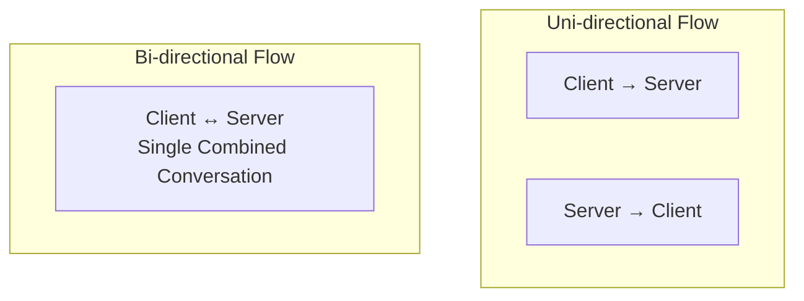

# What is a Bi-directional Flow?

A Bi-directional Flow is a network traffic flow that combines both directions of communication between two endpoints into a single logical conversation.

Instead of treating inbound and outbound traffic as separate records, bi-directional flow analysis correlates both traffic directions to provide a complete view of a network session.

Bi-directional flows are commonly used in [Flow Analysis](/glossary/flow-analysis), [Traffic Investigation](/glossary/traffic-investigation), and [Conversation View](/glossary/conversation-view) workflows.

## **How Bi-directional Flows Work**

Traditional flow exporters often generate separate flow records for:
- client-to-server traffic
- server-to-client traffic

Bi-directional flow analysis combines these records into a unified session view.

For example:

1. A client connects to a web server
2. Traffic flows in both directions
3. Flow records are collected from the exporter
4. The monitoring platform correlates both directions
5. A single conversation view is created

A bi-directional flow may include:
- source and destination IP addresses
- ports and protocols
- bytes sent and received
- packet counts
- session duration
- response behavior

*Figure: Comparison between uni-directional flows, which store each traffic direction separately, and bi-directional flows, which combine both directions into a single session view.*

## **Why Bi-directional Flows Matter**

Analyzing traffic in both directions improves visibility into how devices and applications communicate across a network.

Bi-directional flow analysis helps teams:
- understand complete conversations
- improve troubleshooting
- detect abnormal traffic behavior
- analyze application performance
- identify failed or asymmetric communication

It improves visibility into:
- client-server interactions
- east-west traffic
- session behavior
- response patterns
- traffic asymmetry
- suspicious communication flows

Bi-directional visibility is especially important in:
- enterprise networks
- SOC environments
- ISP traffic analytics
- application troubleshooting
- network forensics

## **Common Operational Use Cases**

### Traffic Investigation

Analyze full communication sessions during incident investigations.

### Application Troubleshooting

Understand request and response behavior between applications and services.

### Security Monitoring

Detect suspicious communication patterns and asymmetric traffic behavior.

### East-West Traffic Analysis

Monitor internal communication between systems and network segments.

### Session Visibility

Improve understanding of long-running or complex network conversations.

## **Bi-directional Flow vs Uni-directional Flow**

| Feature | Bi-directional Flow | Uni-directional Flow |
|---|---|---|
| Traffic View | Both directions combined | Single traffic direction |
| Session Visibility | Complete conversation | Partial communication view |
| Troubleshooting Value | Higher | Limited |
| Flow Correlation | Required | Not required |
| Operational Context | Richer | Simpler |

Bi-directional flows provide more context and visibility than isolated uni-directional flow records.

## **How Trisul Handles Bi-directional Flows**

Trisul provides advanced conversation-level traffic visibility using correlated flow analytics and session-aware traffic analysis.

Combined with:
- Flow Stitchingᵀ
- Flow Legsᵀ
- Conversation View
- Top-K Analyticsᵀ
- Retro Analysisᵀ

Trisul helps teams:
- analyze complete traffic conversations
- investigate suspicious communication patterns
- visualize east-west traffic behavior
- identify asymmetric routing
- troubleshoot application sessions
- correlate long-running traffic flows

Trisul can also combine [Packet Capture](/glossary/packet-capture) and [Flow Analysis](/glossary/flow-analysis) workflows for deeper conversation-level visibility.

## **Related Terms**

- [Flow Analysis](/glossary/flow-analysis)
- [Conversation View](/glossary/conversation-view)
- [Traffic Investigation](/glossary/traffic-investigation)
- [East-West Traffic](/glossary/east-west-traffic)
- [Flow Stitching](/glossary/flow-stitching)
- [Uni-directional Flow](/glossary/uni-directional-flow)

---

## **FAQ**

### What is a bi-directional flow?

A bi-directional flow combines both directions of network communication into a single logical session or conversation.

### Why are bi-directional flows important?

They provide better visibility into complete network conversations and improve troubleshooting and security analysis.

### What's the difference between bi-directional and uni-directional flows?

Bi-directional flows include both traffic directions, while uni-directional flows represent only one direction of communication.

### Can NetFlow support bi-directional flow analysis?

Yes. Monitoring platforms can correlate NetFlow records to create bi-directional session views.

### Are bi-directional flows useful for security monitoring?

Yes. They help identify abnormal communication patterns, asymmetric traffic, and suspicious session behavior.

### How do bi-directional flows improve troubleshooting?

They provide full request-response visibility between communicating systems and applications.