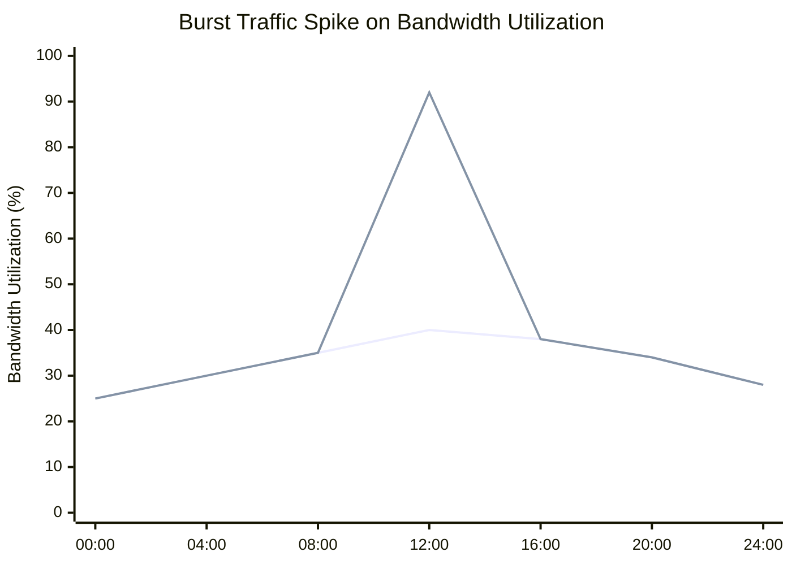

# What is Burst Traffic?

Burst traffic is a sudden, short-lived increase in network traffic volume that rises above the normal baseline for a brief period.

Traffic bursts can come from legitimate activity such as software updates, backups, video streaming, file transfers, or synchronization jobs. They can also result from abnormal events such as traffic floods, scans, or DDoS attacks.

Burst traffic monitoring is commonly used in [Bandwidth Monitoring](/glossary/bandwidth-monitoring), [Anomaly Detection](/glossary/anomaly-detection), and [Traffic Investigation](/glossary/traffic-investigation) workflows.

## **How Burst Traffic Works**

Network traffic is naturally uneven. Demand changes with user activity, scheduled jobs, application behavior, and external events.

A traffic burst occurs when:
- traffic volume rises quickly.
- packet rates spike suddenly.
- bandwidth usage exceeds the expected baseline.
- a link or interface is briefly pushed toward saturation.

For example:

1. Hundreds of users begin downloading updates at the same time.
2. Network bandwidth usage rises sharply.
3. Interfaces approach saturation.
4. Monitoring systems detect the spike and compare it against the baseline.

Burst traffic may last:
- milliseconds.
- seconds.
- minutes.
- longer if the spike is sustained by congestion or attack traffic.

*Figure: Burst traffic visualization showing a sudden short-duration spike in bandwidth utilization compared to normal traffic levels.*

## **Why Burst Traffic Matters**

Short traffic spikes can create performance problems even when average bandwidth utilization looks normal.

Burst traffic can cause:
- packet loss.
- increased latency.
- interface congestion.
- application slowdowns.
- QoS degradation.
- dropped connections.

Monitoring burst traffic helps teams:
- identify congestion patterns.
- troubleshoot intermittent performance issues.
- detect abnormal traffic behavior.
- optimize bandwidth allocation.
- improve capacity planning.

Burst traffic visibility is especially important in:
- ISP backbones.
- data centers.
- cloud environments.
- VoIP networks.
- high-speed enterprise networks.

## **Types of Burst Traffic**

### Application Traffic Bursts

Short-term spikes caused by applications such as streaming, backups, file transfers, or software distribution.

### Microbursts

Very short traffic spikes that can overwhelm interface buffers before average utilization looks abnormal.

### Security-Related Bursts

Traffic floods caused by scans, malware activity, or DDoS attacks.

### User Activity Bursts

Traffic spikes generated by many users or systems acting at the same time, such as logon windows or synchronized updates.

## **Common Operational Use Cases**

### Congestion Troubleshooting

Identify sudden bandwidth spikes affecting application performance.

### DDoS Detection

Detect traffic floods and abnormal packet-rate spikes.

### Capacity Planning

Understand peak traffic behavior and upgrade requirements.

### QoS Optimization

Protect critical applications during burst traffic conditions.

### ISP Traffic Analytics

Monitor backbone utilization and subscriber traffic spikes.

## **Burst Traffic vs Sustained Traffic**

| Feature | Burst Traffic | Sustained Traffic |
|---|---|---|
| Duration | Short-term | Long-term |
| Traffic Pattern | Sudden spikes | Stable or continuous usage |
| Congestion Risk | High during spikes | Gradual saturation |
| Detection Difficulty | Harder to catch | Easier to observe |
| Common Cause | Temporary activity surges | Ongoing high utilization |

Burst traffic is temporary and abrupt, while sustained traffic stays elevated over a longer period.

## **How Trisul Handles Burst Traffic Analysis**

Trisul provides traffic visibility and flow analytics that can help identify sudden traffic spikes and abnormal bandwidth behavior.

Combined with:
- Top-K Analyticsᵀ
- Multigraph Analyticsᵀ
- Retro Analysisᵀ
- Long-Term Traffic Retention
- Flow Stitchingᵀ

Trisul helps teams:
- detect burst traffic patterns.
- visualize bandwidth spikes.
- investigate congestion events.
- identify top traffic contributors.
- analyze DDoS-related traffic floods.
- troubleshoot intermittent network slowdowns.

Trisul can also support [Flow Analysis](/glossary/flow-analysis) and [Packet Capture](/glossary/packet-capture) workflows for deeper burst traffic investigation.

## **Related Terms**

- [Bandwidth Monitoring](/glossary/bandwidth-monitoring)
- [Anomaly Detection](/glossary/anomaly-detection)
- [Traffic Investigation](/glossary/traffic-investigation)
- [Microburst Detection](/glossary/microburst-detection)
- [Packet Loss Monitoring](/glossary/packet-loss-monitoring)
- [DDoS Detection](/glossary/ddos-detection)

---

## **FAQ**

### What is burst traffic?

Burst traffic is a sudden and temporary increase in network traffic volume or bandwidth usage.

### Why is burst traffic important?

Traffic bursts can cause congestion, packet loss, latency spikes, and application performance issues.

### What causes burst traffic?

Common causes include file transfers, backups, streaming traffic, software updates, synchronized user activity, and DDoS attacks.

### What's the difference between burst traffic and sustained traffic?

Burst traffic is short-term and sudden, while sustained traffic remains elevated over a longer period.

### Can burst traffic affect network performance?

Yes. Even short-duration traffic spikes can overload interfaces and degrade application performance.

### How is burst traffic detected?

Burst traffic is commonly detected using flow monitoring, bandwidth analysis, packet inspection, and anomaly detection systems.