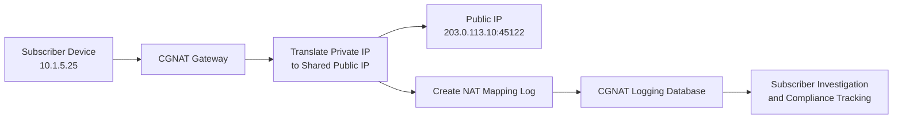

# What is CGNAT Logging?

CGNAT Logging is the process of recording network address translation (NAT) mappings created by Carrier-Grade NAT (CGNAT) systems used by internet service providers (ISPs).

These logs help map private subscriber IP addresses and ports to shared public IP addresses, making it possible to identify subscriber activity for troubleshooting, security investigations, and regulatory compliance.

CGNAT logging is widely used in ISP environments, subscriber tracking systems, and [Traffic Investigation](/glossary/traffic-investigation) workflows.

## How CGNAT Logging Works

Carrier-Grade NAT allows multiple subscribers to share a smaller pool of public IPv4 addresses.

When subscriber traffic passes through a CGNAT device:

1. A private IP address is translated to a public IP address
2. Source ports are also translated
3. The CGNAT system creates a NAT mapping entry
4. The mapping is logged for future reference

A CGNAT log entry may include:
- subscriber private IP address
- translated public IP address
- source and destination ports
- protocol type
- timestamp
- session duration

For example:

- Subscriber: `10.1.5.25`
- Public IP: `203.0.113.10`
- Translated Port: `45122`

The log allows operators to identify which subscriber used a specific public IP and port at a given time.

 
*Figure: CGNAT workflow showing private-to-public IP translation and NAT mapping logs used for subscriber traceability and compliance.*

## Why CGNAT Logging Matters

Without CGNAT logs, it becomes difficult to identify which subscriber generated specific internet traffic because multiple users share the same public IP address.

CGNAT logging helps ISPs:
- maintain subscriber traceability
- support lawful interception requests
- investigate abuse complaints
- comply with regulatory requirements
- troubleshoot subscriber activity
- investigate security incidents

It improves visibility into:
- subscriber internet usage
- public-to-private IP mappings
- outbound communication tracking
- abuse investigation workflows
- traffic attribution

CGNAT logging is especially important in:
- ISPs
- broadband providers
- mobile carriers
- large-scale IPv4 environments
- regulatory compliance systems

## Common Operational Use Cases

### Subscriber Identification

Identify which subscriber used a public IP address at a specific time.

### Regulatory Compliance

Maintain logs required for legal and telecom compliance obligations.

### Abuse Investigation

Investigate spam, malware activity, or suspicious outbound communication.

### Security Monitoring

Trace malicious traffic back to originating subscribers.

### IPv4 Address Conservation

Support large-scale IPv4 sharing environments using CGNAT.

## CGNAT Logging vs Traditional NAT Logging

| Feature | CGNAT Logging | Traditional NAT Logging |
|---|---|---|
| Deployment Scale | ISP-scale | Enterprise or smaller networks |
| Public IP Sharing | Shared across many users | Often fewer users |
| Logging Volume | Extremely high | Moderate |
| Subscriber Tracking | Critical | Limited requirement |
| Compliance Role | Major | Lower |

CGNAT logging operates at much larger scale and requires high-performance logging and retention systems.

## How Trisul Handles CGNAT Logging

Trisul provides scalable traffic analytics and subscriber visibility workflows for CGNAT environments and ISP infrastructures.

Combined with:
- Subscriber Mapping
- Flow Analysis
- Long-Term Traffic Retention
- Top-K Analyticsᵀ
- Traffic Investigation

Trisul helps teams:
- correlate subscriber activity
- investigate NAT mappings
- analyze traffic behavior
- monitor public IP utilization
- troubleshoot subscriber issues
- investigate abuse reports

Trisul can also correlate [NetFlow](/glossary/netflow), [IPFIX](/glossary/ipfix), and [NAT Logging](/glossary/nat-logging) workflows for deeper subscriber visibility.

## Related Terms

- [NAT Logging](/glossary/nat-logging)
- [Subscriber Mapping](/glossary/subscriber-mapping)
- [Traffic Investigation](/glossary/traffic-investigation)
- [IPDR](/glossary/ipdr)
- [NetFlow](/glossary/netflow)
- [ISP Traffic Analytics](/glossary/isp-traffic-analytics)

---

## FAQ

### What is CGNAT logging?

CGNAT logging records NAT translation mappings created by Carrier-Grade NAT systems.

### Why is CGNAT logging important?

It helps ISPs identify subscriber activity when multiple users share the same public IP address.

### What information is stored in CGNAT logs?

Logs typically include private IPs, public IPs, translated ports, timestamps, and protocol information.

### Why do ISPs use CGNAT?

ISPs use CGNAT to conserve public IPv4 addresses by allowing many subscribers to share a smaller public IP pool.

### Is CGNAT logging required for compliance?

In many regions, ISPs must retain CGNAT logs for lawful interception, abuse handling, and regulatory compliance.

### Can CGNAT logging generate large amounts of data?

Yes. Large ISP environments can generate extremely high-volume CGNAT logs that require scalable retention and analytics systems.