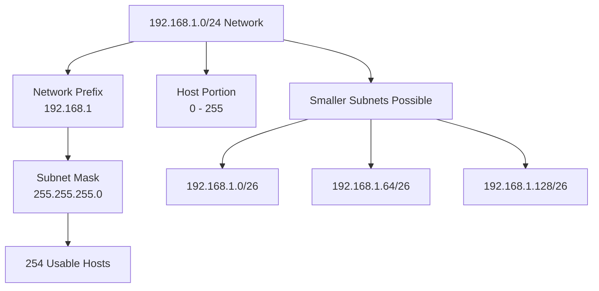

# What is CIDR?

CIDR (Classless Inter-Domain Routing) is a method of IP address allocation and routing that uses variable-length subnet masks to improve address efficiency and routing scalability.

CIDR replaces the older class-based IP addressing model by allowing networks to be divided into flexible subnet sizes instead of fixed address classes.

CIDR is widely used in IP routing, subnetting, cloud networking, and [BGP](/glossary/bgp) route advertisement workflows.

## How CIDR Works

CIDR represents IP networks using a prefix length format called CIDR notation.

Example:

192.168.1.0/24
In this example:

192.168.1.0 is the network address
/24 represents the subnet mask prefix length

The prefix length defines how many bits belong to the network portion of the address.

Common examples:

|CIDR Block  | Subnet Mask | Approximate Hosts|
|-----------|---------------|------------------|
|/8 |  255.0.0.0 | 16 million+|
|/16 | 255.255.0.0 | 65,534|
|/24 | 255.255.255.0 | 254|
|/30 | 255.255.255.252|  2|| 

CIDR allows network administrators to allocate address ranges more efficiently than traditional class-based addressing.

*Figure: CIDR subnetting diagram showing network prefixes, subnet masks, and how IP ranges can be divided into smaller subnets using CIDR notation.*

## Why CIDR Matters

Before CIDR, IP addressing relied on fixed classes such as:

Class A
Class B
Class C

This caused inefficient IP allocation and routing table growth.

CIDR improves:

IP address utilization
subnet flexibility
routing scalability
route aggregation
internet routing efficiency

CIDR is especially important in:

enterprise networking
ISP routing
cloud infrastructure
BGP route advertisement
subnet design

## Common Operational Use Cases  

### IP Subnetting

Divide networks into smaller logical segments.

### Route Aggregation

Reduce routing table size using summarized IP prefixes.

### Cloud Networking

Allocate scalable subnets for cloud workloads and virtual networks.

### ISP Routing

Advertise aggregated network prefixes through BGP.

### Access Control Policies

Define IP ranges in firewall and ACL rules.

## CIDR vs Classful Addressing

|Feature |CIDR  |Classful Addressing|
|-------------|--------------|------|
|Subnet Flexibility | Variable-length |Fixed classes|
|IP Efficiency |High | Lower|
|Route Aggregation |Supported Limited|
|Scalability| Better | Limited|
|Modern Usage  |Standard | Mostly obsolete|

CIDR provides more flexible and efficient IP address allocation than the older class-based model.

## How Trisul Uses CIDR Visibility

Trisul uses CIDR-aware traffic analysis and subnet visibility to help teams analyze traffic distribution across IP ranges and network segments.

Combined with:

Flow Analysis
Traffic Investigation
GeoIP Enrichment
Top-K Analyticsᵀ
Multigraph Analyticsᵀ

Trisul helps teams:

analyze subnet-level traffic behavior
monitor traffic by IP range
investigate suspicious subnet activity
visualize traffic distribution
analyze routing behavior
monitor internal segmentation traffic

Trisul can also correlate NetFlow
, IPFIX
, and Packet Capture
 workflows with CIDR-based network analysis.

## Related Terms

BGP
ASN
NetFlow
Access Control List (ACL)
Traffic Investigation
Network Security Monitoring

## FAQ

### What does CIDR stand for?

CIDR stands for Classless Inter-Domain Routing.

### What is CIDR notation?

CIDR notation represents an IP address range using a prefix length, such as 192.168.1.0/24.

### Why is CIDR important?

CIDR improves IP address allocation efficiency and reduces internet routing table size through route aggregation.

### What's the difference between CIDR and subnetting?

CIDR is the addressing method that enables flexible subnetting using variable-length prefixes.

### Is CIDR used in modern networking?

Yes. CIDR is the standard approach for IP addressing and routing in modern networks.

### How does CIDR help ISPs?

ISPs use CIDR for efficient route advertisement, IP allocation, and scalable internet routing.