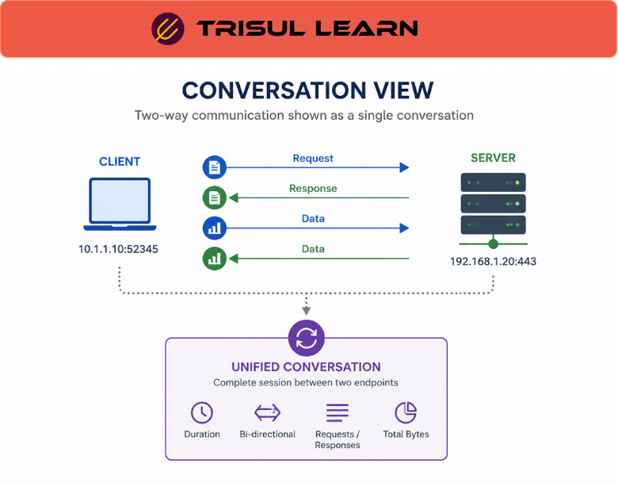

# What is Conversation View?

Conversation View is a network traffic analysis method that displays communication between two endpoints as a complete conversation instead of isolated traffic records.

It helps network and security teams understand how systems, applications, and users communicate across a network by correlating traffic in both directions.

Conversation View is commonly used in [Flow Analysis](/glossary/flow-analysis), [Traffic Investigation](/glossary/traffic-investigation), and [Bi-directional Flow](/glossary/bi-directional-flow) workflows.

## How Conversation View Works

Traditional traffic monitoring often displays flows or packets independently.

Conversation View groups related traffic into a unified communication session.

A conversation may include:
- source and destination IP addresses
- ports and protocols
- request and response traffic
- bytes sent and received
- session duration
- application behavior

For example:

1. A client connects to a web server
2. Traffic flows in both directions
3. The monitoring platform correlates related flow records
4. The full communication session is displayed as a single conversation

This provides better visibility into:
- who communicated
- how much traffic was exchanged
- how long the session lasted
- how the application behaved

## Why Conversation View Matters

Viewing traffic as isolated records can make investigations difficult and fragmented.

Conversation View improves:
- troubleshooting efficiency
- traffic visibility
- session analysis
- anomaly investigation
- application monitoring
- security analysis

It helps teams:
- understand complete communication patterns
- identify failed sessions
- investigate suspicious activity
- analyze request-response behavior
- monitor east-west traffic

Conversation visibility is especially useful in:
- SOC operations
- application troubleshooting
- ISP traffic analytics
- network forensics
- performance monitoring

## Common Operational Use Cases

### Traffic Investigation

Analyze complete communication sessions during incident investigations.

### Application Troubleshooting

Identify application delays, failed connections, or abnormal behavior.

### Security Monitoring

Investigate suspicious communication between internal and external systems.

### East-West Traffic Visibility

Monitor internal traffic movement between servers and network segments.

### Session Analysis

Understand how applications and devices interact across the network.

## Conversation View vs Raw Flow Records

| Feature | Conversation View | Raw Flow Records |
|---|---|---|
| Traffic Visibility | Complete session view | Individual traffic records |
| Request-Response Context | Included | Limited |
| Troubleshooting Efficiency | Higher | Lower |
| Session Correlation | Built-in | Manual |
| Operational Context | Rich | Fragmented |

Conversation View improves operational visibility by grouping related traffic into meaningful communication sessions.

## How Trisul Handles Conversation View

Trisul provides conversation-level traffic visibility using correlated flow analytics and session-aware traffic analysis.

Combined with:
- Flow Stitchingᵀ
- Flow Legsᵀ
- Contextᵀ
- Top-K Analyticsᵀ
- Retro Analysisᵀ

Trisul helps teams:
- analyze complete traffic conversations
- visualize communication patterns
- investigate suspicious sessions
- monitor east-west traffic
- troubleshoot application behavior
- correlate historical traffic activity

Trisul can also combine [Packet Capture](/glossary/packet-capture), [Flow Analysis](/glossary/flow-analysis), and [Application Visibility](/glossary/application-visibility) workflows for deeper session analysis.

## Related Terms

- [Bi-directional Flow](/glossary/bi-directional-flow)
- [Flow Analysis](/glossary/flow-analysis)
- [Traffic Investigation](/glossary/traffic-investigation)
- [Packet Capture](/glossary/packet-capture)
- [Application Visibility](/glossary/application-visibility)
- [East-West Traffic](/glossary/east-west-traffic)

---

## FAQ

### What is Conversation View in network monitoring?

Conversation View displays traffic between two endpoints as a complete communication session instead of separate flow records.

### Why is Conversation View important?

It improves troubleshooting, security investigations, and traffic visibility by showing complete communication behavior.

### How does Conversation View work?

It correlates related traffic flows and packet activity into a unified session view.

### What's the difference between Conversation View and raw flow data?

Conversation View groups traffic into complete sessions, while raw flow data often displays isolated records independently.

### Is Conversation View useful for security analysis?

Yes. It helps identify suspicious communication patterns, abnormal sessions, and unauthorized traffic behavior.

### Can Conversation View work with NetFlow data?

Yes. Monitoring platforms can correlate NetFlow and IPFIX records to build conversation-level visibility.