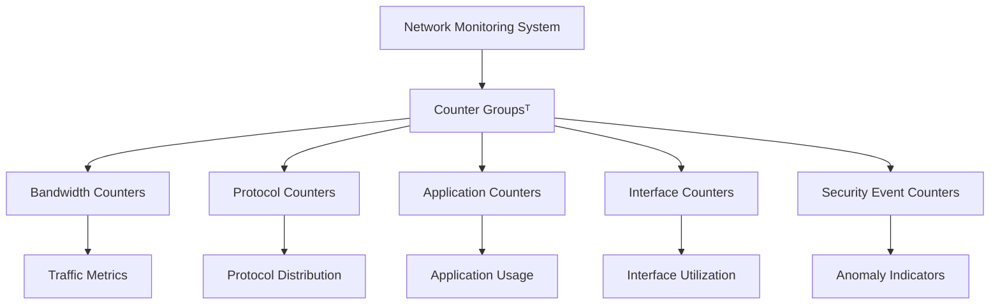

# What are Counter Groupsᵀ?

Counter Groupsᵀ are a Trisul Network Analytics feature used to organize and aggregate related traffic metrics, statistics, and network activity counters into logical monitoring categories.

They help network and security teams analyze traffic behavior by grouping similar measurements such as bandwidth usage, protocols, applications, interfaces, hosts, or traffic flows into structured operational views.

Counter Groupsᵀ improve visibility across large-scale traffic monitoring and analytics environments.

## How Counter Groupsᵀ Work

Modern networks generate massive volumes of telemetry and traffic statistics from:
- flow records
- packet analysis
- interfaces
- applications
- protocols
- subscribers
- routing systems

Counter Groupsᵀ organize these measurements into related metric collections.

For example:

1. Traffic data is collected from routers and exporters
2. Metrics are categorized into logical groups
3. Related counters are aggregated together
4. Teams analyze trends and traffic behavior through grouped analytics

Counter Groupsᵀ may organize metrics by:
- bandwidth usage
- protocols
- applications
- interfaces
- ASNs
- subscribers
- traffic direction
- security events

*Figure: Counter Groupsᵀ organizing related network metrics into logical monitoring categories for operational analysis.*

*Figure: Counter Groupsᵀ organizing related traffic metrics into structured monitoring categories for analysis and visibility.*
*Figure: Counter Groupsᵀ workflow showing how traffic metrics from multiple sources are aggregated into organized monitoring and analytics categories.*

## Why Counter Groupsᵀ Matter

Without structured grouping, large-scale traffic metrics can become difficult to analyze and manage.

Counter Groupsᵀ help teams:
- simplify traffic analysis
- improve operational visibility
- organize analytics workflows
- monitor related metrics together
- improve troubleshooting efficiency
- scale monitoring environments more effectively

They improve visibility into:
- traffic trends
- bandwidth consumption
- protocol distribution
- subscriber behavior
- interface utilization
- security activity

Counter Groupsᵀ are especially useful in:
- ISP environments
- enterprise monitoring
- SOC operations
- multi-tenant deployments
- high-volume traffic infrastructures

## Common Operational Use Cases

### Bandwidth Analysis

Group interface and traffic utilization counters together.

### Protocol Monitoring

Analyze protocol distribution and traffic composition.

### Subscriber Analytics

Track traffic usage across subscriber groups.

### Security Monitoring

Group suspicious traffic indicators and anomaly metrics.

### Multi-Tenant Monitoring

Separate metrics across customers, regions, or network segments.

## Counter Groupsᵀ vs Individual Counters

| Feature | Counter Groupsᵀ | Individual Counters |
|---|---|---|
| Visibility | Aggregated operational view | Isolated metrics |
| Scalability | Higher | Limited |
| Traffic Correlation | Easier | Manual |
| Analysis Workflow | Structured | Fragmented |
| Operational Context | Rich | Basic |

Counter Groupsᵀ improve visibility by organizing related traffic measurements into meaningful monitoring categories.

## How Trisul Uses Counter Groupsᵀ

Trisul uses Counter Groupsᵀ across its traffic analytics and monitoring workflows to organize large-scale network telemetry and operational metrics.

Combined with:
- Top-K Analyticsᵀ
- Multigraph Analyticsᵀ
- Retro Analysisᵀ
- Flow Analysis
- Long-Term Traffic Retention

Trisul helps teams:
- monitor traffic trends efficiently
- organize protocol and application analytics
- analyze bandwidth consumption
- scale ISP traffic monitoring
- improve operational dashboards
- correlate related network statistics

Trisul can also integrate [NetFlow](/glossary/netflow), [IPFIX](/glossary/ipfix), and [Bandwidth Monitoring](/glossary/bandwidth-monitoring) workflows with grouped analytics views.

## Related Terms

- [Flow Analysis](/glossary/flow-analysis)
- [Bandwidth Monitoring](/glossary/bandwidth-monitoring)
- [Multigraph Analytics](/glossary/multigraph-analytics)
- [Top-K Analytics](/glossary/top-k-analytics)
- [Traffic Investigation](/glossary/traffic-investigation)
- [Network Security Monitoring](/glossary/network-security-monitoring-nsm)

---

## FAQ

### What are Counter Groupsᵀ in Trisul?

Counter Groupsᵀ are structured collections of related traffic metrics and network statistics used for monitoring and analytics.

### Why are Counter Groupsᵀ important?

They help organize large-scale traffic data into meaningful operational categories for easier analysis and visibility.

### What types of metrics can Counter Groupsᵀ include?

They can include bandwidth usage, protocols, interfaces, applications, ASNs, subscribers, and security-related metrics.

### How do Counter Groupsᵀ improve monitoring?

They simplify analytics workflows and improve visibility into related traffic behavior and operational trends.

### Are Counter Groupsᵀ useful in ISP environments?

Yes. They help ISPs organize subscriber traffic analytics, bandwidth monitoring, and peering visibility at scale.

### Can Counter Groupsᵀ work with flow analytics?

Yes. Counter Groupsᵀ integrate with NetFlow, IPFIX, packet analysis, and traffic monitoring workflows in Trisul.