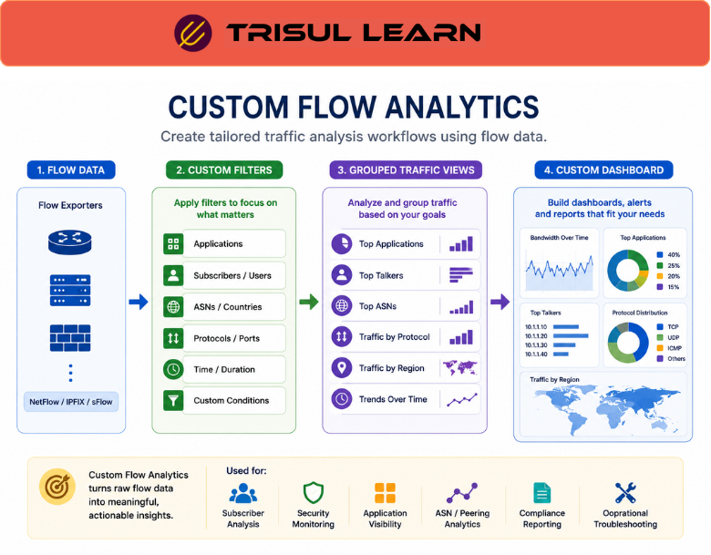

# What is Custom Flow Analytics?

**Custom flow analytics** is the practice of building tailored traffic analysis workflows using flow data such as NetFlow, IPFIX, or sFlow to monitor specific network behaviors, operational metrics, or security conditions.  

Instead of relying only on predefined dashboards or reports, custom flow analytics allows teams to define specialized views, filters, thresholds, alerts, and traffic analysis models based on their own operational requirements.  

Custom flow analytics is widely used in **[Traffic Investigation](/glossary/traffic-investigation)**, **[Bandwidth Monitoring](/glossary/bandwidth-monitoring)**, and **[Network Security Monitoring](/glossary/network-security-monitoring-nsm)** workflows.

## **How Custom Flow Analytics Works**

Flow exporters (routers, switches, firewalls, and probes) generate traffic metadata containing details such as:
- source and destination IP addresses  
- protocols  
- ports  
- bandwidth usage  
- packet counts  
- session duration  
- application‑or‑port‑based information  

Custom analytics platforms process this data using:
- custom filters and search criteria  
- traffic grouping rules (by IP, ASN, application, subscriber, interface, etc.)  
- thresholds and alerting rules  
- behavioral and time‑series analysis  
- visualization workflows  
- query‑based investigation  

For example:

1. A network team collects NetFlow records from key edge routers.  
2. Traffic is filtered for specific applications, subscribers, or IP ranges.  
3. Custom dashboards and alerts are created for operational KPIs.  
4. Teams analyze traffic behavior over time based on their own SLAs and monitoring goals.  

Custom flow analytics may focus on:
- applications or services  
- ASNs and peering paths  
- interfaces and capacity segments  
- subscribers or user groups  
- protocols and ports  
- regions or POPs  
- traffic direction (ingress vs egress)  
- security‑relevant behavior (scanning, unusual flows, protocol abuse)  

*Figure: Custom flow analytics using flow data to build targeted dashboards and alerts for specific network segments and operational goals.*

## **Why Custom Flow Analytics Matters**

Every network environment has different visibility requirements.

Standard, one‑size‑fit‑all dashboards may not fully address:
- ISP‑scale traffic analysis  
- granular subscriber monitoring  
- security investigations  
- compliance or internal reporting  
- peering and inter‑AS visibility  
- application‑specific troubleshooting  

Custom flow analytics helps teams:
- create targeted visibility workflows for specific segments or services  
- improve troubleshooting and incident‑response turnaround  
- detect operational anomalies and traffic‑spike patterns  
- optimize reporting and audit‑ready views  
- analyze unique traffic behaviors (for example, enterprise‑SaaS, CDNs, or cloud‑migration phases)  
- improve monitoring flexibility without changing the underlying data source  

It is especially useful in:
- ISPs and national/backbone operators  
- enterprise SOC environments  
- multi‑tenant and wholesale infrastructures  
- cloud and hybrid‑cloud environments  
- large‑scale, traffic‑heavy monitoring deployments  

## **Common Operational Use Cases**

### Subscriber Traffic Analytics

Analyze traffic behavior for specific users, subscriber groups, or service tiers to support capacity planning, quality‑of‑service, and churn‑analysis workflows.

### Security Monitoring

Create custom views and alerts for suspicious protocols, scanning behavior, unusual outbound flows, or protocol‑mix anomalies that may indicate threats or policy violations.

### Application Visibility

Monitor traffic generated by specific applications or services (for example, SaaS, video, or legacy enterprise apps) across branches, data centers, or cloud regions.

### BGP and ASN Analytics

Track traffic exchanged between peering networks and ASNs, and correlate it with flow‑level metrics for capacity and peering‑agreement validation.

### Compliance Reporting

Generate customized reports tied to operational SLAs, internal policies, or regulatory requirements (for example, detailed traffic‑by‑ASN or subscriber‑group summaries).

## **Custom Flow Analytics vs Standard Flow Reporting**

| Feature | Custom Flow Analytics | Standard Flow Reporting |
|---|---|---|
| Flexibility | High | Limited |
| Custom Filtering | Extensive, per‑field and per‑time‑window | Basic, mostly fixed filters |
| Operational Adaptability | Strong; can evolve with new use cases | Fixed workflows and view templates |
| Visualization Control | Advanced; custom dashboards, charts, and tables | Predefined dashboards and views |
| Specialized Monitoring | Supported (ISP, SOC, compliance, custom segments) | Limited to generic summaries |

Custom flow analytics provides deeper operational flexibility and adaptability compared to static, preconfigured reporting systems.

## **How Trisul Handles Custom Flow Analytics**

Trisul provides flexible traffic analytics and customizable monitoring workflows for analyzing complex, high‑scale network environments.  

Using features such as:
- Top-K Analyticsᵀ  
- Flow Taggerᵀ  
- Multigraph Analyticsᵀ  
- Retro Analysisᵀ  
- Custom Counter Groupsᵀ  
- Long‑Term Traffic Retention  

Trisul helps teams:
- build custom traffic dashboards tailored to specific segments (for example, subscriber‑groups, ASNs, or application‑types)  
- analyze subscriber behavior and traffic‑fairness or policy‑compliance patterns  
- investigate protocol‑level and app‑level traffic anomalies over time  
- monitor ASN‑ and peering‑related traffic without changing flow sources  
- create reusable traffic filters, tags, and analytical workflows  
- visualize operational traffic trends through custom charts and time‑series views  

Trisul can also correlate **[NetFlow](/glossary/netflow)**, **[IPFIX](/glossary/ipfix)**, and **[Packet Capture](/glossary/packet-capture)** workflows for deeper traffic analysis and retro‑analysis when needed.

## **Related Terms**

- [Flow Analysis](/glossary/flow-analysis)  
- [Traffic Investigation](/glossary/traffic-investigation)  
- [NetFlow](/glossary/netflow)  
- [IPFIX](/glossary/ipfix)  
- [Bandwidth Monitoring](/glossary/bandwidth-monitoring)  
- [Top-K Analytics](/glossary/top-k-analytics)  

---

## **FAQ**

### What is custom flow analytics?

Custom flow analytics is the practice of creating tailored traffic analysis workflows using NetFlow, IPFIX, or other flow data sources and tools to monitor specific operational, security, or business requirements.

### Why is custom flow analytics important?

It provides flexible, context‑aware visibility into traffic behavior, operational metrics, security activity, and application usage, beyond what generic, prebuilt dashboards offer.

### What data is used in custom flow analytics?

Common data sources include NetFlow, IPFIX, sFlow, packet‑metadata logs, protocol‑decoded information, and derived traffic statistics.

### Who uses custom flow analytics?

ISPs, large enterprises, SOC teams, cloud operators, and network engineering teams commonly use custom flow analytics to monitor traffic patterns, capacity, and security‑relevant behavior.

### Can custom flow analytics help with security monitoring?

Yes. Teams can define custom workflows for anomaly detection, suspicious traffic analysis, and threat‑investigation scenarios, such as scanning patterns, unusual protocol usage, or abnormal outbound traffic.

### What's the difference between standard reporting and custom analytics?

Standard reporting relies on predefined dashboards and static views, while custom analytics allows flexible, query‑driven filtering, dynamic visualization, and operationally tailored analysis for specific segments and use cases.