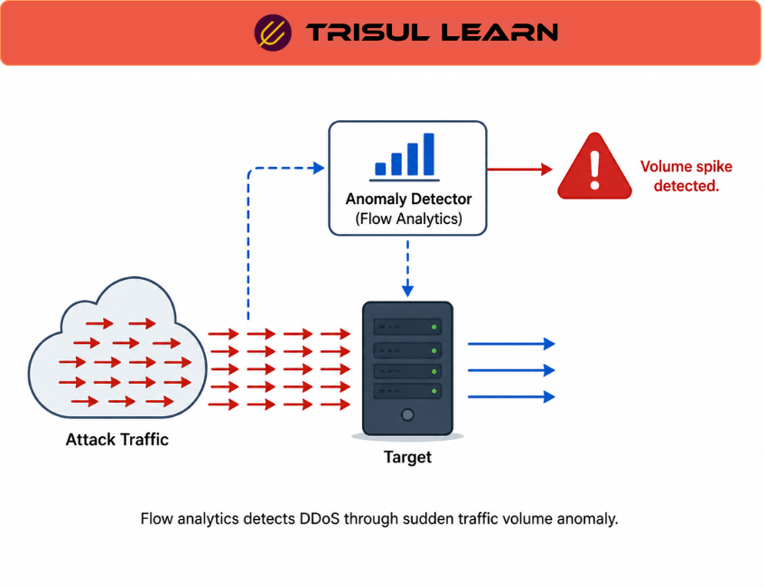

export const jsonLd = {
  "@context": "https://schema.org",
  "@type": "FAQPage",
  "mainEntity": [
    {
      "@type": "Question",
      "name": "What are the indicators of a DDoS attack?",
      "acceptedAnswer": {
        "@type": "Answer",
        "text": "Indicators include a single IP or range making excessive consecutive requests, heavy traffic from a single geographical location, unusual traffic patterns persisting for minutes or hours, service returning 500 Internal Server Error or 503 Server Unavailable messages, alerts about bandwidth/memory/CPU issues, packet TTLs expiring due to bandwidth consumption, and massive spikes in SYN packets without corresponding ACK packets indicating SYN flooding."
      }
    },
    {
      "@type": "Question",
      "name": "How does flow-based DDoS detection work?",
      "acceptedAnswer": {
        "@type": "Answer",
        "text": "Flow-based detection passively analyzes flow data from NetFlow, J-Flow, sFlow, and IPFIX-enabled routers. It monitors traffic volume, top talkers, source/destination distribution, and protocol breakdown. When thresholds are exceeded or anomalies are detected, alerts are triggered. Flow-based detection scales to hypervolumetric attacks that overwhelm inline tools but cannot automatically adjust protection configurations."
      }
    },
    {
      "@type": "Question",
      "name": "What is the difference between inline and out-of-band DDoS detection?",
      "acceptedAnswer": {
        "@type": "Answer",
        "text": "Inline packet inspection tools sit in front of infrastructure and monitor all traffic, can automatically adjust protection configurations, but are easily overwhelmed by hypervolumetric attacks and cause increased latency. Out-of-band tools passively analyze flow data, scale to massive attacks, and avoid false positives but cannot automatically adjust protection and must trigger mitigation via routing to a centralized cleansing station."
      }
    },
    {
      "@type": "Question",
      "name": "What types of DDoS attacks can be detected?",
      "acceptedAnswer": {
        "@type": "Answer",
        "text": "Detections include volumetric attacks like UDP floods and ICMP floods, protocol attacks like SYN floods and fragmented packet attacks, and application-layer attacks like HTTP floods and DNS amplification. SYN flooding is detected by a large number of SYN packets with no corresponding ACK packets. DNS amplification is detected by high volumes of DNS queries from spoofed sources."
      }
    }
  ]
};

# What is DDoS detection?

DDoS detection identifies distributed denial-of-service attacks by monitoring traffic patterns, volume anomalies, and behavioral indicators. DDoS attacks flood targets with malicious traffic from many sources, overwhelming bandwidth or resources. Detection is critical for rapid mitigation. Two primary methods are inline packet inspection and out-of-band flow analysis. Flow-based detection scales to hypervolumetric attacks that overwhelm inline tools.

---

## What DDoS detection examines

Detection examines traffic volume anomalies, top talkers, source/destination distribution, and protocol breakdown. It monitors for excessive consecutive requests from single IPs or ranges, heavy traffic from single geographical locations, unusual traffic patterns persisting over minutes or hours, and service errors like 500 Internal Server Error or 503 Server Unavailable.

SYN flooding is detected by a large number of SYN packets with no corresponding ACK packets. DNS amplification is detected by high DNS query volumes from spoofed sources. Application-layer attacks are detected by HTTP request patterns and response codes.

---

## DDoS detection in network operations

SOC teams use DDoS detection for threat monitoring and incident response. When an attack is detected, automated alerts trigger mitigation workflows. Flow-based detection identifies attacks at the network edge before they overwhelm internal infrastructure.

NOC teams use DDoS detection for bandwidth monitoring and capacity alerts. Unusual traffic spikes that could indicate attacks are distinguished from legitimate traffic surges. DDoS detection helps operators determine whether an outage is due to heavier-than-normal legitimate traffic or malicious flood traffic.

ISPs use DDoS detection for upstream protection and customer notification. Attack traffic is identified at the network edge, and mitigation is triggered via routing to centralized cleansing stations.

---

## Inline vs out-of-band DDoS detection

| Dimension | Inline detection | Out-of-band detection |
|---|---|---|
| Deployment | In front of infrastructure | Passive flow analysis |
| Automatic mitigation | Yes, adjusts protection configs | No, triggers via routing |
| Scalability | Easily overwhelmed by hypervolumetric | Scales to massive attacks |
| Latency impact | Increased latency from inspection | No latency impact |
| False positives | Higher risk | Lower risk |
| Best fit | Small to medium attacks | Large-scale, hypervolumetric |

Inline and out-of-band detection are complementary. Inline provides automatic mitigation for smaller attacks; out-of-band provides scalable detection for large attacks that would overwhelm inline systems.

---

## How Trisul handles DDoS detection

Trisul provides DDoS detection through flow monitoring and anomaly detection. It monitors traffic volume, top talkers, and protocol distribution across interfaces and hosts. Trisul's flow analytics identify unusual traffic patterns that could indicate attacks, such as sudden spikes in traffic volume, high volumes of traffic from single sources, and SYN flood patterns.

Trisul's Trigger-based alerting allows operators to set fixed limits for specific metrics like bandwidth utilization or connection counts. Flow Tracker monitors per-flow conditions as traffic flows. When an attack is detected, Trisul can identify the top talkers, source distribution, and affected interfaces. For full DDoS mitigation, Trisul should be paired with dedicated DDoS mitigation appliances or scrubbing services. Full flow analysis documentation is at https://docs.trisul.org/docs/ug/flow/.

---

## Related terms

- [What is flow monitoring?](/glossary/flow-monitoring)
- [What is flow analysis?](/glossary/flow-analysis)
- [What is anomaly detection?](/glossary/anomaly-detection)
- [What is SYN flood?](/glossary/syn-flood)
- [What is network security monitoring?](/glossary/network-security-monitoring)
- [What is Top-K analytics?](/glossary/top-k-analytics)

---

## Frequently asked questions

### What are the indicators of a DDoS attack?

Indicators include a single IP or range making excessive consecutive requests, heavy traffic from a single geographical location, unusual traffic patterns persisting for minutes or hours, service returning 500 Internal Server Error or 503 Server Unavailable messages, alerts about bandwidth/memory/CPU issues, packet TTLs expiring due to bandwidth consumption, and massive spikes in SYN packets without corresponding ACK packets indicating SYN flooding.

### How does flow-based DDoS detection work?

Flow-based detection passively analyzes flow data from NetFlow, J-Flow, sFlow, and IPFIX-enabled routers. It monitors traffic volume, top talkers, source/destination distribution, and protocol breakdown. When thresholds are exceeded or anomalies are detected, alerts are triggered. Flow-based detection scales to hypervolumetric attacks that overwhelm inline tools but cannot automatically adjust protection configurations.

### What is the difference between inline and out-of-band DDoS detection?

Inline packet inspection tools sit in front of infrastructure and monitor all traffic, can automatically adjust protection configurations, but are easily overwhelmed by hypervolumetric attacks and cause increased latency. Out-of-band tools passively analyze flow data, scale to massive attacks, and avoid false positives but cannot automatically adjust protection and must trigger mitigation via routing to a centralized clearing station.

### What types of DDoS attacks can be detected?

Detections include volumetric attacks like UDP floods and ICMP floods, protocol attacks like SYN floods and fragmented packet attacks, and application-layer attacks like HTTP floods and DNS amplification. SYN flooding is detected by a large number of SYN packets with no corresponding ACK packets. DNS amplification is detected by high volumes of DNS queries from spoofed sources.