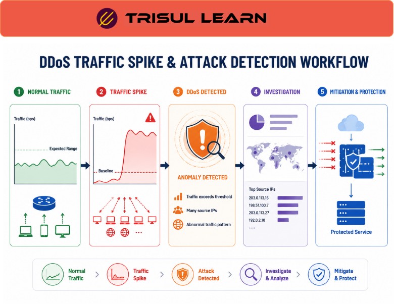

# What is DDoS Detection?

**DDoS detection** is the process of identifying Distributed Denial‑of‑Service (DDoS) attacks by monitoring abnormal traffic patterns, traffic floods, and unusual network behavior.  

DDoS attacks attempt to overwhelm servers, applications, or network infrastructure with large volumes of traffic, causing performance degradation, latency, or service unavailability.  

DDoS detection helps network and security teams identify such attacks quickly and trigger response or mitigation workflows before services become severely impacted.

## **How DDoS Detection Works**

DDoS detection systems continuously monitor network traffic and compare current behavior against expected traffic patterns, baselines, or thresholds.  

These systems analyze:
- bandwidth usage and capacity utilization  
- packet and connection‑rate metrics  
- protocol behavior (floods of specific protocols or states)  
- traffic distribution (by destination, interface, or application)  
- source IP and subnet activity  
- geographic and ASN‑level traffic patterns  
- flow‑level anomalies (for example, unusually long sessions or unexpected protocol mixes)  

When traffic deviates significantly from normal patterns or exceeds configured thresholds, the system generates alerts or triggers further investigation.  

For example:

1. A sudden traffic spike targets a public‑facing service.  
2. Packet rates increase far beyond normal levels.  
3. Thousands of source IPs begin sending requests simultaneously.  
4. The monitoring system flags the activity as a potential DDoS attack.  

*Figure: DDoS detection workflow showing how abnormal traffic patterns are identified and flagged for further investigation.*

## **Why DDoS Detection Matters**

DDoS attacks can:
- disrupt or degrade business services  
- overload network infrastructure and upstream links  
- increase latency and jitter  
- saturate bandwidth  
- reduce application availability  
- negatively impact user or customer experience  

Early detection helps organizations:
- reduce downtime and blast‑radius  
- improve incident‑response speed  
- trigger mitigation systems faster  
- protect critical services and applications  
- maintain network stability during traffic surges  
- investigate attack characteristics for future tuning  

DDoS detection is especially important in:
- ISPs and backbone networks  
- cloud environments and hosted services  
- enterprise networks with public‑facing infrastructure  
- hosting and colocation providers  
- financial and government services  
- public‑facing e‑commerce and media platforms  

## **Types of DDoS Attacks**

### Volumetric Attacks

Overwhelm capacity using massive traffic floods (for example, UDP or ICMP floods) that saturate bandwidth or upstream links.

### Protocol Attacks

Exploit weaknesses in network or transport‑layer protocols or infrastructure devices (for example, SYN floods, fragmented‑packet floods).

### Application‑Layer Attacks

Target specific applications or services using Layer 7 requests (for example, HTTP‑level request floods or slow‑loris‑style attacks).

### Reflection and Amplification Attacks

Use third‑party systems (DNS, NTP, etc.) to amplify attack traffic volume and obscure the real source.

## **Common Operational Use Cases**

### Traffic Flood Detection

Identify sudden spikes in bandwidth, packet rates, or connection‑rate metrics on key interfaces or services.

### Attack Investigation

Analyze attack sources, protocols, and traffic behavior to understand attack vectors and support upstream‑provider coordination.

### ISP Backbone Monitoring

Detect large‑scale attacks affecting subscriber or upstream traffic, including peering‑link overloads and major traffic anomalies.

### Security Operations

Monitor suspicious inbound and outbound traffic behavior for early indicators of amplification targets or botnet‑driven floods.

### Mitigation Triggering

Activate local rate‑limiting, filtering, or upstream DDoS‑mitigation services based on detection signals.

## **DDoS Detection vs DDoS Mitigation**

| Feature | DDoS Detection | DDoS Mitigation |
|---|---|---|
| Primary Goal | Identify and alert on attacks | Block, drop, or scrub attack traffic |
| Focus | Monitoring and visibility | Traffic filtering and protection |
| Traffic Analysis | Extensive, diagnostic | Operational, often automated |
| Alerting | Core component | Optional or embedded |
| Attack Response | Investigative and reactive | Preventive and corrective |

DDoS detection identifies attacks and provides visibility; DDoS mitigation actively reduces or blocks malicious traffic using filtering, scrubbing, or rate‑limiting mechanisms.

## **How Trisul Handles DDoS Detection**

Trisul provides real‑time traffic visibility and behavioral analytics that can help identify abnormal traffic floods and DDoS‑style attack patterns.  

Using features such as:
- Top‑K Analyticsᵀ  
- Multigraph Analyticsᵀ  
- Retro Analysisᵀ  
- Flow Taggerᵀ  
- Long‑Term Traffic Retention  
- Badfellasᵀ  

Trisul helps teams:
- detect traffic floods and bandwidth‑spike patterns  
- identify top‑speaking attack sources and target destinations  
- analyze attack patterns over time and across interfaces  
- monitor protocol‑ and application‑level anomalies  
- investigate protocol‑abuse scenarios (for example, unusual TCP/UDP behavior)  
- visualize attack‑traffic distribution and volume trends over time  

Trisul can also correlate **[NetFlow](/glossary/netflow)**, **[Packet Capture](/glossary/packet-capture)**, and **[Anomaly Detection](/glossary/anomaly-detection)** workflows for deeper DDoS investigation and long‑term analysis.

## **Related Terms**

- [Anomaly Detection](/glossary/anomaly-detection)  
- [Bandwidth Monitoring](/glossary/bandwidth-monitoring)  
- [Traffic Investigation](/glossary/traffic-investigation)  
- [Flow Analysis](/glossary/flow-analysis)  
- [Packet Capture](/glossary/packet-capture)  
- [Badfellasᵀ](/glossary/badfellas)

---

## **FAQ**

### What is DDoS detection?

DDoS detection is the process of identifying distributed denial‑of‑service attacks by analyzing traffic volumes, packet rates, and behavioral anomalies that deviate from normal patterns.

### Why is DDoS detection important?

It helps organizations detect attacks early, minimize service disruption, reduce downtime, and initiate mitigation or upstream‑provider coordination faster.

### How are DDoS attacks detected?

Detection systems analyze bandwidth usage, packet and connection rates, traffic distribution, protocol behavior, and anomalies to identify suspicious patterns that may indicate DDoS activity.

### What's the difference between DDoS detection and mitigation?

DDoS detection identifies attacks and generates visibility and alerts, while DDoS mitigation actively blocks, filters, or scrubs malicious traffic to protect services.

### Can NetFlow help detect DDoS attacks?

Yes. NetFlow and IPFIX are commonly used to detect abnormal traffic spikes, high‑rate flows, and unusual source‑to‑destination patterns that may indicate DDoS behavior.

### Is DDoS detection useful for ISPs?

Yes. ISPs use DDoS detection to monitor backbone and peering traffic, protect infrastructure, and investigate large‑scale attacks affecting subscriber or upstream traffic.