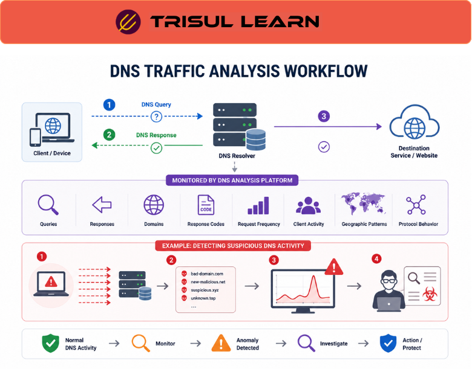

# What is DNS Traffic Analysis?

DNS Traffic Analysis is the process of monitoring and analyzing Domain Name System (DNS) traffic to understand domain activity, troubleshoot network issues, and detect suspicious communication patterns.

Because most internet communication begins with a DNS lookup, DNS traffic provides valuable visibility into user behavior, application activity, and potential security threats.

DNS traffic analysis is widely used in [Traffic Investigation](/glossary/traffic-investigation), [Anomaly Detection](/glossary/anomaly-detection), and [Network Security Monitoring](/glossary/network-security-monitoring-nsm) workflows.

## **How DNS Traffic Analysis Works**

When a user or application attempts to access a website or service:

1. A DNS request is sent to resolve a domain name
2. The DNS server responds with an IP address
3. The client connects to the destination service

DNS analysis platforms monitor:
- DNS queries
- DNS responses
- queried domains
- response codes
- request frequency
- client activity
- geographic patterns
- protocol behavior

For example:

1. A device begins generating thousands of DNS queries
2. Requests target suspicious or newly created domains
3. The monitoring platform identifies abnormal behavior
4. Analysts investigate the traffic for possible malware activity

## **Why DNS Traffic Analysis Matters**

DNS traffic often reveals network activity before other traffic analysis methods detect issues.

DNS visibility helps teams:
- identify malicious domains
- detect malware communication
- troubleshoot resolution failures
- analyze application behavior
- investigate suspicious outbound traffic
- monitor user activity patterns

It improves visibility into:
- command-and-control communication
- DNS tunneling
- phishing domains
- malware callbacks
- domain reputation
- application connectivity issues

DNS analysis is especially important in:
- SOC operations
- enterprise networks
- ISP environments
- cloud infrastructures
- threat hunting workflows

## **Types of DNS Analysis**

### Query Analysis

Monitor requested domains and query frequency.

### Response Analysis

Analyze DNS response behavior and returned IP addresses.

### DNS Security Analysis

Detect suspicious domains, malware activity, and DNS abuse.

### Behavioral DNS Analysis

Identify unusual DNS communication patterns or anomalies.

### DNS Performance Monitoring

Monitor DNS latency, failures, and resolution issues.

## **Common Operational Use Cases**

### Malware Detection

Identify suspicious domains and command-and-control communication.

### DNS Tunneling Detection

Detect hidden data transfer through DNS queries.

### Troubleshooting DNS Failures

Analyze failed lookups and response issues.

### Application Visibility

Understand which services and domains applications communicate with.

### Threat Hunting

Investigate suspicious outbound traffic and domain activity.

## **DNS Traffic Analysis vs General Traffic Monitoring**

| Feature | DNS Traffic Analysis | General Traffic Monitoring |
|---|---|---|
| Primary Focus | DNS communication | Overall network traffic |
| Visibility Type | Domain and query behavior | Traffic flows and bandwidth |
| Security Relevance | Very high | Broad |
| Operational Context | Domain-level visibility | Network-wide visibility |
| Common Data Sources | DNS packets and logs | Flow records and packet data |

DNS traffic analysis provides domain-level visibility that complements broader network monitoring workflows.

## **How Trisul Handles DNS Traffic Analysis**

Trisul provides DNS-aware traffic visibility using packet analysis, flow analytics, and behavioral monitoring workflows.

Combined with:
- Packet Capture
- Flow Analysis
- Top-K Analyticsᵀ
- Retro Analysisᵀ
- Badfellasᵀ
- Multigraph Analyticsᵀ

Trisul helps teams:
- analyze DNS query behavior
- identify suspicious domains
- investigate DNS anomalies
- monitor outbound DNS activity
- troubleshoot resolution failures
- detect abnormal DNS traffic patterns

Trisul can also correlate [Packet Capture](/glossary/packet-capture), [Flow Analysis](/glossary/flow-analysis), and [Anomaly Detection](/glossary/anomaly-detection) workflows for deeper DNS investigation.

## **Related Terms**

- [Packet Capture](/glossary/packet-capture)
- [Flow Analysis](/glossary/flow-analysis)
- [Anomaly Detection](/glossary/anomaly-detection)
- [Traffic Investigation](/glossary/traffic-investigation)
- [Application Visibility](/glossary/application-visibility)
- [Network Security Monitoring](/glossary/network-security-monitoring-nsm)

---

## **FAQ**

### What is DNS traffic analysis?

DNS traffic analysis is the process of monitoring and analyzing DNS queries and responses to understand network activity and detect suspicious behavior.

### Why is DNS traffic analysis important?

It helps identify malware communication, DNS abuse, application behavior, and network troubleshooting issues.

### What can DNS analysis detect?

DNS analysis can detect suspicious domains, DNS tunneling, malware callbacks, phishing activity, and abnormal query behavior.

### How is DNS traffic monitored?

DNS traffic is commonly analyzed using packet capture, DNS logs, flow analytics, and behavioral monitoring systems.

### Is DNS traffic analysis useful for security monitoring?

Yes. DNS traffic often reveals malicious communication before other network indicators become visible.

### Can DNS traffic analysis help troubleshoot applications?

Yes. It helps identify failed domain lookups, latency issues, and application connectivity problems.