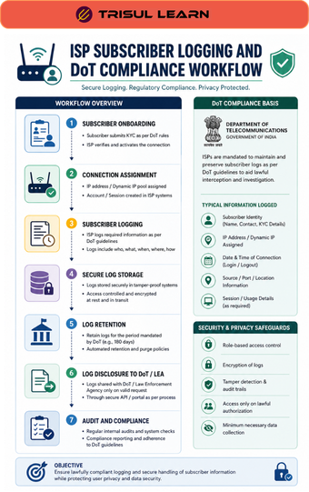

# What is DoT Compliance?

DoT Compliance refers to the regulatory requirements defined by the Department of Telecommunications (DoT) for telecom operators, ISPs, and network service providers to monitor, log, retain, and provide network usage data when required by authorities.

These requirements commonly involve:
- subscriber traceability
- IP address tracking
- NAT logging
- IPDR generation
- traffic retention
- lawful interception support
- security monitoring

DoT compliance is especially important for ISPs, broadband providers, and telecom operators operating in regulated environments.

## **How DoT Compliance Works**

Telecom and internet providers generate large volumes of subscriber and traffic metadata from:
- authentication systems
- CGNAT devices
- routers and firewalls
- DHCP systems
- traffic monitoring platforms
- flow exporters

Compliance systems collect and retain information such as:
- subscriber identity
- assigned IP addresses
- session timestamps
- NAT mappings
- traffic records
- usage logs

A typical workflow looks like this:

1. A subscriber connects to the network
2. IP assignments and traffic activity are recorded
3. NAT mappings and session details are logged
4. Logs are retained according to compliance requirements
5. Authorized queries can retrieve subscriber activity records

## **Why DoT Compliance Matters**

Regulatory compliance helps telecom providers:
- maintain subscriber traceability
- support lawful investigations
- investigate abuse complaints
- meet regulatory obligations
- improve operational accountability
- retain traffic visibility

Without proper logging and retention:
- subscriber attribution becomes difficult
- abuse investigations are delayed
- compliance violations may occur
- lawful requests become harder to fulfill

DoT compliance is especially important in:
- ISPs
- telecom providers
- broadband operators
- CGNAT environments
- large subscriber networks

## **Common Compliance Components**

### IPDR Logging

Maintain Internet Protocol Detail Records for subscriber activity tracking.

### CGNAT Logging

Track private-to-public IP mappings in shared IP environments.

### Subscriber Mapping

Associate network activity with subscriber identities.

### Traffic Retention

Store traffic metadata for defined retention periods.

### Security Monitoring

Monitor suspicious traffic behavior and abuse activity.

## **Common Operational Use Cases**

### Subscriber Traceability

Identify which subscriber used a public IP address at a specific time.

### Abuse Investigation

Investigate spam, malware activity, phishing, or suspicious outbound traffic.

### Regulatory Reporting

Generate records required for compliance and audit purposes.

### Security Operations

Support incident response and lawful investigations.

### ISP Traffic Analytics

Monitor subscriber usage and operational network activity.

## **DoT Compliance vs General Network Monitoring**

| Feature | DoT Compliance | General Network Monitoring |
|---|---|---|
| Primary Goal | Regulatory and subscriber traceability | Performance and visibility |
| Data Retention | Mandatory | Operationally defined |
| Subscriber Mapping | Critical | Optional |
| Compliance Requirement | High | Low |
| Operational Scope | Legal and operational | Mainly technical visibility |

DoT compliance focuses on regulatory accountability, while general monitoring focuses on operational visibility and troubleshooting.

## **How Trisul Helps with DoT Compliance**

Trisul provides scalable traffic analytics and subscriber visibility workflows designed for ISP and telecom compliance environments.

Combined with:
- IPDR generation
- Subscriber Mapping
- NAT Logging
- Long-Term Traffic Retention
- Traffic Investigation
- Flow Analysis

Trisul helps teams:
- maintain subscriber traceability
- investigate abuse complaints
- analyze subscriber traffic activity
- monitor NAT mappings
- generate compliance records
- retain traffic metadata efficiently

Trisul can also correlate [CGNAT Logging](/glossary/cgnat-logging), [NetFlow](/glossary/netflow), and [IPDR](/glossary/ipdr) workflows for deeper compliance visibility.

## **Related Terms**

- [IPDR](/glossary/ipdr)
- [CGNAT Logging](/glossary/cgnat-logging)
- [NAT Logging](/glossary/nat-logging)
- [Subscriber Mapping](/glossary/subscriber-mapping)
- [Traffic Investigation](/glossary/traffic-investigation)
- [ISP Traffic Analytics](/glossary/isp-traffic-analytics)

---

## **FAQ**

### What is DoT Compliance?

DoT Compliance refers to telecom and ISP regulatory requirements related to subscriber logging, traffic retention, and network traceability.

### Why is DoT compliance important for ISPs?

It helps ISPs meet legal obligations, support investigations, and maintain subscriber accountability.

### What data is commonly retained for DoT compliance?

Common records include subscriber identities, IP assignments, NAT logs, timestamps, and IPDR records.

### What is the role of CGNAT logging in DoT compliance?

CGNAT logging helps map shared public IP addresses back to individual subscribers.

### How does IPDR relate to DoT compliance?

IPDR systems help record and analyze subscriber internet usage and session activity for compliance purposes.

### Can traffic analytics platforms help with DoT compliance?

Yes. Traffic analytics platforms help collect, retain, analyze, and investigate subscriber traffic and network activity.