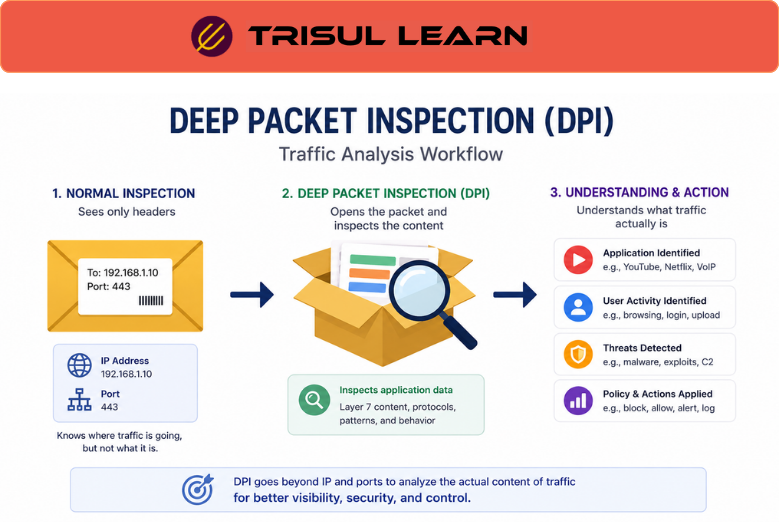

# What is Deep Packet Inspection (DPI)?

Deep Packet Inspection (DPI) is a traffic analysis technique that examines the contents and metadata of network packets beyond basic header information.

Unlike traditional traffic monitoring that only analyzes IP addresses and ports, DPI inspects packet payloads and application-layer data to identify applications, protocols, user activity, and suspicious behavior.

DPI is widely used in [Application Visibility](/glossary/application-visibility), [Traffic Investigation](/glossary/traffic-investigation), and [Network Security Monitoring](/glossary/network-security-monitoring-nsm) workflows.

## **How Deep Packet Inspection Works**

Network packets contain:
- headers
- protocol information
- payload data
- application-layer content

DPI systems inspect packets at deeper protocol layers to identify:
- applications
- protocols
- traffic behavior
- content patterns
- anomalies
- policy violations

A typical DPI workflow looks like this:

1. Traffic packets are captured or mirrored
2. The DPI engine analyzes packet contents
3. Protocols and applications are identified
4. Traffic is classified and analyzed
5. Policies, alerts, or analytics are applied

DPI can identify:
- web traffic
- streaming applications
- VoIP traffic
- encrypted sessions
- malware communication
- suspicious payload behavior

## **Why DPI Matters**

Basic traffic monitoring often cannot identify which applications or services generate network traffic.

DPI improves visibility into:
- application behavior
- protocol usage
- user activity
- encrypted traffic patterns
- suspicious communication
- policy violations

It helps organizations:
- troubleshoot application issues
- optimize bandwidth usage
- enforce network policies
- detect malicious traffic
- improve security visibility
- analyze Layer 7 behavior

DPI is especially important in:
- enterprise networks
- ISP infrastructures
- SOC environments
- cloud deployments
- application-aware monitoring systems

## **Types of DPI Analysis**

### Application Identification

Detect applications based on packet behavior and protocol signatures.

### Protocol Analysis

Inspect traffic at Layer 7 to identify protocol activity.

### Security Inspection

Detect malware communication, suspicious payloads, or exploit attempts.

### Policy Enforcement

Apply traffic filtering or prioritization based on application behavior.

### Behavioral Analysis

Analyze communication patterns and traffic anomalies.

## **Common Operational Use Cases**

### Application Visibility

Identify bandwidth-heavy applications and services.

### Security Monitoring

Detect malicious traffic, scanning behavior, or suspicious communication.

### QoS Optimization

Prioritize critical applications using Layer 7 awareness.

### ISP Traffic Analytics

Analyze subscriber application usage patterns.

### Traffic Troubleshooting

Investigate protocol issues and abnormal application behavior.

## **DPI vs Flow Analysis**

| Feature | DPI | Flow Analysis |
|---|---|---|
| Visibility Level | Packet and application-level | Flow metadata |
| Payload Inspection | Yes | No |
| Application Awareness | High | Moderate |
| Resource Usage | Higher | Lower |
| Traffic Context | Deep | Broad |

DPI provides deeper application visibility, while flow analysis provides scalable traffic-wide visibility.

## **How Trisul Handles DPI Workflows**

Trisul combines packet analysis and flow analytics to improve Layer 7 visibility and operational traffic analysis.

Combined with:
- Packet Capture
- Flow Analysis
- Application Visibility
- Top-K Analyticsᵀ
- Retro Analysisᵀ
- Multigraph Analyticsᵀ

Trisul helps teams:
- analyze application traffic
- investigate suspicious communication
- troubleshoot protocol issues
- monitor Layer 7 behavior
- correlate packet and flow visibility
- investigate traffic anomalies

Trisul can also correlate [Packet Capture](/glossary/packet-capture), [NetFlow](/glossary/netflow), and [Application Visibility](/glossary/application-visibility) workflows for deeper traffic investigation.

## **Related Terms**

- [Packet Capture](/glossary/packet-capture)
- [Application Visibility](/glossary/application-visibility)
- [Flow Analysis](/glossary/flow-analysis)
- [Traffic Investigation](/glossary/traffic-investigation)
- [Layer 7 Visibility](/glossary/layer-7-visibility)
- [Network Security Monitoring](/glossary/network-security-monitoring-nsm)

---

## **FAQ**

### What is Deep Packet Inspection?

Deep Packet Inspection (DPI) is a method of analyzing packet contents and application-layer traffic behavior.

### Why is DPI important?

DPI improves application visibility, security monitoring, and Layer 7 traffic analysis.

### What can DPI detect?

DPI can identify applications, protocols, malware communication, suspicious payloads, and abnormal traffic behavior.

### What's the difference between DPI and flow analysis?

DPI inspects packet contents, while flow analysis focuses mainly on traffic metadata and communication patterns.

### Does DPI work with encrypted traffic?

DPI has limited visibility into encrypted payloads, but it can still analyze metadata, traffic behavior, and protocol characteristics.

### Is DPI resource intensive?

Yes. DPI requires more processing power and storage than traditional flow-based monitoring.