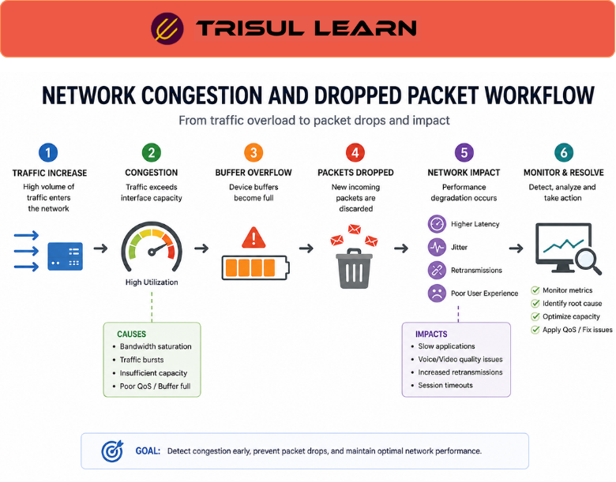

# What are Dropped Packets?

**Dropped packets** are network packets that fail to reach their intended destination because they are discarded by network devices such as routers, switches, firewalls, or servers.  

Packet drops can occur due to congestion, overloaded interfaces, hardware limitations, misconfigurations, or security filtering.  

Monitoring dropped packets helps network teams identify performance problems, congestion, and abnormal network behavior.

## **How Packet Drops Happen**

Network devices continuously process large volumes of traffic and must queue, forward, or filter each packet.

When a device cannot process or forward packets successfully, they may be discarded.  

Common causes include:
- interface congestion or bandwidth saturation  
- full or overflowing packet buffers  
- firewall or ACL filtering (intentional drops)  
- malformed or invalid packets  
- routing‑related issues (blackholes, flaps, policy‑driven drops)  
- hardware limitations (line‑rate mismatch, CPU saturation)  
- QoS or traffic‑shaping policies that drop low‑priority traffic  

For example:

1. Traffic volume exceeds the outgoing interface capacity.  
2. Device output queues become full.  
3. New incoming packets cannot be queued.  
4. Excess packets are dropped before transmission.  

Packet drops may occur:
- temporarily during traffic bursts  
- continuously during sustained congestion  
- intentionally as part of filtering or shaping policies  

*Figure: Dropped packets workflow showing how interface congestion and buffer overflow cause packets to be discarded.*

## **Why Dropped Packets Matter**

Packet drops can significantly affect network performance and application behavior.  

Dropped packets may cause:
- slow application response and transaction timeouts  
- poor voice and video quality (audio cuts, pixelation, jitter)  
- TCP retransmissions and reduced effective throughput  
- increased latency and round‑trip times  
- session instability or connection resets  
- intermittent service interruptions  

Monitoring packet drops helps teams:
- identify congestion points and choke links  
- troubleshoot performance and latency issues  
- optimize bandwidth allocation and QoS policies  
- detect overloaded or misconfigured devices  
- investigate abnormal traffic patterns that may indicate DDoS or misbehaving services  

Packet loss visibility is especially important in:
- VoIP and unified‑communications networks  
- video‑conferencing and streaming environments  
- ISP backbone and peering links  
- cloud and data‑center fabrics  
- real‑time and low‑latency applications  
- high‑speed and high‑density traffic networks  

## **Common Causes of Dropped Packets**

### Network Congestion

Traffic exceeds available bandwidth or interface capacity, forcing devices to drop packets at egress or ingress queues.

### Buffer Overflow

Device queues become full during traffic bursts or sustained high‑rate flows, causing new packets to be dropped.

### Firewall Filtering

Security policies (ACLs, firewall rules, or IDS/IPS) intentionally drop certain traffic that matches filtering or blocking rules.

### Hardware Limitations

Routers, switches, or NICs cannot process traffic at line rate due to CPU, memory, or ASIC limitations.

### QoS Enforcement

Queuing and shaping mechanisms drop low‑priority or unmarked traffic during congestion to protect high‑priority services.

### Routing Problems

Incorrect routes, blackholes, or unstable routing can cause traffic to be dropped rather than forwarded.

## **Common Operational Use Cases**

### Performance Troubleshooting

Identify congestion points, overloaded links, and misconfigured devices causing packet loss.

### VoIP Quality Monitoring

Analyze packet‑loss patterns affecting voice and video‑conferencing quality and jitter.

### DDoS Analysis

Detect overload conditions and sustained packet‑drop spikes caused by volumetric traffic floods.

### Capacity Planning

Identify interfaces and segments that regularly approach or exceed capacity, indicating need for upgrade or shaping.

### Security Monitoring

Analyze dropped traffic triggered by filtering policies to understand what traffic is being blocked and why.

## **Dropped Packets vs Retransmissions**

| Feature | Dropped Packets | Retransmissions |
|---|---|---|
| Meaning | Packets discarded before delivery | Packets resent after loss or timeout |
| Trigger | Buffer overflow, filtering, or hardware limits | Missing acknowledgments (for example, TCP ACK) |
| Network Impact | Packet loss and reduced throughput | Increased traffic and overhead |
| Detection Point | Network devices and interfaces | End systems and transport‑layer protocols |
| Common Cause | Congestion, filtering, hardware limits | Packet drops and high latency |

Dropped packets often trigger retransmissions in protocols such as TCP, leading to higher overhead and reduced effective throughput.

## **How Trisul Handles Dropped Packet Analysis**

Trisul provides traffic visibility and performance analytics that can help identify conditions leading to packet loss, congestion, and abnormal traffic behavior.  

Using features such as:
- Packet Capture  
- Flow Analysis  
- Top‑K Analyticsᵀ  
- Retro Analysisᵀ  
- Multigraph Analyticsᵀ  
- Traffic Investigation  

Trisul helps teams:
- analyze traffic‑burst patterns and interface‑level congestion that may correlate with packet‑drop events  
- investigate congestion events and traffic‑spike behavior at the flow and time‑series level  
- identify overloaded or oversubscribed interfaces and segments  
- troubleshoot application‑performance issues that may be influenced by packet‑loss conditions  
- monitor traffic‑burst behavior and saturation patterns that commonly precede drops  
- correlate traffic‑spikes and utilization metrics with flow and session data for deeper performance analysis  

Trisul can also correlate **[Packet Capture](/glossary/packet-capture)**, **[Bandwidth Monitoring](/glossary/bandwidth-monitoring)**, and **[Burst Traffic](/glossary/burst-traffic)** workflows for deeper performance‑ and congestion‑analysis, while remaining aligned with operator‑driven investigation rather than automated packet‑recovery.

## **Related Terms**

- [Packet Loss Monitoring](/glossary/packet-loss-monitoring)  
- [Bandwidth Monitoring](/glossary/bandwidth-monitoring)  
- [Burst Traffic](/glossary/burst-traffic)  
- [Traffic Investigation](/glossary/traffic-investigation)  
- [Packet Capture](/glossary/packet-capture)  
- [Flow Analysis](/glossary/flow-analysis)  

---

## **FAQ**

### What are dropped packets?

Dropped packets are network packets that are discarded by routers, switches, firewalls, or servers before reaching their intended destination.

### What causes packet drops?

Common causes include congestion, overloaded interfaces, buffer overflow, firewall or ACL filtering, malformed packets, hardware limitations, and QoS policies.

### Why are dropped packets important?

Packet drops can degrade application performance, increase latency, cause TCP retransmissions, and affect real‑time services such as VoIP and video conferencing.

### How do dropped packets affect VoIP and video calls?

Packet loss can cause audio distortion, gaps, jitter, one‑way audio, and poor video quality or freezing.

### What's the difference between packet drops and retransmissions?

Packet drops occur when packets are discarded in the network, while retransmissions refer to the sender resending packets that did not arrive or were not acknowledged.

### How are dropped packets detected?

Dropped packets are typically detected by analyzing interface counters, input/output‑dropped statistics, flow‑level patterns, and packet‑capture traces to identify mismatches between expected and received traffic.