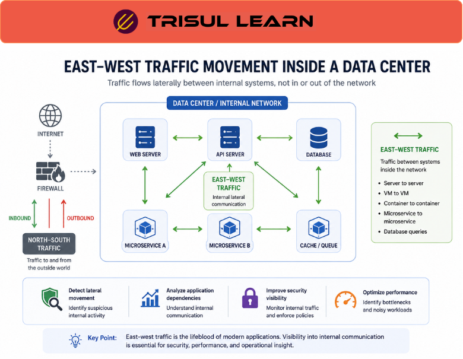

# What is East-West Traffic?

**East‑West traffic** refers to network communication that occurs between systems, servers, applications, or devices inside the same internal network or data center environment.  

Unlike **north‑south traffic**, which moves into and out of the network (for example, client‑to‑server or server‑to‑internet), east‑west traffic moves laterally between internal systems.  

East‑west traffic visibility is important for security monitoring, application‑dependency analysis, and internal‑traffic investigation.

## **How East-West Traffic Works**

Modern applications and infrastructures often rely on multiple internal components that communicate continuously.  

East‑west traffic commonly occurs between:
- application servers and backend services  
- databases and cache or file‑storage systems  
- virtual machines and hypervisors  
- containers and orchestration workloads  
- microservices and APIs  
- internal user desktops and shared services  
- cloud workloads within the same VPC or tenant  

For example:

1. A user accesses a web application at the edge.  
2. The web server communicates with an internal API server.  
3. The API server queries a database server.  
4. Traffic flows laterally between internal systems without leaving the data center.  

This internal communication is classified as east‑west traffic.  

*Figure: East‑west traffic workflow showing how internal systems communicate laterally within a data center or cloud environment.*

## **Why East-West Traffic Matters**

Traditional security monitoring often focused on north‑south traffic entering or leaving the network.  

However, many modern threats move laterally within the environment after initial compromise.  

Monitoring east‑west traffic helps organizations:
- detect lateral movement of attackers across internal systems  
- identify insider‑threat or policy‑violation patterns  
- monitor internal‑application and service‑dependency behavior  
- investigate suspicious internal communication  
- analyze microservice and service‑to‑service interactions  
- validate and verify segmentation and zone‑policies  

East‑west traffic visibility is especially important in:
- data centers and colocation environments  
- cloud and hybrid‑cloud environments  
- virtualized and containerized infrastructures  
- Kubernetes and similar orchestration environments  
- zero‑trust or micro‑segmentation‑based architectures  
- SOC operations focusing on internal‑threat detection  

## **Common Operational Use Cases**

### Lateral Movement Detection

Identify attackers or compromised hosts moving between internal systems after an initial breach.

### Application Dependency Analysis

Monitor communication paths and traffic patterns between application components, tiers, and backends to understand service‑dependency graphs.

### Microservices Visibility

Analyze internal service‑to‑service communication and latency patterns in microservices‑based architectures.

### Internal Traffic Investigation

Investigate suspicious or anomalous communication between internal hosts, segments, or zones.

### Segmentation Monitoring

Validate that traffic‑control policies are enforced between network segments and zones, and detect policy‑bypass or unexpected cross‑segment flows.

## **East-West Traffic vs North-South Traffic**

| Feature | East-West Traffic | North-South Traffic |
|---|---|---|
| Traffic Direction | Internal lateral communication between systems | Inbound and outbound communication across edges |
| Common Environment | Data centers, private clouds, internal networks | Internet‑facing edges and perimeters |
| Visibility Focus | Internal systems, services, and segments | External connectivity and perimeter behavior |
| Security Relevance | Lateral‑movement detection, internal‑threat visibility | Perimeter‑protection and egress‑monitoring |
| Typical Devices | Servers, VMs, containers, internal routers | Firewalls, edge routers, WAFs, gateways |

East‑west traffic focuses on communication **within** a network or zone, while north‑south traffic focuses on traffic **into and out of** the network.

## **How Trisul Handles East-West Traffic Visibility**

Trisul provides deep internal‑traffic visibility using flow analytics, packet analysis, and conversation‑level monitoring workflows.  

Using features such as:
- Flow Stitchingᵀ  
- Conversation View  
- Top‑K Analyticsᵀ  
- Contextᵀ  
- Packet Capture  
- Retro Analysisᵀ  

Trisul helps teams:
- visualize internal communication patterns and host‑to‑host flows  
- analyze lateral traffic movement and service‑dependency graphs  
- investigate suspicious internal sessions and anomalous flows  
- monitor microservice‑ and service‑to‑service communication  
- troubleshoot application‑dependency and latency issues  
- identify anomalous east‑west traffic behavior that may indicate threats or policy violations  

Trisul can also correlate **[Packet Capture](/glossary/packet-capture)**, **[Flow Analysis](/glossary/flow-analysis)**, and **[Conversation View](/glossary/conversation-view)** workflows for deeper internal‑traffic analysis and long‑term investigation.

## **Related Terms**

- [North-South Traffic](/glossary/north-south-traffic)  
- [Conversation View](/glossary/conversation-view)  
- [Flow Analysis](/glossary/flow-analysis)  
- [Traffic Investigation](/glossary/traffic-investigation)  
- [Packet Capture](/glossary/packet-capture)  
- [Network Security Monitoring](/glossary/network-security-monitoring-nsm)  

---

## **FAQ**

### What is east-west traffic?

East‑west traffic is internal network communication between systems, applications, or devices within the same environment, such as inside a data center or cloud tenant.

### Why is east-west traffic important?

It helps organizations monitor internal communication, detect lateral movement of attackers, and improve visibility into application‑dependency and service‑interaction patterns.

### What's the difference between east-west and north-south traffic?

East‑west traffic moves laterally between internal systems, while north‑south traffic moves into or out of the network (for example, client‑to‑server or server‑to‑internet traffic).

### Why is east-west visibility important for security?

Many attackers move laterally inside networks after compromise, so monitoring internal traffic is critical for early‑detection, breach‑containment, and policy‑validation.

### Where is east-west traffic common?

It is common in data centers, cloud environments, virtualized infrastructures, container‑orchestration platforms, and microservices‑based architectures.

### How is east-west traffic monitored?

Monitoring platforms typically use flow analysis, packet capture, protocol‑level analysis, and conversation‑based views to monitor internal communication and detect anomalies.