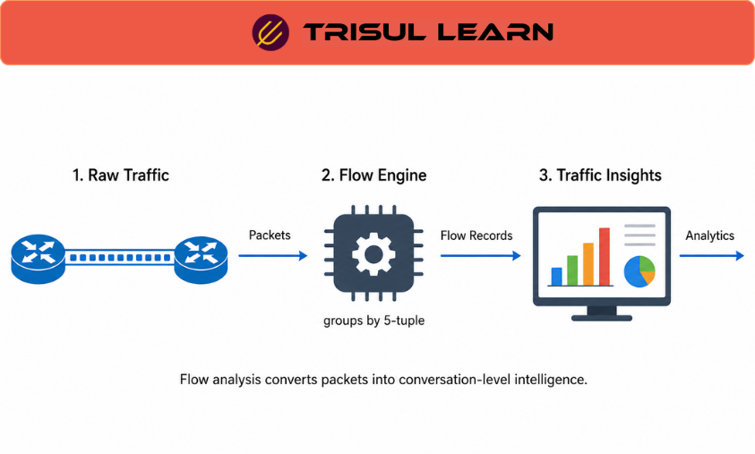

export const jsonLd = {
  "@context": "https://schema.org",
  "@type": "FAQPage",
  "mainEntity": [
    {
      "@type": "Question",
      "name": "What questions can flow analysis answer?",
      "acceptedAnswer": {
        "@type": "Answer",
        "text": "Flow analysis answers who talked to whom, when, how much moved, and over which protocols. It identifies top bandwidth consumers, traffic drivers, and anomalies versus baseline. It cannot reveal payload content: files transferred, commands run, or credentials passed. For payload questions, packet capture is required."
      }
    },
    {
      "@type": "Question",
      "name": "How is flow analysis different from packet analysis?",
      "acceptedAnswer": {
        "@type": "Answer",
        "text": "Flow analysis uses conversation summaries: 5-tuple, counts, timestamps, flags. Packet analysis uses full packet content including payload. Flow analysis scales to weeks or months across a network; packet analysis is limited to hours or days at specific points. Flow analysis suits detection and scoping; packet analysis suits investigation and confirmation."
      }
    },
    {
      "@type": "Question",
      "name": "What use cases does flow analysis support?",
      "acceptedAnswer": {
        "@type": "Answer",
        "text": "Flow analysis supports bandwidth trending, capacity planning, top talker identification, anomaly detection, security investigation, and compliance audit. NOC teams use it for interface saturation and utilization. SOC teams use it for intrusion, lateral movement, and exfiltration analysis. ISPs use it for per-prefix, per-AS, and peering traffic. All are metadata-level questions that do not require payload inspection."
      }
    },
    {
      "@type": "Question",
      "name": "What limits flow analysis accuracy?",
      "acceptedAnswer": {
        "@type": "Answer",
        "text": "Sampling misses short or low-volume flows. Exporter coverage gaps hide flows that do not pass through any NetFlow-enabled device. Collector completeness gaps hide flows that the exporter sent but the collector dropped or failed to process. All three distort the picture of network activity that flow analysis produces."
      }
    }
  ]
};

# What is flow analysis?

Flow analysis examines network flow records to understand traffic patterns, identify top talkers, detect anomalies, and investigate security or performance issues. It works entirely from metadata: the 5-tuple, byte and packet counts, timestamps, and flags. Flow analysis does not inspect payloads. That constraint is also its advantage: it covers an entire network for weeks or months, making it the primary visibility mechanism for trending, detection, and preliminary investigation.

---

## What flow analysis examines

Analysis uses conversation metadata across time and topology. Analysts query for specific hosts, interfaces, time windows, or protocols and aggregate results to identify patterns: which hosts consume the most bandwidth, which applications drive traffic, and whether traffic to a destination is anomalous.

Flow tags expand analysis by grouping traffic by business context: country, ASN, application, or threat category. Instead of querying by raw IP, operators query by tag.

Time-based analysis is central. Traffic trends over days or weeks reveal capacity issues and baseline shifts invisible in single snapshots. Backward investigation from a known indicator relies on the flow database retention window.

---

## Flow analysis in network operations

NOC teams use flow analysis for bandwidth trending and capacity planning. Per-interface traffic over time identifies links approaching saturation and the hosts or applications responsible.

SOC teams use it for detection and scoping. When a host is compromised, flow analysis maps lateral movement by identifying all hosts it communicated with, when, and how much data was transferred. When a new indicator of compromise is published, analysts query historical flows to determine which internal hosts contacted that indicator.

ISPs use it for traffic engineering, peering, and compliance. Per-prefix and per-AS traffic informs routing policy and capacity. Flow records serve as the IP-level audit trail for data retention and lawful intercept regulations.

---

## Flow analysis vs packet analysis

| Dimension | Flow analysis | Packet analysis |
|---|---|---|
| What it examines | 5-tuple, counts, timestamps | Full packet including payload |
| Payload visibility | None | Full, subject to encryption |
| Retention | Weeks to months | Hours to days |
| Coverage | Topology-wide | Specific observation points |
| Best fit | Detection, trending, scoping | Investigation, confirmation |

Flow analysis and packet analysis are complementary. Flow establishes scope and timeline; packet provides evidence of content.

---

## How Trisul handles flow analysis

Trisul stores every flow record without rollup, preserving full resolution for queries. Interface Tracking provides per-interface analysis of hosts, applications, and protocols over time. Top-K analytics identifies highest consumers across counter groups in real time. Flow Taggers attach searchable labels at ingestion, and Explore Flows provides a query interface for retrieving and pivoting by IP, port, protocol, time range, or tag. Full documentation is at https://docs.trisul.org/docs/ug/flow/.

---

## Related terms

- [What is a flow?](/docs/glossary/flow)
- [What is flow data?](/docs/glossary/flow-data)
- [What is flow monitoring?](/docs/glossary/flow-monitoring)
- [What is flow analyzer?](/docs/glossary/flow-analyzer)
- [What is flow forensics?](/docs/glossary/flow-forensics)
- [What is NetFlow?](/docs/glossary/netflow)
- [What is IPFIX?](/docs/glossary/ipfix)
- [What is full packet capture?](/docs/glossary/full-packet-capture)

---

## Frequently asked questions

### What questions can flow analysis answer?

Flow analysis answers who talked to whom, when, how much moved, and over which protocols. It identifies top bandwidth consumers, traffic drivers, and anomalies versus baseline. It cannot reveal payload content: files transferred, commands run, or credentials passed. For payload questions, packet capture is required.

### How is flow analysis different from packet analysis?

Flow analysis uses conversation summaries: 5-tuple, counts, timestamps, flags. Packet analysis uses full packet content including payload. Flow analysis scales to weeks or months across a network; packet analysis is limited to hours or days at specific points. Flow analysis suits detection and scoping; packet analysis suits investigation and confirmation.

### What use cases does flow analysis support?

Flow analysis supports bandwidth trending, capacity planning, top talker identification, anomaly detection, security investigation, and compliance audit. NOC teams use it for interface saturation and utilization. SOC teams use it for intrusion, lateral movement, and exfiltration analysis. ISPs use it for per-prefix, per-AS, and peering traffic. All are metadata-level questions that do not require payload inspection.

### What limits flow analysis accuracy?

Sampling misses short or low-volume flows. Exporter coverage gaps hide flows that do not pass through any NetFlow-enabled device. Collector completeness gaps hide flows that the exporter sent but the collector dropped or failed to process. All three distort the picture of network activity that flow analysis produces.