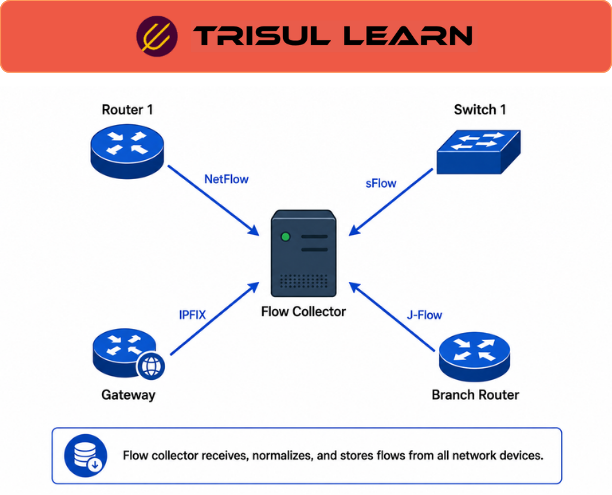

export const jsonLd = {
  "@context": "https://schema.org",
  "@type": "FAQPage",
  "mainEntity": [
    {
      "@type": "Question",
      "name": "What happens when a flow collector drops records?",
      "acceptedAnswer": {
        "@type": "Answer",
        "text": "Flow export uses UDP, which has no acknowledgment or retransmission. If the collector is overwhelmed, overloaded, or the path between exporter and collector is congested, records are lost silently. The collector has no way to request retransmission, and the exporter does not know whether its records arrived. Gaps in the data appear as absent flows rather than errors, which means monitoring must be done on the exporter side, not just the collector. Validating collector performance against exporter drop counters is necessary to confirm data completeness."
      }
    },
    {
      "@type": "Question",
      "name": "What is a unified flow collector?",
      "acceptedAnswer": {
        "@type": "Answer",
        "text": "A unified flow collector accepts multiple export formats in a single pipeline: NetFlow v5, v9, IPFIX, sFlow, and sometimes AWS VPC Flow Logs or other cloud telemetry. Instead of running separate collectors for each format, the unified platform normalizes all incoming records into a common schema, enriches them with metadata like interface names and geolocation, and stores them in a single database. This is practical in multi-vendor environments where different devices export different formats, and it simplifies operations by consolidating all flow data into one queryable store."
      }
    },
    {
      "@type": "Question",
      "name": "How does a flow collector handle sampling?",
      "acceptedAnswer": {
        "@type": "Answer",
        "text": "Exporters include a sampling rate field in sampled flow records. The collector multiplies observed byte and packet counts by the inverse of that rate to estimate actual totals. A flow record with 10,000 bytes at a 1-in-100 sampling rate is reported as approximately 1,000,000 bytes. This estimation is accurate for high-volume flows where the law of large numbers applies. For low-volume flows, extrapolation introduces significant error, and a flow sampled only once or twice cannot be reliably scaled to a meaningful estimate."
      }
    },
    {
      "@type": "Question",
      "name": "Can a flow collector reconstruct flows without NetFlow from the device?",
      "acceptedAnswer": {
        "@type": "Answer",
        "text": "Yes. A flow collector with packet capture capability can generate IPFIX records directly from raw packets, bypassing the network device entirely. The collector observes packets via a TAP or SPAN port, rebuilds flows from the wire, and exports them to itself as if they came from a router. This produces unsampled, complete flow data even when the network device does not support NetFlow or only supports sampling. It is the recommended approach for high-fidelity flow monitoring at security-critical observation points."
      }
    }
  ]
};

# What is a flow collector?

A flow collector receives, parses, stores, and makes queryable the flow records exported by network devices running NetFlow, IPFIX, or sFlow. The collector is the central point in a flow monitoring architecture: all exporters send their records to one or more collector addresses, and the collector provides the storage, indexing, and query interface that users and alerting systems depend on. Without a collector, flow records are just UDP datagrams that disappear after the network device flushes its cache.

---

## How a flow collector works

When a collector receives flow records, it first parses the templates that define the record format. In NetFlow v9 and IPFIX, the exporter sends a template record before sending data records, and the collector must cache that template to interpret incoming data correctly. If the template is missing or the collector has not seen it, the data records are discarded.

The collector then handles operational concerns: deduplication of records from multiple exporters, stitching of unidirectional flow pairs into bidirectional entries, and scaling of sampled byte counts by the sampling rate field. These steps are not optional; if they are skipped or implemented incorrectly, the flow database will contain inaccurate data that produces misleading reports.

Records are stored in a database optimized for high-volume time-series data, indexed by IP addresses, ports, protocol, and time. This indexing enables queries that return results for flows from weeks ago in seconds rather than minutes.

---

## Flow collectors in network operations

In enterprise and ISP deployments, the collector is typically centralized, with exporters on routers and switches across the topology sending to a single collector cluster. A single collector can handle millions of flows per second, but capacity planning is necessary for large networks. Under-provisioned collectors drop records under load, and the loss is silent because UDP provides no backpressure.

Collectors often feed multiple downstream systems: a network operations dashboard for trending, a security analytics platform for detection, and a compliance system for audit logging. The collector must be able to hold the full raw dataset, not just aggregated summaries, so that each downstream system can query the data it needs.

For high-fidelity requirements, the collector may also receive packet captures and generate flow records from the wire, bypassing device-based export entirely.

---

## Flow collector vs flow exporter

| Dimension | Flow collector | Flow exporter |
|---|---|---|
| Role | Receives, stores, and serves flow data | Generates and sends flow records |
| Data store | Yes, long-term retention database | No, only a transient flow cache |
| Query interface | Yes, for users and downstream systems | No, only export configuration |
| Scaling concern | Database capacity, query performance | Cache size, CPU, export rate limits |
| Best fit | Centralized flow analytics and reporting | Per-device flow telemetry generation |

The exporter and collector are complementary roles in the same pipeline. A single physical device can run both roles, but in most deployments they are separate: routers and switches as exporters, dedicated servers or appliances as collectors.

---

## How Trisul handles flow collection

Trisul acts as the collector in a flow monitoring deployment. It accepts NetFlow v1, v5, v9, Flexible NetFlow, IPFIX, and all sFlow versions simultaneously from multiple exporters. All routers and interfaces are auto-discovered when the first records arrive, without manual configuration. Every flow record is stored without rollup or summarization, preserving full resolution for historical queries at any point within the retention window.

For observation points where device-based export is unavailable or produces sampled data, Trisul generates IPFIX records directly from raw packet capture, producing complete unsampled flow data from the wire. Trisul's flow database supports full-resolution queries, flow tagging, and retro analysis, letting operators apply new detection logic against historical data after the fact. Full NetFlow setup documentation is at https://docs.trisul.org/docs/ug/netflow/.

---

## Related terms

- [What is a flow?](/docs/glossary/flow)
- [What is flow exporter?](/docs/glossary/flow-exporter)
- [What is flow monitoring?](/docs/glossary/flow-monitoring)
- [What is flow data?](/docs/glossary/flow-data)
- [What is NetFlow?](/docs/glossary/netflow)
- [What is IPFIX?](/docs/glossary/ipfix)
- [What is sFlow?](/docs/glossary/sflow)
- [What is flow sampling?](/docs/glossary/flow-sampling)

---

## Frequently asked questions

### What happens when a flow collector drops records?

Flow export uses UDP, which has no acknowledgment or retransmission. If the collector is overwhelmed, overloaded, or the path between exporter and collector is congested, records are lost silently. The collector has no way to request retransmission, and the exporter does not know whether its records arrived. Gaps in the data appear as absent flows rather than errors, which means monitoring must be done on the exporter side, not just the collector. Validating collector performance against exporter drop counters is necessary to confirm data completeness.

### What is a unified flow collector?

A unified flow collector accepts multiple export formats in a single pipeline: NetFlow v5, v9, IPFIX, sFlow, and sometimes AWS VPC Flow Logs or other cloud telemetry. Instead of running separate collectors for each format, the unified platform normalizes all incoming records into a common schema, enriches them with metadata like interface names and geolocation, and stores them in a single database. This is practical in multi-vendor environments where different devices export different formats, and it simplifies operations by consolidating all flow data into one queryable store.

### How does a flow collector handle sampling?

Exporters include a sampling rate field in sampled flow records. The collector multiplies observed byte and packet counts by the inverse of that rate to estimate actual totals. A flow record with 10,000 bytes at a 1-in-100 sampling rate is reported as approximately 1,000,000 bytes. This estimation is accurate for high-volume flows where the law of large numbers applies. For low-volume flows, extrapolation introduces significant error, and a flow sampled only once or twice cannot be reliably scaled to a meaningful estimate.

### Can a flow collector reconstruct flows without NetFlow from the device?

Yes. A flow collector with packet capture capability can generate IPFIX records directly from raw packets, bypassing the network device entirely. The collector observes packets via a TAP or SPAN port, rebuilds flows from the wire, and exports them to itself as if they came from a router. This produces unsampled, complete flow data even when the network device does not support NetFlow or only supports sampling. It is the recommended approach for high-fidelity flow monitoring at security-critical observation points.