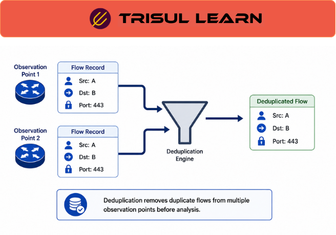

export const jsonLd = {
  "@context": "https://schema.org",
  "@type": "FAQPage",
  "mainEntity": [
    {
      "@type": "Question",
      "name": "Why does flow deduplication sometimes increase storage rather than reduce it?",
      "acceptedAnswer": {
        "@type": "Answer",
        "text": "Some platforms retain both original flow legs and deduplicated views simultaneously to preserve investigative context while also supporting normalized reporting. This can increase storage requirements because both representations remain available for different operational workflows."
      }
    },
    {
      "@type": "Question",
      "name": "How does a collector identify duplicate flow records?",
      "acceptedAnswer": {
        "@type": "Answer",
        "text": "Collectors commonly compare fields such as source and destination addresses, ports, protocols, timestamps, and exporter metadata within a configured correlation window to identify records representing the same communication. Deduplication logic varies by platform and telemetry architecture."
      }
    },
    {
      "@type": "Question",
      "name": "Does flow deduplication affect security investigations?",
      "acceptedAnswer": {
        "@type": "Answer",
        "text": "Yes. Aggressive deduplication may reduce visibility into per-device or per-interface telemetry that can be useful during investigations. Some operational workflows therefore preserve original records alongside correlated or deduplicated views."
      }
    },
    {
      "@type": "Question",
      "name": "What is the difference between flow deduplication and packet deduplication?",
      "acceptedAnswer": {
        "@type": "Answer",
        "text": "Flow deduplication operates on summarized telemetry records representing communications, while packet deduplication operates on individual packets observed multiple times within packet-capture environments. The two processes address different forms of monitoring duplication."
      }
    },
    {
      "@type": "Question",
      "name": "How does Trisul support flow-deduplication workflows?",
      "acceptedAnswer": {
        "@type": "Answer",
        "text": "Trisul supports flow-deduplication workflows through flow-leg correlation, MergeMultipleSources options, historical traffic analysis, and operational traffic-visibility capabilities that help operators analyze overlapping telemetry from multiple exporters."
      }
    }
  ]
};

# What is flow deduplication?

**Flow deduplication** is the process of identifying and handling duplicate flow records generated when multiple exporters observe and export telemetry for the same network communication.

Duplicate telemetry commonly occurs when:
- Multiple routers observe the same flow
- Traffic traverses several monitored interfaces
- Overlapping exporters monitor the same path
- Packet-derived and exporter-derived telemetry coexist
- Monitoring architectures overlap

Without deduplication or correlation workflows:
- Traffic volume may be counted multiple times
- Reporting accuracy may decrease
- Operational visibility may become noisy
- Analytics may overestimate utilization
- Investigations may become harder to interpret

Flow deduplication helps normalize telemetry visibility while preserving useful operational context where needed.

Trisul supports flow-leg correlation and configurable multi-source flow handling workflows for overlapping telemetry environments.

---

## How flow deduplication works

Flow deduplication workflows compare incoming telemetry records to identify records representing the same communication.

Collectors commonly compare:
- Source and destination addresses
- Source and destination ports
- Protocol information
- Timestamps
- Flow duration
- Exporter metadata
- Interface context

Typical workflow:

1. **Flow ingestion** → Exporters send telemetry records
2. **Correlation analysis** → The collector compares records against correlation logic
3. **Duplicate identification** → Potential duplicate records are identified
4. **Deduplication handling** → Records may be merged, grouped, correlated, or retained separately
5. **Operational visibility** → Deduplicated or correlated views become available for analysis

Different platforms implement deduplication differently:
- Some discard duplicates entirely
- Some merge telemetry into a normalized record
- Some preserve original legs alongside merged views
- Some provide visual grouping without altering stored records

The exact behavior depends on:
- Telemetry architecture
- Investigation requirements
- Storage design
- Operational priorities
- Correlation logic

---

## Why duplicate flow records occur

Duplicate records are common in large-scale telemetry environments.

Examples include:
- Core and edge routers exporting the same traffic
- Bidirectional observation points
- Multi-hop routed traffic
- Distributed monitoring architectures
- Overlay and underlay visibility overlap
- Packet-derived and exporter-derived telemetry overlap

A single communication session may therefore appear multiple times within telemetry pipelines.

Differences between records may include:
- Interface identifiers
- Export timestamps
- Byte counters
- Sampling ratios
- DSCP values
- Exporter metadata
- Routing information

These differences make perfect correlation difficult in some environments.

---

## Flow deduplication in network operations

Flow deduplication is important in:
- ISP and carrier monitoring
- Enterprise backbone monitoring
- Datacenter visibility
- Multi-site telemetry collection
- Security analytics
- Capacity planning
- Traffic accounting workflows

### NOC operations

NOC teams use deduplication workflows to:
- Improve bandwidth reporting accuracy
- Reduce telemetry noise
- Normalize utilization metrics
- Improve trend analysis
- Simplify operational dashboards

Without normalization:
- Utilization may be overcounted
- Capacity reports may become inaccurate
- Interface trends may be misleading

### SOC operations

SOC teams may preserve original telemetry legs because:
- Per-interface context may aid investigations
- Path visibility may matter during incident response
- Ingress and egress analysis may require original records
- Multi-hop visibility may help reconstruct activity

Security workflows often balance:
- Reporting simplicity
- Investigative depth
- Historical accuracy
- Telemetry completeness

The operational tradeoff depends on investigation requirements.

---

## Flow deduplication vs flow stitching

| Dimension | Flow deduplication | Flow stitching |
|---|---|---|
| Primary purpose | Handle overlapping exporter telemetry | Combine directional records into bidirectional conversations |
| Input records | Similar telemetry from multiple exporters | Opposite-direction flow records |
| Operational goal | Normalize duplicated visibility | Improve conversation-level visibility |
| Potential data impact | May reduce exporter-specific context | Typically preserves directional traffic information |
| Common use case | Multi-exporter environments | Bidirectional traffic analysis |

Both workflows may operate together in large-scale traffic-analysis platforms.

---

## Flow deduplication vs packet deduplication

| Dimension | Flow deduplication | Packet deduplication |
|---|---|---|
| Data type | Flow telemetry records | Individual packets |
| Visibility layer | Communication metadata | Packet-level visibility |
| Common environments | Flow collectors and telemetry systems | Packet-capture systems |
| Typical time scale | Seconds or exporter timeouts | Milliseconds or packet timing |
| Operational purpose | Normalize overlapping telemetry | Remove duplicate packet observations |

The two workflows solve different operational problems.

---

## Operational considerations

Flow-deduplication workflows commonly face operational considerations including:
- Exporter timing differences
- Sampling inconsistencies
- Timestamp drift
- Multi-path routing
- Interface-context preservation
- Correlation complexity
- High-cardinality telemetry
- Retention tradeoffs

Deduplication may improve:
- Reporting consistency
- Traffic accounting
- Dashboard readability

However, aggressive merging may reduce:
- Per-hop visibility
- Interface-level context
- Investigative detail
- Exporter-specific telemetry visibility

Some deployments therefore maintain:
- Original records
- Correlated views
- Deduplicated summaries

simultaneously for different operational workflows.

---

## How Trisul handles flow deduplication

Trisul supports configurable flow-deduplication and flow-correlation workflows for overlapping telemetry environments.

Relevant capabilities include:

- **Flow Legs Correlation** workflows
- **MergeMultipleSources** configuration options
- **Historical traffic analysis**
- **Explore Flows** for traffic investigations
- **Flow Taggers** for contextual enrichment
- **Interface Tracking** for interface-level visibility
- **Host and application traffic analysis**
- **Operational traffic-correlation workflows**
- **Preservation of underlying telemetry records where configured**

These capabilities help operators normalize traffic visibility, reduce duplicate telemetry noise, preserve investigative context, and analyze traffic across overlapping monitoring architectures.

Trisul emphasizes operational flexibility by supporting both correlated and original telemetry workflows depending on deployment requirements.

Relevant Trisul use cases:
- https://www.trisul.org/trisul-netflow-analyzer-usecases/#network-performance-monitoring
- https://www.trisul.org/trisul-netflow-analyzer-usecases/#incident-investigation
- https://www.trisul.org/trisul-netflow-analyzer-usecases/#isp-and-carrier-monitoring

---

## Related terms

- [Flow legs](/glossary/flow-legs)
- [Flow stitching](/glossary/flow-stitching)
- [Flow monitoring](/glossary/flow-monitoring)
- [Flow exporter](/glossary/flow-exporter)
- [Flow](/glossary/flow)
- [NetFlow](/glossary/netflow)
- [Flow sampling](/glossary/flow-sampling)
- [Packet deduplication](/glossary/packet-deduplication)

---

## Frequently asked questions

### Why does flow deduplication sometimes increase storage rather than reduce it?

Some platforms retain both original flow legs and deduplicated views simultaneously to preserve investigative context while also supporting normalized reporting. This can increase storage requirements because both representations remain available for different operational workflows.

### How does a collector identify duplicate flow records?

Collectors commonly compare fields such as source and destination addresses, ports, protocols, timestamps, and exporter metadata within a configured correlation window to identify records representing the same communication. Deduplication logic varies by platform and telemetry architecture.

### Does flow deduplication affect security investigations?

Yes. Aggressive deduplication may reduce visibility into per-device or per-interface telemetry that can be useful during investigations. Some operational workflows therefore preserve original records alongside correlated or deduplicated views.

### What is the difference between flow deduplication and packet deduplication?

Flow deduplication operates on summarized telemetry records representing communications, while packet deduplication operates on individual packets observed multiple times within packet-capture environments. The two processes address different forms of monitoring duplication.

### How does Trisul support flow-deduplication workflows?

Trisul supports flow-deduplication workflows through flow-leg correlation, MergeMultipleSources options, historical traffic analysis, and operational traffic-visibility capabilities that help operators analyze overlapping telemetry from multiple exporters.