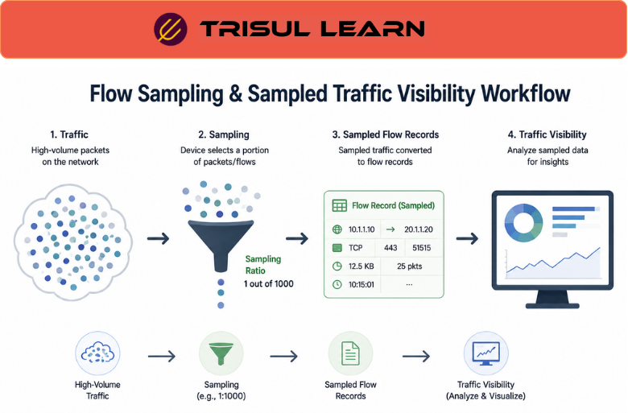

# What is Flow Sampling?

Flow Sampling is a traffic monitoring technique where only a portion of network packets or flows are selected for analysis instead of monitoring every packet in the network.

Sampling helps reduce processing overhead, storage requirements, and bandwidth consumption while still providing useful visibility into overall traffic behavior.

Flow sampling is commonly used in:
- high-speed networks
- ISP infrastructures
- data centers
- cloud environments
- large-scale traffic monitoring systems

## **How Flow Sampling Works**

In full traffic monitoring, every packet or flow is processed and exported.

With sampling, the monitoring device selects traffic based on predefined rules such as:
- every nth packet
- random packet selection
- probabilistic sampling
- interval-based sampling

For example:

1. A router receives millions of packets per second
2. The device samples 1 out of every 1,000 packets
3. Sampled traffic is converted into flow records
4. Monitoring systems analyze the sampled data

Sampling ratios commonly look like:
- 1:100
- 1:1000
- 1:10,000

Higher sampling reduces resource usage but may lower visibility accuracy for smaller traffic flows.

## **Why Flow Sampling Matters**

Modern networks can generate traffic volumes too large to monitor exhaustively.

Flow sampling helps organizations:
- scale traffic monitoring
- reduce storage requirements
- lower CPU and memory usage
- monitor backbone traffic efficiently
- improve exporter performance
- support high-speed environments

Sampling is especially useful in:
- ISP backbones
- multi-terabit networks
- cloud infrastructures
- large enterprise WANs
- distributed monitoring systems

## **Types of Flow Sampling**

### Packet Sampling

Select individual packets for analysis.

### Flow Sampling

Sample traffic flows instead of every packet.

### Random Sampling

Randomly select traffic based on probability.

### Systematic Sampling

Capture traffic at fixed intervals.

### Adaptive Sampling

Adjust sampling dynamically based on traffic conditions.

## **Common Operational Use Cases**

### ISP Traffic Monitoring

Scale traffic visibility across large subscriber environments.

### Backbone Monitoring

Monitor high-speed links without overwhelming infrastructure.

### DDoS Visibility

Analyze traffic spikes while reducing monitoring overhead.

### Capacity Planning

Track traffic growth trends efficiently.

### Cloud Traffic Analytics

Monitor large-scale east-west and north-south traffic flows.

## **Flow Sampling vs Full Flow Monitoring**

| Feature | Flow Sampling | Full Flow Monitoring |
|---|---|---|
| Traffic Coverage | Partial | Complete |
| Resource Usage | Lower | Higher |
| Scalability | High | Moderate |
| Visibility Accuracy | Approximate | Precise |
| High-Speed Suitability | Excellent | More demanding |

Flow sampling improves scalability, while full monitoring provides more precise visibility.

## **How Trisul Handles Sampled Flow Visibility**

Trisul supports scalable traffic analytics workflows for sampled and high-volume flow environments.

Combined with:
- Flow Analysis
- Top-K Analyticsᵀ
- Multigraph Analyticsᵀ
- Long-Term Traffic Retention
- Retro Analysisᵀ
- Flow Stitchingᵀ

Trisul helps teams:
- analyze sampled traffic behavior
- monitor backbone utilization
- investigate bandwidth trends
- identify major traffic consumers
- analyze high-speed traffic environments
- correlate sampled traffic patterns

Trisul can also integrate [NetFlow](/glossary/netflow), [sFlow](/glossary/sflow), and [Traffic Investigation](/glossary/traffic-investigation) workflows for scalable traffic analysis.

## **Related Terms**

- [Flow Monitoring](/glossary/flow-monitoring)
- [Flow Analysis](/glossary/flow-analysis)
- [NetFlow](/glossary/netflow)
- [sFlow](/glossary/sflow)
- [Bandwidth Monitoring](/glossary/bandwidth-monitoring)
- [Capacity Planning](/glossary/capacity-planning)

---

## **FAQ**

### What is flow sampling?

Flow sampling is the process of monitoring only a subset of network traffic instead of analyzing every packet or flow.

### Why is flow sampling used?

It reduces processing overhead, storage requirements, and bandwidth usage in high-speed networks.

### How does flow sampling work?

Devices select packets or flows based on predefined sampling rules such as every nth packet or probabilistic selection.

### What's the difference between sampled and full flow monitoring?

Sampled monitoring provides approximate visibility with lower overhead, while full monitoring provides complete traffic visibility.

### Is flow sampling useful for ISPs?

Yes. ISPs use sampling to monitor large backbone networks and subscriber traffic efficiently.

### Can flow sampling affect visibility accuracy?

Yes. Smaller flows or short-lived traffic may be missed depending on the sampling ratio.