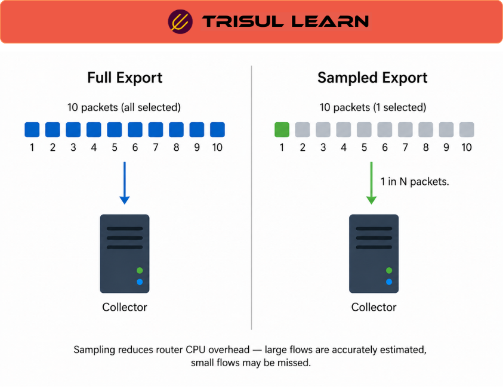

export const jsonLd = {
  "@context": "https://schema.org",
  "@type": "FAQPage",
  "mainEntity": [
    {
      "@type": "Question",
      "name": "What sampling rate is acceptable for network monitoring?",
      "acceptedAnswer": {
        "@type": "Answer",
        "text": "Acceptable sampling rates depend on operational goals, traffic patterns, exporter capabilities, and network scale. Coarser sampling may be adequate for capacity trending and large-scale traffic analysis, while security investigations and anomaly detection generally benefit from lower sampling ratios or unsampled telemetry because low-volume activity may otherwise be underrepresented."
      }
    },
    {
      "@type": "Question",
      "name": "How does flow sampling affect security detection?",
      "acceptedAnswer": {
        "@type": "Answer",
        "text": "Sampling may reduce visibility into short-duration, infrequent, or low-volume communications. Depending on the sampling ratio and traffic characteristics, some security-relevant events may be underrepresented or missed entirely. The operational impact depends on exporter behavior, monitoring placement, and detection requirements."
      }
    },
    {
      "@type": "Question",
      "name": "Does sFlow use the same sampling mechanism as NetFlow?",
      "acceptedAnswer": {
        "@type": "Answer",
        "text": "No. sFlow primarily uses packet-based sampling combined with interface counters, while NetFlow and IPFIX exporters may implement packet sampling, flow sampling, or hybrid telemetry behaviors depending on the platform implementation. Sampling behavior varies significantly across vendors and exporter architectures."
      }
    },
    {
      "@type": "Question",
      "name": "Can collectors estimate actual traffic volume from sampled telemetry?",
      "acceptedAnswer": {
        "@type": "Answer",
        "text": "Collectors may estimate traffic totals using exporter-provided sampling metadata. Estimation accuracy is generally stronger for high-volume traffic patterns than for low-volume or short-duration communications. The reliability of estimates depends on sampling methodology, traffic distribution, exporter consistency, and telemetry completeness."
      }
    },
    {
      "@type": "Question",
      "name": "What is the difference between deterministic and probabilistic sampling?",
      "acceptedAnswer": {
        "@type": "Answer",
        "text": "Deterministic sampling selects packets or flows using a fixed interval or sequence, while probabilistic sampling uses random selection probabilities. Different platforms support different sampling models, each with operational tradeoffs involving predictability, scalability, statistical distribution, and monitoring requirements."
      }
    }
  ]
};

# What is flow sampling?

**Flow sampling** is a telemetry technique where network devices observe and export only a subset of packets or flows to reduce processing, storage, and export overhead while still providing statistical visibility into network traffic.

Instead of exporting every observed communication:
- Only selected packets may be sampled
- Only selected flows may be tracked
- Export rates may be reduced statistically

Sampling allows flow telemetry to scale across:
- High-speed links
- Large enterprise networks
- ISP backbones
- Datacenter environments
- Cloud-network infrastructure

However, sampling also introduces:
- Statistical estimation
- Reduced fidelity
- Potential visibility gaps
- Lower accuracy for low-volume traffic

Flow sampling is commonly used with:
- NetFlow
- IPFIX
- sFlow
- High-scale telemetry systems

Trisul supports sampled telemetry ingestion and analysis workflows using NetFlow, IPFIX, sFlow, and packet-derived traffic visibility.

---

## How flow sampling works

Sampling reduces telemetry volume by selecting only a subset of observed traffic for export.

Typical workflow:

1. **Traffic observation** → Packets are observed on monitored interfaces
2. **Sampling selection** → A subset of packets or flows is selected
3. **Flow generation** → Telemetry records are created from sampled observations
4. **Sampling metadata export** → Exporters include sampling information where supported
5. **Collector estimation** → Analytics systems estimate totals using sampling metadata

Sampling behavior depends heavily on:
- Export protocol
- Exporter implementation
- Hardware capabilities
- Platform configuration
- Traffic characteristics

Some exporters sample:
- Individual packets
- Flow creation events
- Interface observations
- Specific traffic classes

The exact telemetry model varies significantly across platforms.

---

## Packet sampling vs flow sampling

Different telemetry technologies implement sampling differently.

### Packet sampling

Packet sampling selects packets directly from observed traffic.

This approach is commonly associated with:
- sFlow
- High-speed switching telemetry
- Statistical traffic analysis

Packet sampling may provide:
- Traffic-distribution visibility
- Application mix analysis
- Statistical protocol visibility

However, packet sampling may:
- Miss short conversations
- Reduce visibility into low-volume traffic
- Limit per-flow reconstruction accuracy

### Flow sampling

Flow sampling typically selects only some flows for export or tracking.

This approach is commonly associated with:
- NetFlow
- IPFIX
- Flexible flow exporters

Depending on exporter implementation, flow sampling may involve:
- Packet-triggered flow selection
- Probabilistic flow export
- Hardware-assisted sampling
- Hybrid telemetry approaches

Different vendors implement flow sampling differently.

Operators should validate exporter behavior before assuming telemetry semantics.

---

## Flow sampling in network operations

Sampling is widely used in large-scale operational environments.

### NOC operations

Network operations teams use sampled telemetry for:
- Capacity planning
- Bandwidth trending
- Interface-utilization analysis
- Traffic engineering
- Application visibility
- Network baselining

High-volume traffic patterns are often represented adequately for:
- Trend analysis
- Traffic engineering
- Capacity estimation

Sampling reduces:
- Export bandwidth
- Collector load
- Storage requirements
- Hardware resource consumption

### SOC operations

Security teams may use sampled telemetry for:
- Threat hunting
- Communication analysis
- Historical investigations
- Traffic anomaly detection

However, low-volume activity may be harder to detect in sampled telemetry.

Potentially affected visibility includes:
- Slow scanning behavior
- Low-bandwidth exfiltration
- Sparse beaconing activity
- Short-lived sessions
- Infrequent communications

Security-sensitive deployments may therefore prefer:
- Lower sampling ratios
- Selective unsampled telemetry
- Packet-derived visibility
- Hybrid monitoring architectures

The operational tradeoff depends on:
- Network scale
- Security requirements
- Exporter capability
- Storage architecture
- Investigation goals

---

## Sampled flow vs unsampled flow

| Dimension | Sampled flow telemetry | Unsampled flow telemetry |
|---|---|---|
| Visibility model | Statistical subset of observed traffic | Full exported telemetry visibility |
| Scalability | Higher | Lower because of increased telemetry volume |
| Resource requirements | Lower exporter and storage overhead | Higher exporter and collector load |
| Low-volume visibility | May be reduced | Generally stronger |
| Traffic estimation | Statistical approximation | Direct telemetry reporting |
| Common use cases | Trending and large-scale monitoring | Detailed investigations and higher-fidelity analysis |

Unsampled telemetry generally improves visibility fidelity but may require:
- More capable exporters
- Additional collector capacity
- Larger storage systems
- Higher ingestion throughput

Operational architecture determines which approach is practical.

---

## Sampling accuracy and estimation

Collectors may estimate traffic totals using:
- Sampling ratios
- Exporter metadata
- Statistical scaling logic

Estimation accuracy depends on:
- Traffic distribution
- Sampling consistency
- Export reliability
- Sampling methodology
- Exporter implementation

High-volume traffic patterns are often estimated more reliably than:
- Low-volume traffic
- Short-duration sessions
- Sparse communication events

Adaptive or dynamic sampling may further complicate:
- Historical comparisons
- Traffic estimation
- Aggregated reporting
- Cross-device normalization

Organizations should validate telemetry assumptions before using sampled data for:
- Compliance workflows
- Billing
- Precise accounting
- Security investigations

---

## Deterministic vs probabilistic sampling

Sampling algorithms vary by platform.

### Deterministic sampling

Deterministic sampling selects packets or flows using fixed intervals such as:
- Every Nth packet
- Every Nth flow

Advantages may include:
- Simplicity
- Predictable export rates
- Lower computational overhead

Limitations may include:
- Predictable selection behavior
- Potential traffic bias
- Uneven representation under some traffic patterns

### Probabilistic sampling

Probabilistic sampling uses randomized selection probabilities.

Advantages may include:
- Better statistical distribution
- Reduced predictability
- More uniform selection behavior

However, implementation complexity and operational behavior vary significantly across platforms.

Exporter-specific validation remains important.

---

## Operational considerations

Flow-sampling deployments commonly face operational considerations including:
- Exporter resource limitations
- Sampling consistency
- Multi-vendor telemetry differences
- Estimation accuracy
- Collector scaling
- Historical retention
- Visibility gaps
- Security-monitoring limitations

Telemetry interpretation depends heavily on:
- Sampling methodology
- Exporter behavior
- Monitoring placement
- Traffic characteristics
- Operational objectives

Organizations commonly validate sampled telemetry using:
- Interface counters
- Baseline comparisons
- Packet-level validation
- Exporter statistics
- Traffic-engineering measurements

Understanding telemetry limitations is important for accurate operational analysis.

---

## How Trisul handles flow sampling

Trisul supports sampled and unsampled telemetry workflows through integrated traffic-analysis and telemetry-ingestion capabilities.

Relevant capabilities include:

- **NetFlow, IPFIX, sFlow, and related telemetry ingestion**
- **Sampling-aware traffic analysis workflows**
- **Historical traffic analysis**
- **Explore Flows** for interactive investigations
- **Top-K analytics** for identifying dominant traffic entities
- **Flow Taggers** for contextual traffic enrichment
- **Interface Tracking** for interface-level visibility
- **Packet-derived flow generation workflows**
- **Host and application traffic analysis**
- **Operational dashboards and historical querying workflows**

Trisul can also generate flow telemetry from packet observations in environments where:
- Unsampled visibility is required
- Exporter capabilities are limited
- Native flow export is unavailable

These capabilities help operators analyze traffic behavior, estimate utilization, investigate historical communications, and support operational or security workflows across sampled and unsampled environments.

Trisul primarily focuses on scalable traffic analytics and operational visibility rather than payload-only forensic workflows.

Relevant Trisul use cases:
- https://www.trisul.org/trisul-netflow-analyzer-usecases/#network-performance-monitoring
- https://www.trisul.org/trisul-netflow-analyzer-usecases/#advanced-threat-detection
- https://www.trisul.org/trisul-netflow-analyzer-usecases/#incident-investigation
- https://www.trisul.org/trisul-netflow-analyzer-usecases/#isp-and-carrier-monitoring

---

## Related terms

- [Flow](/glossary/flow)
- [NetFlow](/glossary/netflow)
- [IPFIX](/glossary/ipfix)
- [sFlow](/glossary/sflow)
- [Flow timeout](/glossary/flow-timeout)
- [Flow stitching](/glossary/flow-stitching)
- [Full packet capture](/glossary/full-packet-capture)
- [Network security monitoring](/glossary/network-security-monitoring)

---

## Frequently asked questions

### What sampling rate is acceptable for network monitoring?

Acceptable sampling rates depend on operational goals, traffic patterns, exporter capabilities, and network scale. Coarser sampling may be adequate for capacity trending and large-scale traffic analysis, while security investigations and anomaly detection generally benefit from lower sampling ratios or unsampled telemetry because low-volume activity may otherwise be underrepresented.

### How does flow sampling affect security detection?

Sampling may reduce visibility into short-duration, infrequent, or low-volume communications. Depending on the sampling ratio and traffic characteristics, some security-relevant events may be underrepresented or missed entirely. The operational impact depends on exporter behavior, monitoring placement, and detection requirements.

### Does sFlow use the same sampling mechanism as NetFlow?

No. sFlow primarily uses packet-based sampling combined with interface counters, while NetFlow and IPFIX exporters may implement packet sampling, flow sampling, or hybrid telemetry behaviors depending on the platform implementation. Sampling behavior varies significantly across vendors and exporter architectures.

### Can collectors estimate actual traffic volume from sampled telemetry?

Collectors may estimate traffic totals using exporter-provided sampling metadata. Estimation accuracy is generally stronger for high-volume traffic patterns than for low-volume or short-duration communications. The reliability of estimates depends on sampling methodology, traffic distribution, exporter consistency, and telemetry completeness.

### What is the difference between deterministic and probabilistic sampling?

Deterministic sampling selects packets or flows using a fixed interval or sequence, while probabilistic sampling uses random selection probabilities. Different platforms support different sampling models, each with operational tradeoffs involving predictability, scalability, statistical distribution, and monitoring requirements.