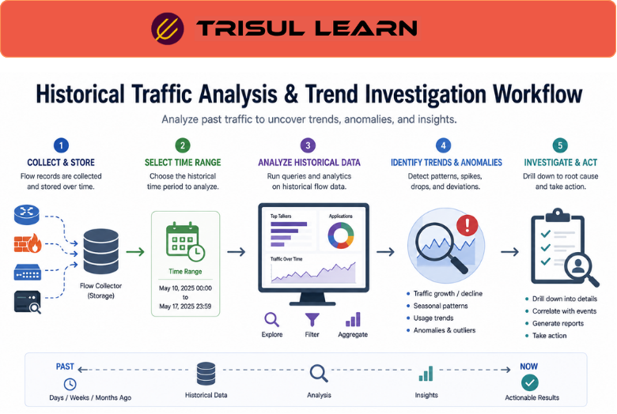

# What is Historical Traffic Analysis?

Historical Traffic Analysis is the process of analyzing previously recorded network traffic data to understand past communication behavior, investigate incidents, identify trends, and troubleshoot performance or security issues.

Instead of only viewing live traffic, historical analysis allows teams to review how traffic behaved hours, days, weeks, or even months earlier.

Historical visibility is important for:
- troubleshooting
- security investigations
- capacity planning
- traffic forensics
- compliance analysis
- operational reporting

## How Historical Traffic Analysis Works

Monitoring platforms continuously collect and retain traffic data such as:
- flow records
- packet captures
- bandwidth statistics
- application visibility
- protocol activity
- DNS traffic
- subscriber activity

This data is indexed and stored for later investigation.

A typical workflow looks like this:

1. Traffic activity is collected continuously
2. Historical records are retained
3. Analysts search previous traffic activity
4. Trends, anomalies, or incidents are investigated

For example:

1. A performance issue occurred overnight
2. Historical traffic data is reviewed
3. Analysts identify a bandwidth spike during the incident
4. Root cause analysis begins

## Why Historical Traffic Analysis Matters

Real-time monitoring alone may miss:
- intermittent issues
- delayed incident detection
- long-term traffic trends
- stealthy security activity
- gradual performance degradation

Historical traffic analysis helps organizations:
- investigate past incidents
- reconstruct traffic timelines
- identify recurring patterns
- analyze long-term trends
- troubleshoot intermittent problems
- improve operational planning

It improves visibility into:
- application behavior
- bandwidth growth
- attack timelines
- routing changes
- subscriber activity
- network anomalies

Historical analysis is especially important in:
- SOC environments
- ISP infrastructures
- enterprise networks
- cloud environments
- compliance workflows

## Common Operational Use Cases

### Security Investigations

Analyze suspicious traffic activity after detection.

### Capacity Planning

Study long-term traffic growth and utilization trends.

### Performance Troubleshooting

Investigate intermittent latency or congestion events.

### Traffic Forensics

Reconstruct historical communication behavior.

### Application Trend Analysis

Monitor how application usage changes over time.

## Historical Traffic Analysis vs Real-Time Monitoring

| Feature | Historical Traffic Analysis | Real-Time Monitoring |
|---|---|---|
| Time Scope | Past network activity | Current network activity |
| Primary Goal | Investigation and trend analysis | Immediate visibility |
| Incident Reconstruction | Strong | Limited |
| Long-Term Trends | Supported | Limited |
| Operational Focus | Retrospective analysis | Live monitoring |

Historical analysis explains what happened previously, while real-time monitoring focuses on what is happening now.

## How Trisul Handles Historical Traffic Analysis

Trisul provides long-term traffic retention and scalable analytics workflows for historical network visibility.

Combined with:
- Retro Analysisᵀ
- Flow Stitchingᵀ
- Top-K Analyticsᵀ
- Contextᵀ
- Packet Capture
- Multigraph Analyticsᵀ

Trisul helps teams:
- investigate historical traffic behavior
- analyze long-term bandwidth trends
- reconstruct communication timelines
- identify recurring anomalies
- troubleshoot intermittent issues
- correlate traffic events over time

Trisul can also integrate [Flow Analysis](/glossary/flow-analysis), [Packet Capture](/glossary/packet-capture), and [Flow Forensics](/glossary/flow-forensics) workflows for deeper historical visibility.

## Related Terms

- [Retro Analysisᵀ](/glossary/retro-analysis)
- [Flow Forensics](/glossary/flow-forensics)
- [Traffic Investigation](/glossary/traffic-investigation)
- [Capacity Planning](/glossary/capacity-planning)
- [Flow Analysis](/glossary/flow-analysis)
- [Packet Capture](/glossary/packet-capture)

---

## FAQ

### What is historical traffic analysis?

Historical traffic analysis is the process of reviewing previously recorded network traffic data to investigate behavior and trends.

### Why is historical traffic analysis important?

It helps organizations troubleshoot incidents, analyze long-term trends, and investigate past security events.

### What types of data are used in historical analysis?

Common data sources include NetFlow, IPFIX, packet captures, bandwidth metrics, DNS activity, and application traffic.

### What's the difference between historical analysis and real-time monitoring?

Historical analysis focuses on past traffic behavior, while real-time monitoring focuses on current network activity.

### Can historical traffic analysis help security investigations?

Yes. It helps reconstruct attack timelines, analyze suspicious communication, and investigate incidents after detection.

### Is historical traffic analysis useful for capacity planning?

Yes. Long-term traffic trends help organizations forecast growth and optimize infrastructure planning.