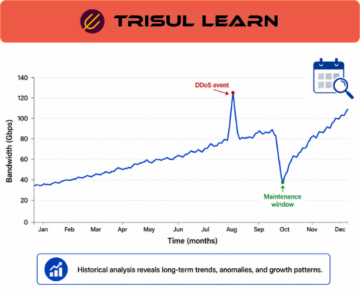

export const jsonLd = {
  "@context": "https://schema.org",
  "@type": "FAQPage",
  "mainEntity": [
    {
      "@type": "Question",
      "name": "What is historical traffic analysis?",
      "acceptedAnswer": {
        "@type": "Answer",
        "text": "Historical traffic analysis is the process of examining retained network telemetry and traffic data over time to identify trends, recurring patterns, anomalies, utilization growth, and operational behavior for troubleshooting, capacity planning, and security investigations."
      }
    },
    {
      "@type": "Question",
      "name": "What data sources are used for historical traffic analysis?",
      "acceptedAnswer": {
        "@type": "Answer",
        "text": "Historical traffic analysis commonly uses flow telemetry such as NetFlow, IPFIX, sFlow, and J-Flow, along with SNMP metrics, packet analysis, interface telemetry, DNS activity, and other retained operational telemetry depending on the monitoring architecture."
      }
    },
    {
      "@type": "Question",
      "name": "What are common use cases for historical traffic analysis?",
      "acceptedAnswer": {
        "@type": "Answer",
        "text": "Common use cases include capacity planning, congestion analysis, recurring-issue investigation, bandwidth trending, anomaly detection, traffic-pattern analysis, historical troubleshooting, security investigations, and validation of infrastructure or policy changes."
      }
    },
    {
      "@type": "Question",
      "name": "How does historical traffic analysis differ from real-time monitoring?",
      "acceptedAnswer": {
        "@type": "Answer",
        "text": "Real-time monitoring focuses on current operational visibility and immediate event detection, while historical traffic analysis examines retained telemetry over extended periods to identify trends, recurring behaviors, long-term anomalies, and operational baselines."
      }
    },
    {
      "@type": "Question",
      "name": "How does Trisul support historical traffic analysis?",
      "acceptedAnswer": {
        "@type": "Answer",
        "text": "Trisul supports historical traffic analysis through retained flow telemetry, packet and flow visibility, Explore Flows investigations, trend analysis workflows, Top-K analytics, and historical querying capabilities for operational and security investigations."
      }
    }
  ]
};

# What is historical traffic analysis?

Historical traffic analysis is the process of examining retained network telemetry and traffic data over time to identify trends, recurring patterns, anomalies, utilization growth, and operational behavior for troubleshooting, capacity planning, and security investigations.

Instead of focusing only on current network activity, historical analysis helps operators understand:
- How traffic changes over time
- Which applications grow or decline
- Which systems generate recurring congestion
- Which patterns repeat daily or seasonally
- Whether operational changes improved performance
- How historical baselines compare with current behavior

Historical analysis is commonly used for:
- Capacity planning
- Congestion analysis
- Trend analysis
- Historical troubleshooting
- Security investigations
- Traffic engineering
- Baseline creation
- Operational reporting

Historical traffic analysis is widely associated with:
- NetFlow
- IPFIX
- sFlow
- SNMP telemetry
- Packet analysis
- Long-term traffic retention

Trisul supports historical traffic-analysis workflows through retained telemetry, traffic correlation, and operational investigation capabilities.

---

## How historical traffic analysis works

Historical analysis relies on telemetry collected continuously and retained for later analysis.

Common telemetry sources include:
- NetFlow
- IPFIX
- sFlow
- J-Flow
- SNMP metrics
- Packet telemetry
- DNS activity
- Interface statistics

Typical workflow:

1. **Telemetry collection** → Traffic and operational data is gathered
2. **Retention and indexing** → Historical records are stored and indexed
3. **Aggregation and summarization** → Metrics are grouped across time intervals
4. **Trend analysis** → Operators analyze changes and recurring behavior
5. **Operational investigation** → Teams correlate historical patterns with events

Historical analysis may examine:
- Bandwidth utilization
- Application growth
- Protocol distribution
- Traffic spikes
- Interface saturation
- Conversation behavior
- Peak usage periods
- Long-term anomalies

The exact visibility depends on:
- Telemetry completeness
- Retention policies
- Aggregation intervals
- Monitoring architecture
- Historical indexing quality

---

## Historical traffic analysis in network operations

Historical traffic analysis is widely used across operational and security environments.

### NOC operations

Network operations teams use historical analysis for:
- Capacity planning
- Congestion investigations
- WAN optimization
- Traffic engineering
- Utilization trending
- Root-cause analysis

Operators commonly investigate:
- Recurring performance issues
- Growth trends
- Peak utilization periods
- Application bandwidth growth
- Long-term congestion patterns
- Infrastructure bottlenecks

Historical baselines help teams determine:
- Whether traffic behavior is normal
- Whether issues are recurring
- Whether upgrades are necessary
- Whether traffic distribution changed unexpectedly

### SOC operations

Security teams use historical analysis for:
- Threat hunting
- Incident investigations
- Beaconing analysis
- Data-exfiltration investigations
- Traffic-baseline analysis
- Long-term anomaly detection

Historical visibility helps analysts identify:
- Persistent suspicious communication
- Rare traffic patterns
- Slow-moving threats
- Behavioral deviations
- Long-term attacker activity

Security investigations commonly correlate:
- Flow telemetry
- Packet analysis
- DNS activity
- Firewall logs
- Endpoint telemetry
- Historical baselines

### ISP and carrier environments

ISPs and carriers commonly use historical analysis for:
- Subscriber trending
- Backbone utilization analysis
- Peering optimization
- Traffic forecasting
- Capacity growth analysis
- Regional traffic visibility

The operational value depends heavily on:
- Retention duration
- Telemetry scalability
- Query performance
- Aggregation quality
- Historical indexing

---

## Common historical analysis capabilities

| Capability | Operational purpose |
|---|---|
| Bandwidth trending | Track utilization growth over time |
| Top-K analysis | Identify dominant traffic sources historically |
| Seasonal pattern analysis | Detect recurring traffic cycles |
| Before-and-after comparison | Validate operational changes |
| Traffic baselining | Establish normal operational behavior |
| Historical anomaly analysis | Detect unusual long-term changes |

Additional workflows may include:
- Traffic forecasting
- Application growth analysis
- Capacity modeling
- Security timeline reconstruction

depending on the monitoring platform.

---

## Historical analysis vs real-time monitoring

| Dimension | Historical traffic analysis | Real-time monitoring |
|---|---|---|
| Primary focus | Long-term trends and retained telemetry | Current operational visibility |
| Time orientation | Retrospective analysis | Immediate observation |
| Common use case | Capacity planning and investigations | Alerting and rapid response |
| Typical workflows | Trend analysis and correlation | Incident detection and monitoring |
| Data scope | Historical retained telemetry | Current or near-real-time telemetry |

The two workflows are complementary and commonly used together.

---

## What makes historical traffic analysis effective

Effective historical analysis depends heavily on:
- Telemetry retention
- Historical indexing
- Query scalability
- Aggregation quality
- Time synchronization
- Correlation workflows

Operational challenges commonly include:
- Large data volumes
- Storage scalability
- High-cardinality telemetry
- Incomplete retention
- Sampled telemetry distortion
- Long-term indexing performance

Analysis quality also depends on:
- Baseline accuracy
- Monitoring coverage
- Exporter configuration
- Aggregation intervals
- Historical consistency

Historical data is most useful when:
- Baselines are well understood
- Retention is consistent
- Time-series analysis is available
- Multiple telemetry sources can be correlated

Organizations commonly improve historical visibility through:
- Long-term telemetry retention
- Centralized analytics platforms
- Indexed querying workflows
- Metadata enrichment
- Flow-based monitoring architectures

---

## How Trisul handles historical traffic analysis

Trisul supports historical traffic-analysis workflows through retained telemetry, historical querying, and traffic-correlation capabilities.

Relevant capabilities include:

- **Historical traffic analysis**
- **Flow and packet visibility**
- **Explore Flows** for investigative drill-down
- **Top-K analytics**
- **Flow Taggers** for contextual telemetry enrichment
- **Traffic-pattern and trend analysis**
- **NetFlow, IPFIX, sFlow, and packet-derived telemetry support**
- **Operational dashboards and historical reporting workflows**
- **Traffic correlation and investigation workflows**

Trisul can help operators:
- Analyze historical traffic trends
- Investigate recurring operational issues
- Identify long-term congestion patterns
- Compare traffic behavior across time ranges
- Support operational and security investigations
- Correlate historical traffic patterns

These workflows are particularly useful for:
- Capacity planning
- Traffic engineering
- Historical troubleshooting
- Threat investigations
- Operational reporting
- Baseline analysis

Relevant Trisul use cases:
- https://www.trisul.org/trisul-netflow-analyzer-usecases/#network-performance-monitoring
- https://www.trisul.org/trisul-netflow-analyzer-usecases/#advanced-threat-detection
- https://www.trisul.org/trisul-netflow-analyzer-usecases/#network-security-monitoring
- https://www.trisul.org/trisul-netflow-analyzer-usecases/#isp-and-carrier-monitoring

---

## Related terms

- [Flow monitoring](/glossary/flow-monitoring)
- [Capacity planning](/glossary/capacity-planning)
- [Bandwidth monitoring](/glossary/bandwidth-monitoring)
- [Trend analysis](/glossary/trend-analysis)
- [Realtime traffic monitoring](/glossary/realtime-traffic-monitoring)
- [Top talkers](/glossary/top-talkers)
- [Network performance monitoring](/glossary/network-performance-monitoring)

---

## Frequently asked questions

### What is historical traffic analysis?

Historical traffic analysis is the process of examining retained network telemetry and traffic data over time to identify trends, recurring patterns, anomalies, utilization growth, and operational behavior for troubleshooting, capacity planning, and security investigations.

### What data sources are used for historical traffic analysis?

Historical traffic analysis commonly uses flow telemetry such as NetFlow, IPFIX, sFlow, and J-Flow, along with SNMP metrics, packet analysis, interface telemetry, DNS activity, and other retained operational telemetry depending on the monitoring architecture.

### What are common use cases for historical traffic analysis?

Common use cases include capacity planning, congestion analysis, recurring-issue investigation, bandwidth trending, anomaly detection, traffic-pattern analysis, historical troubleshooting, security investigations, and validation of infrastructure or policy changes.

### How does historical traffic analysis differ from real-time monitoring?

Real-time monitoring focuses on current operational visibility and immediate event detection, while historical traffic analysis examines retained telemetry over extended periods to identify trends, recurring behaviors, long-term anomalies, and operational baselines.

### How does Trisul support historical traffic analysis?

Trisul supports historical traffic analysis through retained flow telemetry, packet and flow visibility, Explore Flows investigations, trend analysis workflows, Top-K analytics, and historical querying capabilities for operational and security investigations.