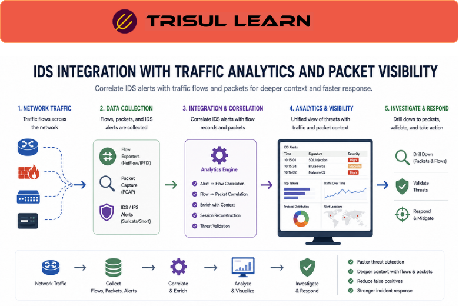

# What is IDS Integration?

IDS Integration is the process of connecting an Intrusion Detection System (IDS) with network monitoring, traffic analytics, or security platforms to improve threat visibility and incident investigation.

An IDS monitors network traffic for suspicious behavior, attack signatures, or abnormal communication patterns. Integration allows IDS alerts to be correlated with traffic analytics, flow records, packet captures, and operational context.

IDS integration improves visibility into:
- suspicious traffic
- attack behavior
- malware communication
- anomalous sessions
- lateral movement
- security events

## How IDS Integration Works

An Intrusion Detection System analyzes network traffic using:
- signature-based detection
- behavioral analysis
- anomaly detection
- protocol inspection

When suspicious activity is detected:
1. The IDS generates an alert
2. The alert is forwarded to monitoring or analytics platforms
3. Related traffic records are correlated
4. Analysts investigate the event using additional visibility data

IDS integrations may combine:
- packet capture
- flow analytics
- DNS visibility
- endpoint activity
- traffic metadata
- SIEM workflows

For example:

1. The IDS detects suspicious outbound traffic
2. The monitoring platform correlates related flow records
3. Packet captures reveal additional communication details
4. Analysts reconstruct the attack timeline

## Why IDS Integration Matters

Standalone IDS alerts often provide limited operational context.

Without integration, teams may struggle to:
- investigate alerts efficiently
- correlate related traffic activity
- reconstruct attack timelines
- prioritize incidents
- identify affected systems

IDS integration helps organizations:
- improve threat visibility
- reduce investigation time
- correlate traffic behavior
- improve incident response
- analyze suspicious communication
- strengthen security monitoring workflows

It is especially important in:
- SOC environments
- enterprise security operations
- ISP security monitoring
- cloud infrastructures
- hybrid environments

## Common Operational Use Cases

### Threat Detection

Correlate IDS alerts with network traffic activity.

### Incident Response

Investigate suspicious communication and attack behavior.

### Malware Investigation

Analyze command-and-control traffic and malicious sessions.

### Traffic Forensics

Reconstruct attack timelines using traffic metadata and packet captures.

### Security Operations

Improve visibility across distributed monitoring environments.

## IDS Integration vs Standalone IDS Monitoring

| Feature | IDS Integration | Standalone IDS |
|---|---|---|
| Operational Context | Rich | Limited |
| Traffic Correlation | Strong | Basic |
| Investigation Capability | Advanced | Moderate |
| Visibility Depth | Multi-source | IDS-only |
| Incident Response Efficiency | Higher | Lower |

IDS integration improves visibility by combining threat detection with traffic analytics and investigation workflows.

## How Trisul Supports IDS Integration

Trisul integrates traffic analytics and packet visibility workflows with IDS-driven security operations.

Combined with:
- Packet Capture
- Flow Analysis
- Retro Analysisᵀ
- Contextᵀ
- Badfellasᵀ
- Conversation View

Trisul helps teams:
- correlate IDS alerts with traffic flows
- investigate suspicious communication
- reconstruct attack timelines
- analyze lateral movement
- monitor anomalous traffic behavior
- improve forensic visibility

Trisul can also integrate [Packet Capture](/glossary/packet-capture), [Network Security Monitoring](/glossary/network-security-monitoring-nsm), and [Traffic Investigation](/glossary/traffic-investigation) workflows for deeper security analysis.

## Related Terms

- [Intrusion Detection System (IDS)](/glossary/intrusion-detection-system-ids)
- [Network Security Monitoring](/glossary/network-security-monitoring-nsm)
- [Packet Capture](/glossary/packet-capture)
- [Flow Analysis](/glossary/flow-analysis)
- [Traffic Investigation](/glossary/traffic-investigation)
- [Anomaly Detection](/glossary/anomaly-detection)

---

## FAQ

### What is IDS integration?

IDS integration is the process of connecting intrusion detection systems with traffic analytics and monitoring platforms for improved security visibility.

### Why is IDS integration important?

It helps organizations correlate alerts with traffic activity, investigate incidents faster, and improve threat visibility.

### What types of systems can integrate with IDS platforms?

IDS platforms commonly integrate with SIEMs, flow analyzers, packet capture systems, DNS monitoring tools, and traffic analytics platforms.

### How does IDS integration improve investigations?

It provides operational context by correlating alerts with traffic flows, packet data, and communication behavior.

### Can IDS integration help detect malware activity?

Yes. It helps identify suspicious communication, command-and-control traffic, and anomalous behavior.

### Is IDS integration useful in cloud environments?

Yes. Hybrid and cloud infrastructures benefit from centralized visibility across distributed security environments.