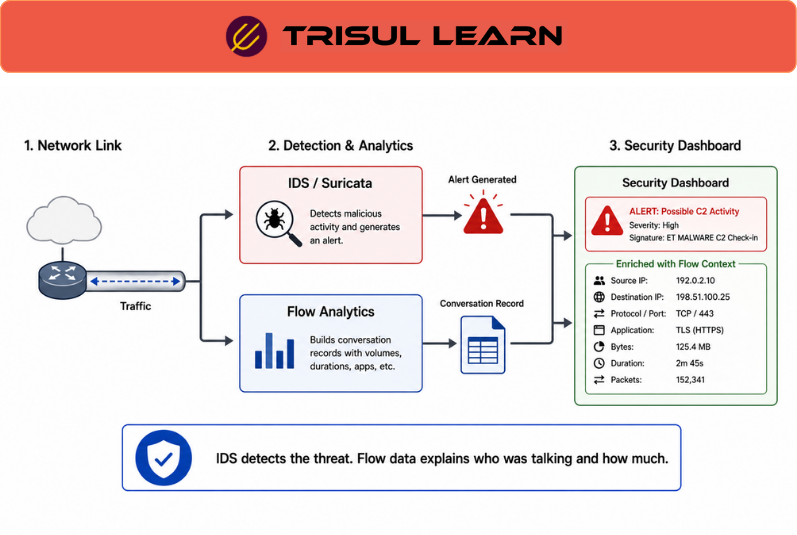

export const jsonLd = {
  "@context": "https://schema.org",
  "@type": "FAQPage",
  "mainEntity": [
    {
      "@type": "Question",
      "name": "What is IDS integration?",
      "acceptedAnswer": {
        "@type": "Answer",
        "text": "IDS integration connects Intrusion Detection Systems with network telemetry, traffic analysis, and security-monitoring platforms to correlate security alerts with network activity for investigation, threat detection, and operational visibility."
      }
    },
    {
      "@type": "Question",
      "name": "How does IDS integration work with network monitoring?",
      "acceptedAnswer": {
        "@type": "Answer",
        "text": "IDS integration correlates intrusion-detection alerts with flow telemetry, packet analysis, DNS activity, and other operational telemetry. This helps analysts investigate suspicious communication patterns, validate alerts, and understand affected systems and traffic behavior."
      }
    },
    {
      "@type": "Question",
      "name": "What are the benefits of IDS integration?",
      "acceptedAnswer": {
        "@type": "Answer",
        "text": "IDS integration improves security visibility by correlating alerts with network behavior, reducing investigation time, supporting traffic-based validation, improving contextual analysis, and helping analysts investigate suspicious communication patterns and potential compromise activity."
      }
    },
    {
      "@type": "Question",
      "name": "What types of IDS support integration?",
      "acceptedAnswer": {
        "@type": "Answer",
        "text": "Both network-based IDS (NIDS) and host-based IDS (HIDS) may integrate with network-monitoring and analytics platforms. Integration commonly involves SIEM systems, flow telemetry, packet analysis, endpoint telemetry, and security investigation workflows."
      }
    },
    {
      "@type": "Question",
      "name": "How does Trisul support IDS integration workflows?",
      "acceptedAnswer": {
        "@type": "Answer",
        "text": "Trisul supports IDS integration workflows through flow telemetry analysis, packet visibility, historical traffic analysis, Explore Flows investigations, and traffic-correlation capabilities that help analysts investigate alerts and suspicious communication behavior."
      }
    }
  ]
};

# What is IDS integration?

IDS integration connects Intrusion Detection Systems with network telemetry, traffic analysis, and security-monitoring platforms to correlate security alerts with network activity for investigation, threat detection, and operational visibility.

IDS integration helps analysts:
- Correlate alerts with traffic behavior
- Investigate suspicious communication
- Analyze affected systems
- Understand attack patterns
- Validate security events
- Trace communication paths
- Investigate historical activity
- Improve operational visibility

Integrated environments commonly combine:
- Intrusion Detection Systems (IDS)
- Flow telemetry
- Packet analysis
- SIEM platforms
- Firewall telemetry
- Endpoint telemetry
- DNS analysis
- Historical traffic analysis

IDS integration is commonly used for:
- Threat investigations
- Incident response
- Security monitoring
- Threat hunting
- Behavioral analysis
- Historical forensics
- Traffic correlation
- Alert validation

Common telemetry sources include:
- NetFlow
- IPFIX
- sFlow
- Packet telemetry
- DNS activity
- Firewall logs
- Endpoint telemetry
- SIEM events

Trisul supports IDS-integration workflows through traffic visibility, historical analysis, and investigative drill-down capabilities.

---

## How IDS integration works

IDS integration correlates intrusion-detection alerts with network telemetry and operational context.

Typical workflow:

1. **Traffic observation** → IDS monitors traffic or endpoint behavior
2. **Alert generation** → Suspicious activity triggers an IDS alert
3. **Telemetry correlation** → Flow and packet telemetry are correlated with the alert
4. **Operational investigation** → Analysts investigate affected traffic and systems
5. **Historical analysis** → Teams review related communication and behavior over time

IDS workflows may correlate:
- Flow telemetry
- Packet analysis
- DNS activity
- Firewall events
- Endpoint telemetry
- Historical traffic records

The exact workflow depends on:
- IDS architecture
- Monitoring placement
- Telemetry completeness
- Packet visibility
- Historical retention
- Correlation workflows

---

## IDS integration in network operations

IDS integration is widely used across operational and security environments.

### SOC operations

Security teams use IDS integration for:
- Threat investigations
- Incident response
- Alert validation
- Malware communication analysis
- Data-exfiltration investigations
- Threat hunting

Analysts commonly investigate:
- Which systems communicated
- Which destinations were involved
- Whether suspicious traffic patterns exist
- Whether communication persisted historically
- Whether additional systems were affected

Integrated telemetry helps analysts:
- Correlate alerts with traffic behavior
- Investigate attack paths
- Understand communication timing
- Identify anomalous activity
- Analyze historical traffic patterns

### NOC and operational environments

Operational teams may also use IDS correlation for:
- Security-related troubleshooting
- Connectivity investigations
- Traffic-anomaly analysis
- Firewall-policy validation
- Tunnel and VPN investigations
- Behavioral visibility

Operational investigations commonly correlate:
- Flow telemetry
- Firewall logs
- DNS activity
- Application behavior
- Historical traffic baselines

### Distributed and hybrid environments

IDS integration is especially useful in:
- Hybrid-cloud environments
- Distributed enterprise networks
- Multi-site architectures
- ISP and carrier environments

Common telemetry sources may include:
- Cloud flow logs
- VPN telemetry
- Distributed flow exporters
- SIEM platforms
- Endpoint telemetry systems

Operational value depends heavily on:
- Telemetry correlation
- Historical retention
- Metadata enrichment
- Time synchronization
- Visibility coverage

---

## Common IDS integration workflows

| Workflow | Operational purpose |
|---|---|
| Alert-to-flow correlation | Match IDS alerts with network activity |
| Historical investigation | Analyze communication before and after alerts |
| Packet drill-down | Inspect packet-level evidence |
| DNS correlation | Analyze suspicious domain activity |
| Traffic attribution | Identify affected hosts and segments |
| Threat hunting | Search for related suspicious behavior |

Additional workflows may include:
- Beaconing analysis
- Lateral-movement investigation
- ASN enrichment
- Geographic analysis
- Tunnel investigation

depending on telemetry availability.

---

## IDS integration vs standalone IDS monitoring

| Dimension | IDS integration | Standalone IDS monitoring |
|---|---|---|
| Primary focus | Correlated security visibility | Alert generation |
| Operational visibility | Multi-telemetry correlation | IDS-local visibility |
| Typical workflow | Investigation and traffic analysis | Alert review |
| Common telemetry | IDS alerts plus traffic telemetry | IDS telemetry alone |
| Investigative depth | Higher due to correlation workflows | More limited without context |

The two approaches are complementary and commonly used together.

---

## What makes IDS integration effective

Effective IDS integration depends heavily on:
- Telemetry completeness
- Historical retention
- Time synchronization
- Correlation workflows
- Packet visibility
- Metadata enrichment

Operational challenges commonly include:
- Alert volume
- False positives
- Incomplete telemetry
- Encrypted traffic visibility
- Distributed infrastructure
- Cross-platform normalization

Analysis quality also depends on:
- Monitoring placement
- Flow-export accuracy
- Historical indexing
- DNS visibility
- Endpoint context

IDS correlation becomes more useful when:
- Historical traffic is retained
- Flow telemetry is searchable
- Packet drill-down is available
- Multiple telemetry sources are correlated

Organizations commonly improve IDS visibility through:
- Flow-based monitoring architectures
- Historical telemetry retention
- Centralized analytics platforms
- Traffic-correlation workflows
- Security telemetry enrichment

---

## How Trisul handles IDS integration

Trisul supports IDS-integration workflows through integrated traffic visibility, historical analysis, and investigative drill-down capabilities.

Relevant capabilities include:

- **NetFlow, IPFIX, sFlow, and J-Flow support**
- **Flow and packet visibility**
- **Historical traffic analysis**
- **Explore Flows** for investigative drill-down
- **Flow Taggers** for contextual telemetry enrichment
- **Traffic-pattern and trend analysis**
- **BGP and ASN enrichment workflows**
- **Operational dashboards and investigation workflows**

Trisul can help analysts:
- Correlate IDS alerts with traffic telemetry
- Investigate suspicious communication patterns
- Analyze historical traffic behavior
- Investigate affected systems
- Support threat investigations
- Correlate distributed traffic activity

These workflows are particularly useful for:
- Threat detection
- Incident response
- Threat hunting
- Security investigations
- Historical forensics
- Operational troubleshooting

Relevant Trisul use cases:
- https://www.trisul.org/trisul-netflow-analyzer-usecases/#advanced-threat-detection
- https://www.trisul.org/trisul-netflow-analyzer-usecases/#network-security-monitoring
- https://www.trisul.org/trisul-netflow-analyzer-usecases/#malware-detection
- https://www.trisul.org/trisul-netflow-analyzer-usecases/#network-performance-monitoring

---

## Related terms

- [Threat detection](/glossary/threat-detection)
- [Indicator of compromise](/glossary/indicator-of-compromise)
- [Intrusion prevention system](/glossary/intrusion-prevention-system)
- [SIEM](/glossary/siem)
- [Incident response](/glossary/incident-response)
- [Network traffic analysis](/glossary/network-traffic-analysis)
- [Security monitoring](/glossary/security-monitoring)

---

## Frequently asked questions

### What is IDS integration?

IDS integration connects Intrusion Detection Systems with network telemetry, traffic analysis, and security-monitoring platforms to correlate security alerts with network activity for investigation, threat detection, and operational visibility.

### How does IDS integration work with network monitoring?

IDS integration correlates intrusion-detection alerts with flow telemetry, packet analysis, DNS activity, and other operational telemetry. This helps analysts investigate suspicious communication patterns, validate alerts, and understand affected systems and traffic behavior.

### What are the benefits of IDS integration?

IDS integration improves security visibility by correlating alerts with network behavior, reducing investigation time, supporting traffic-based validation, improving contextual analysis, and helping analysts investigate suspicious communication patterns and potential compromise activity.

### What types of IDS support integration?

Both network-based IDS (NIDS) and host-based IDS (HIDS) may integrate with network-monitoring and analytics platforms. Integration commonly involves SIEM systems, flow telemetry, packet analysis, endpoint telemetry, and security investigation workflows.

### How does Trisul support IDS integration workflows?

Trisul supports IDS integration workflows through flow telemetry analysis, packet visibility, historical traffic analysis, Explore Flows investigations, and traffic-correlation capabilities that help analysts investigate alerts and suspicious communication behavior.