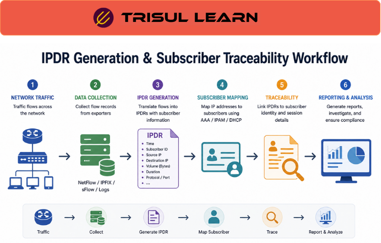

export const jsonLd = {
  "@context": "https://schema.org",
  "@type": "FAQPage",
  "mainEntity": [
    {
      "@type": "Question",
      "name": "What is IPDR?",
      "acceptedAnswer": {
        "@type": "Answer",
        "text": "IPDR (Internet Protocol Detail Record) is an industry standard for collecting and exchanging IP-based service usage and performance data in telecommunications networks. It provides information about IP-based service usage and other activities that can be used by operations support systems and business support systems. IPDR is the IP equivalent of the traditional telecom Call Detail Record."
      }
    },
    {
      "@type": "Question",
      "name": "What data does IPDR contain?",
      "acceptedAnswer": {
        "@type": "Answer",
        "text": "IPDR contains detailed information about network events including source and destination IP addresses, timestamps, packet sizes, protocols used, service quality metrics, subscriber identification, session duration, and data volume. The content is determined by the service provider, network element vendor, or community of users specifying particulars of IP-based services in a given context."
      }
    },
    {
      "@type": "Question",
      "name": "What are the use cases for IPDR?",
      "acceptedAnswer": {
        "@type": "Answer",
        "text": "IPDR is used for billing and accounting including usage-based billing and data volume tracking, traffic analysis including identifying heavy users and popular applications and bottlenecks, capacity planning including resource allocation and infrastructure scaling, security monitoring including anomaly detection and threat detection and incident response, QoS monitoring to ensure critical services receive necessary bandwidth, compliance and auditing for regulatory requirements and data retention laws, and policy enforcement for access controls and traffic rules."
      }
    },
    {
      "@type": "Question",
      "name": "What is the IPDR Streaming Protocol?",
      "acceptedAnswer": {
        "@type": "Answer",
        "text": "The IPDR Streaming Protocol is a real-time reporting protocol released in 2004 that provides an advanced streaming protocol for accounting information exchange. It works with templates negotiated between the collector and exporter, supports TCP, SCTP, or BEEP as transport protocols, and offers reliability through transport protocol-level acknowledgments and IPDR streaming protocol-level acknowledgments. The protocol is largely based on the CRANE protocol."
      }
    }
  ]
};

# What is IPDR?

IPDR (Internet Protocol Detail Record) is an industry standard for collecting and exchanging IP-based service usage and billing data in telecommunications networks, similar to Call Detail Records but for IP services. It provides detailed insights into network events, traffic flows, and subscriber usage for billing, monitoring, security, and capacity planning.

---

## How IPDR works

IPDR data is created by networking devices like cable modems, set-top boxes, CMTS, OLT, gateways, and other network elements. Each IPDR record contains metadata about network activity including IP addresses, timestamps, packet sizes, and protocols. IPDR data is stored, aggregated, and sent to operations and business support systems for processing.

---

## IPDR in network operations

IPDR supports billing and accounting with usage-based billing and data volume tracking. Traffic analysis identifies heavy users, popular applications, and bottlenecks. Capacity planning uses resource usage patterns to scale infrastructure appropriately. Security monitoring detects anomalies and suspicious behavior and supports incident response. QoS monitoring ensures critical services receive necessary bandwidth and prioritizes traffic. Compliance and auditing meet regulatory requirements and facilitate audits with comprehensive records.

---

## Uses of IPDR data

| Use Case | Description |
|---|---|
| Billing and accounting | Track data usage by individual users and customers for usage-based billing |
| Traffic analysis | Identify heavy users, popular applications, and network bottlenecks |
| Capacity planning | Understand resource usage patterns to scale infrastructure appropriately |
| Security monitoring | Detect anomalies and suspicious behavior and support incident response |
| QoS monitoring | Ensure critical services receive necessary bandwidth and prioritize traffic |
| Compliance and auditing | Meet regulatory requirements and facilitate audits with comprehensive records |
| Policy enforcement | Enforce network security policies and access controls based on traffic rules |
| Threat detection | Identify malicious network activity using intrusion detection systems |

---

## What makes IPDR work in practice

Data completeness determines billing accuracy. Missing IPDR records mean unbilled usage. Network elements must be configured to generate IPDR for all sessions and send them to the collector reliably. Retry logic handles temporary collector outages. Duplicate detection prevents double-billing when records are resent.

Schema flexibility enables vendor-specific extensions. IPDR uses XML Schema with a mapping to binary format based on XDR. Standard fields cover common use cases. Enterprise-specific extensions add custom metrics without breaking compatibility. Collectors must parse both standard and extended fields correctly.

---

## How Trisul handles IPDR

Trisul collects and analyzes IPDR data from various sources including CMTS, OLT, gateways, and other network elements. IPDR records are parsed and correlated with flow data including NetFlow, IPFIX, and sFlow to provide comprehensive visibility into subscriber usage, traffic patterns, and service quality. This enables billing support, capacity planning, and security monitoring with detailed subscriber-level data. Full documentation is at https://docs.trisul.org/docs/ug/flow/.

---

## Related terms

- [What is NetFlow?](/docs/glossary/netflow)
- [What is IPFIX?](/docs/glossary/ipfix)
- [What is CDR?](/docs/glossary/cdr)
- [What is subscriber billing?](/docs/glossary/subscriber-billing)
- [What is OSS BSS?](/docs/glossary/oss-bss)

---

## Frequently asked questions

### What is IPDR?

IPDR (Internet Protocol Detail Record) is an industry standard for collecting and exchanging IP-based service usage and performance data in telecommunications networks. It provides information about IP-based service usage and other activities that can be used by operations support systems and business support systems. IPDR is the IP equivalent of the traditional telecom Call Detail Record.

### What data does IPDR contain?

IPDR contains detailed information about network events including source and destination IP addresses, timestamps, packet sizes, protocols used, service quality metrics, subscriber identification, session duration, and data volume. The content is determined by the service provider, network element vendor, or community of users specifying particulars of IP-based services in a given context.

### What are the use cases for IPDR?

IPDR is used for billing and accounting including usage-based billing and data volume tracking, traffic analysis including identifying heavy users and popular applications and bottlenecks, capacity planning including resource allocation and infrastructure scaling, security monitoring including anomaly detection and threat detection and incident response, QoS monitoring to ensure critical services receive necessary bandwidth, compliance and auditing for regulatory requirements and data retention laws, and policy enforcement for access controls and traffic rules.

### What is the IPDR Streaming Protocol?

The IPDR Streaming Protocol is a real-time reporting protocol released in 2004 that provides an advanced streaming protocol for accounting information exchange. It works with templates negotiated between the collector and exporter, supports TCP, SCTP, or BEEP as transport protocols, and offers reliability through transport protocol-level acknowledgments and IPDR streaming protocol-level acknowledgments. The protocol is largely based on the CRANE protocol.