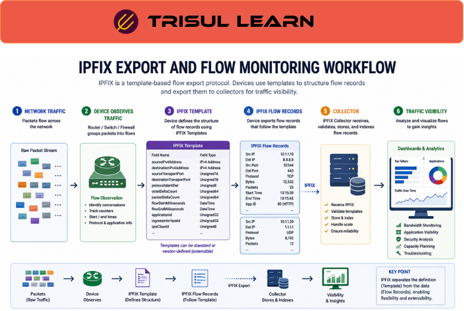

export const jsonLd = {
  "@context": "https://schema.org",
  "@type": "FAQPage",
  "mainEntity": [
    {
      "@type": "Question",
      "name": "What is IPFIX?",
      "acceptedAnswer": {
        "@type": "Answer",
        "text": "IPFIX (IP Flow Information Export) is an IETF standard protocol for transmitting IP flow information from network devices to a collector. It was created to provide a common universal standard for exporting flow data from routers, probes, and other devices used by mediation systems, accounting systems, billing systems, and network management systems. IPFIX is defined in RFC 7011 and RFC 7012."
      }
    },
    {
      "@type": "Question",
      "name": "How does IPFIX differ from NetFlow?",
      "acceptedAnswer": {
        "@type": "Answer",
        "text": "IPFIX is the IETF standardized version of Cisco NetFlow v9. NetFlow v9 introduced the template-based record format that IPFIX adopted and standardized. Unlike vendor-specific NetFlow, IPFIX is an open standard that any vendor can implement. IPFIX extends NetFlow v9 by supporting enterprise-specific Information Elements, variable-length fields, and additional transport options."
      }
    },
    {
      "@type": "Question",
      "name": "What is an IPFIX Information Element?",
      "acceptedAnswer": {
        "@type": "Answer",
        "text": "An IPFIX Information Element is a description of an attribute that may appear in an IPFIX record. Information Elements are IANA-assigned, defined in the IPFIX information model in RFC 7012, and may also be enterprise-specific and proprietary. They are grouped into categories including IP header fields, transport header fields, flow timestamps, per-flow counters, and miscellaneous flow properties. All IEs must be sent in network byte order as big endian."
      }
    },
    {
      "@type": "Question",
      "name": "What transport protocols does IPFIX use?",
      "acceptedAnswer": {
        "@type": "Answer",
        "text": "IPFIX is a push protocol where the exporter periodically sends messages to configured collectors without any interaction from the receiver. IPFIX supports SCTP as preferred for reliability, TCP, and UDP as transport protocols. SCTP is recommended because it is reliable, congestion-aware, and has a simpler state machine than TCP. Templates are resent at regular intervals to ensure the collector can always interpret data records."
      }
    }
  ]
};

# What is IPFIX?

IPFIX (IP Flow Information Export) is an IETF standard protocol for exporting IP flow information from routers, probes, and other network devices to a collector. It was created to provide a common universal standard for flow export, enabling measurement, accounting, billing, and network management. IPFIX is defined in RFC 7011 for protocol specification and RFC 7012 for information model.

---

## How IPFIX works

An IPFIX exporter on a router or probe observes IP packets at an observation point and groups them into flows. Flow records are encoded using templates and sent periodically to a collector. Templates describe the structure of data records, enabling the collector to always interpret records correctly even when new fields are added. IPFIX is a push protocol where the exporter sends data without any request from the collector.

---

## IPFIX in network operations

IPFIX exporters run on routers, switches, and probes throughout the network. The collector receives flow records from multiple exporters and aggregates them for analysis. SNMP provides interface counters and device metrics to complement flow data. Syslog captures device events and configuration changes. RADIUS provides subscriber authentication and accounting information for ISP deployments.

---

## IPFIX message structure

| Component | Description |
|---|---|
| Message Header | Version, length, export time, sequence number, observation domain ID |
| Template Record | Ordered sequence of type and length pairs defining a data record structure |
| Data Record | Values of parameters specified in a template record |
| Options Record | Defines structure and interpretation of a data record including scope |

---

## What makes IPFIX work in practice

Template management is the core mechanism. The exporter sends a template before sending data records that use that template. The collector caches the template and uses it to decode subsequent data records. If the exporter changes the template, it sends a new template with a new template ID. Old templates are kept until the collector stops using them.

Transport reliability affects data integrity. UDP is fast but drops packets under load. SCTP provides可靠 delivery with congestion control. TCP is reliable but adds overhead. For high-volume exporters, SCTP is the best choice. The collector must acknowledge received messages and handle retransmissions when exporters resend lost data.

---

## How Trisul handles IPFIX

Trisul collects IPFIX data natively alongside NetFlow v5, NetFlow v9, sFlow, and J-Flow. IPFIX data received by Trisul is decoded using the template-based mechanism, with templates cached per observation domain. All standard IPFIX Information Elements are supported, and enterprise-specific IEs can be configured for custom decoding. Full documentation is at https://docs.trisul.org/docs/ug/flow/.

---

## Related terms

- [What is NetFlow?](/glossary/netflow)
- [What is sFlow?](/glossary/sflow)
- [What is flow monitoring?](/glossary/flow-monitoring)
- [What is flow exporter?](/glossary/flow-exporter)
- [What is flow collector?](/glossary/flow-collector)

---

## Frequently asked questions

### What is IPFIX?

IPFIX (IP Flow Information Export) is an IETF standard protocol for transmitting IP flow information from network devices to a collector. It was created to provide a common universal standard for exporting flow data from routers, probes, and other devices used by mediation systems, accounting systems, billing systems, and network management systems. IPFIX is defined in RFC 7011 and RFC 7012.

### How does IPFIX differ from NetFlow?

IPFIX is the IETF standardized version of Cisco NetFlow v9. NetFlow v9 introduced the template-based record format that IPFIX adopted and standardized. Unlike vendor-specific NetFlow, IPFIX is an open standard that any vendor can implement. IPFIX extends NetFlow v9 by supporting enterprise-specific Information Elements, variable-length fields, and additional transport options.

### What is an IPFIX Information Element?

An IPFIX Information Element is a description of an attribute that may appear in an IPFIX record. Information Elements are IANA-assigned, defined in the IPFIX information model in RFC 7012, and may also be enterprise-specific and proprietary. They are grouped into categories including IP header fields, transport header fields, flow timestamps, per-flow counters, and miscellaneous flow properties. All IEs must be sent in network byte order as big endian.

### What transport protocols does IPFIX use?

IPFIX is a push protocol where the exporter periodically sends messages to configured collectors without any interaction from the receiver. IPFIX supports SCTP as preferred for reliability, TCP, and UDP as transport protocols. SCTP is recommended because it is reliable, congestion-aware, and has a simpler state machine than TCP. Templates are resent at regular intervals to ensure the collector can always interpret data records.