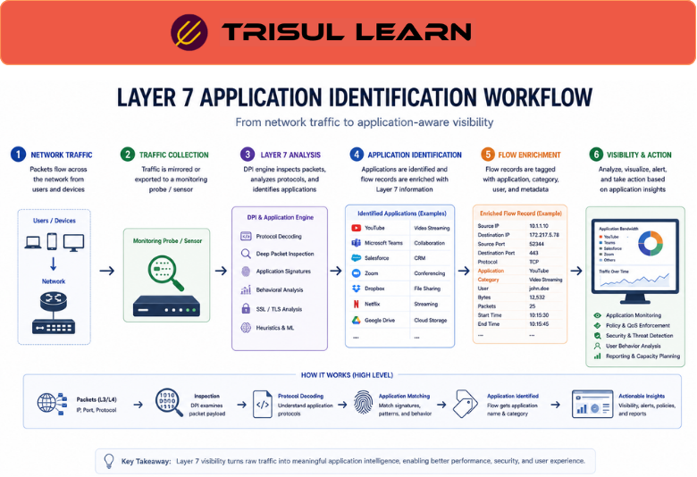

# What is Layer 7 Visibility?

Layer 7 Visibility is the ability to identify, analyze, and monitor network traffic at the application layer of the OSI model.

Instead of only viewing IP addresses, ports, or protocols, Layer 7 visibility helps organizations understand the actual applications, services, and user activity generating network traffic.

It provides deeper operational roles by showing:
- application usage
- user behavior
- cloud services
- web activity
- API communication
- application performance
- suspicious application traffic

Layer 7 visibility is essential for modern traffic analytics, security monitoring, and application-aware network operations.

## **How Layer 7 Visibility Works**

Traditional traffic monitoring focuses mainly on:
- IP addresses
- ports
- protocols
- bandwidth usage

However, many modern applications use:
- shared ports
- encrypted communication
- dynamic cloud services

Layer 7 visibility analyzes traffic patterns and application behavior using:
- Deep Packet Inspection (DPI)
- protocol analysis
- metadata extraction
- application signatures
- behavioral analytics

For example:

1. Traffic uses TCP port 443
2. Basic monitoring only identifies HTTPS traffic
3. Layer 7 analysis identifies:
   - YouTube
   - Microsoft Teams
   - Salesforce
   - Zoom
   - Dropbox
4. Teams gain application-aware visibility

## **Why Layer 7 Visibility Matters**

Modern networks are heavily application-driven.

Without Layer 7 visibility, organizations may struggle to:
- identify application traffic accurately
- troubleshoot user experience issues
- monitor cloud services
- detect shadow IT
- analyze encrypted traffic behavior
- investigate suspicious applications

Layer 7 visibility helps teams:
- understand application behavior
- improve troubleshooting accuracy
- optimize bandwidth usage
- enforce application policies
- detect anomalous traffic
- improve security monitoring

It is especially important in:
- enterprise networks
- cloud environments
- ISP infrastructures
- SOC operations
- SaaS-heavy deployments
- remote work environments

## **Common Operational Use Cases**

### Application Monitoring

Identify applications consuming bandwidth and resources.

### Security Monitoring

Detect suspicious or unauthorized application activity.

### Cloud Service Visibility

Monitor SaaS and internet-based applications.

### QoS and Traffic Prioritization

Apply policies based on application importance.

### User Experience Analysis

Investigate performance issues affecting business applications.

## **Layer 7 Visibility vs Basic Flow Visibility**

| Feature | Layer 7 Visibility | Basic Flow Visibility |
|---|---|---|
| Visibility Depth | Application-aware | IP and port-focused |
| Application Identification | Strong | Limited |
| Operational Context | Rich | Moderate |
| Encrypted Traffic Insight | Partial behavioral visibility | Minimal |
| Troubleshooting Capability | Advanced | Basic |

Layer 7 visibility provides deeper awareness into how applications behave across the network.

## **How Trisul Handles Layer 7 Visibility**

Trisul combines traffic analytics and DPI-driven workflows to provide application-aware network visibility.

Combined with:
- Deep Packet Inspection (DPI)
- Flow Analysis
- Top-K Analyticsᵀ
- Contextᵀ
- Retro Analysisᵀ
- Conversation View

Trisul helps teams:
- identify application traffic
- monitor cloud services
- analyze user behavior
- troubleshoot application performance
- investigate suspicious communication
- visualize application bandwidth consumption

Trisul can also integrate [Application Visibility](/glossary/application-visibility), [Encrypted Traffic Analysis](/glossary/encrypted-traffic-analysis), and [Traffic Investigation](/glossary/traffic-investigation) workflows for deeper analytics visibility.

## **Related Terms**

- [Application Visibility](/glossary/application-visibility)
- [Deep Packet Inspection (DPI)](/glossary/deep-packet-inspection-dpi)
- [Encrypted Traffic Analysis](/glossary/encrypted-traffic-analysis)
- [Flow Analysis](/glossary/flow-analysis)
- [Bandwidth Monitoring](/glossary/bandwidth-monitoring)
- [Traffic Investigation](/glossary/traffic-investigation)

---

## **FAQ**

### What is Layer 7 visibility?

Layer 7 visibility is the ability to identify and analyze network traffic at the application layer.

### Why is Layer 7 visibility important?

It helps organizations understand application behavior, troubleshoot issues, and improve security visibility.

### How does Layer 7 visibility work?

It uses techniques such as DPI, protocol analysis, and application signatures to identify application traffic.

### Can Layer 7 visibility identify cloud applications?

Yes. It can identify SaaS and internet-based applications even when they use shared ports like HTTPS.

### What's the difference between Layer 7 visibility and basic flow monitoring?

Basic flow monitoring focuses on IPs and ports, while Layer 7 visibility identifies actual applications and services.

### Is Layer 7 visibility useful for security monitoring?

Yes. It helps detect suspicious applications, shadow IT, and abnormal traffic behavior.