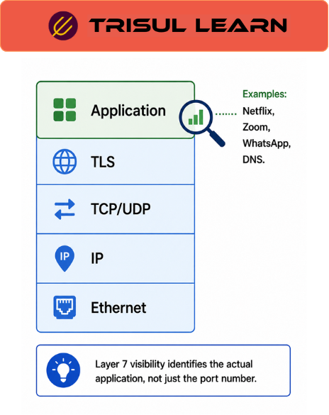

export const jsonLd = {
  "@context": "https://schema.org",
  "@type": "FAQPage",
  "mainEntity": [
    {
      "@type": "Question",
      "name": "What is Layer 7?",
      "acceptedAnswer": {
        "@type": "Answer",
        "text": "Layer 7 is the top layer in the 7-layer OSI Model of the Internet, also known as the application layer. It is just beneath the surface of user interfaces and on top of the other 6 layers. Layer 7 supports communications for end-user processes and applications and the presentation of data for user-facing software applications."
      }
    },
    {
      "@type": "Question",
      "name": "What does Layer 7 visibility provide?",
      "acceptedAnswer": {
        "@type": "Answer",
        "text": "Layer 7 visibility provides granular insight into network data at the application layer. It identifies specific applications like YouTube, Facebook, WhatsApp, and Instagram. It sees protocols like HTTP, FTP, DNS, and SSL/TLS. This enables intelligent approaches to load balancing, security, and traffic management."
      }
    },
    {
      "@type": "Question",
      "name": "How does Layer 7 visibility work?",
      "acceptedAnswer": {
        "@type": "Answer",
        "text": "Layer 7 visibility inspects packet payloads to identify applications and protocols. Unlike lower layers that focus on data transport and routing, Layer 7 interprets the actual content of communication. It reads application-layer headers and signatures to classify traffic."
      }
    },
    {
      "@type": "Question",
      "name": "What are the benefits of Layer 7 visibility?",
      "acceptedAnswer": {
        "@type": "Answer",
        "text": "Benefits include application-specific monitoring, granular traffic control, security threat detection at application level, optimized load balancing based on application type, and compliance with application-specific policies. Layer 7 has full visibility into network data."
      }
    }
  ]
};

# What is Layer 7 visibility?

**Layer 7 visibility** provides **application‑layer insight into network traffic** by identifying **specific applications, protocols, and content**. It operates at the **topmost layer of the OSI model (the application layer)**, where data directly interacts with user applications and services. This visibility lets operators see not just *who talks to whom* (IPs and ports) but also *what they are doing*—such as using YouTube, Facebook, WhatsApp, or specific HTTP/HTTPS services—enabling granular control and policy enforcement over protocols like **HTTP, FTP, DNS, SSL/TLS, and hundreds of other applications**.

---

## How Layer 7 visibility works

Layer 7 visibility works by **examining packet payloads** to identify **application signatures, protocol headers, and content patterns**. It:

- Reads **application‑layer constructs** such as HTTP methods, URIs, DNS queries, and TLS handshakes.  
- Uses **signature databases and classification engines** to map traffic into named applications and services.  
- Often runs as part of **deep packet inspection (DPI)** or **flow‑based analytics**, where application metadata is extracted and attached to flow records without storing full packets.  

Unlike **Layer 3 (network) and Layer 4 (transport)**, which focus on IP addresses and ports, Layer 7 interprets the **semantics of the communication**, giving tools the ability to distinguish, for example, YouTube from generic Google video traffic or Facebook from WhatsApp.

---

## Layer 7 visibility in network operations

In **NOC and security operations**, Layer 7 visibility is used to:

- Identify **which applications consume bandwidth** and set app‑specific policies (quotas, QoS, or blocking).  
- Detect **threats at the application layer**, such as malicious HTTP requests, suspicious DNS tunneling attempts, or abuse of allowed services.  
- Support **capacity planning** by tracking growth trends per application (e.g., streaming, collaboration apps, or SaaS).  

Because Layer 7 distinguishes between **similar but different services** (e.g., YouTube vs Google, Facebook vs WhatsApp vs Instagram), it enables **precise traffic‑management and security policies** rather than broad, port‑based rules that often affect legitimate traffic.

---

## Layer 7 vs lower layers comparison

| Layer | Focus | Visibility |
|------|-------|------------|
| Layer 3 (Network) | IP addresses and routing | Source and destination IP addresses and subnets |
| Layer 4 (Transport) | Ports and transport protocols | TCP/UDP ports and flows between hosts |
| Layer 7 (Application) | Application content and behavior | Specific applications, services, and protocols such as HTTP, DNS, TLS, and named apps |

Layer 7 visibility builds on top of Layers 3 and 4, adding **semantic context** that is essential for **application‑centric monitoring, security, and policy**.

---

## What makes Layer 7 visibility work in practice

Two main factors are critical:

- **Up‑to‑date signature and classification databases**: New apps and update‑driven behaviors constantly change how traffic looks; without regular updates, traffic is misclassified or labeled “unknown.”  
- **Encryption handling**: With **TLS‑encrypted traffic**, Layer 7 cannot inspect payload content directly; visibility is limited to **TLS metadata** (e.g., SNI, certificate details, JA3 fingerprints). To see inside encrypted payloads, operators may use **TLS‑inspection proxies** or obtain session keys, but this must be done in compliance with policy and regulation.  

Even without full decryption, Layer 7 visibility can still provide **valuable metadata‑level classification** that supports **monitoring, policy, and anomaly detection**.

---

## How Trisul handles Layer 7 visibility

Trisul delivers **Layer 7 visibility** by integrating **application‑layer classification** into its flow‑monitoring and flow‑based analytics stack. It:

- Extracts **application metadata from packet payloads** (where visible) and enriches flow records with **application names and protocols**.  
- Differentiates between **hundreds of named applications** such as **YouTube, Facebook, WhatsApp, Instagram, and many other services**.  
- Exposes **Layer 7‑classified flows** in dashboards, KPIs, and investigative views, so operators can see **application‑specific traffic patterns, Top‑N apps, and app‑involved anomalies**.  

This enables **application‑centric network operations, policy‑driven traffic‑management, and security‑oriented application‑level threat detection** across campus, ISP, and enterprise environments. For installation and configuration details, refer to the Trisul documentation at [https://docs.trisul.org/docs/ag/install/](https://docs.trisul.org/docs/ag/install/).

---

## Related terms

- [What is deep packet inspection?](/docs/glossary/dpi)  
- [What is application monitoring?](/docs/glossary/application-monitoring)  
- [What is flow monitoring?](/docs/glossary/flow-monitoring)  
- [What is TLS inspection?](/docs/glossary/tls-inspection)  
- [What is OSI model?](/docs/glossary/osi-model)  

---

## Frequently asked questions

### What is Layer 7?

Layer 7 is the top layer in the 7‑layer OSI Model of the Internet, also known as the application layer. It is just beneath the surface of user interfaces and on top of the other 6 layers. Layer 7 supports communications for end‑user processes and applications and the presentation of data for user‑facing software applications.

### What does Layer 7 visibility provide?

Layer 7 visibility provides granular insight into network data at the application layer. It identifies specific applications like YouTube, Facebook, WhatsApp, and Instagram. It sees protocols like HTTP, FTP, DNS, and SSL/TLS. This enables intelligent approaches to load balancing, security, and traffic management.

### How does Layer 7 visibility work?

Layer 7 visibility inspects packet payloads to identify applications and protocols. Unlike lower layers that focus on data transport and routing, Layer 7 interprets the actual content of communication. It reads application‑layer headers and signatures to classify traffic.

### What are the benefits of Layer 7 visibility?

Benefits include application‑specific monitoring, granular traffic control, security threat detection at application level, optimized load balancing based on application type, and compliance with application‑specific policies. Layer 7 has full visibility into network data.