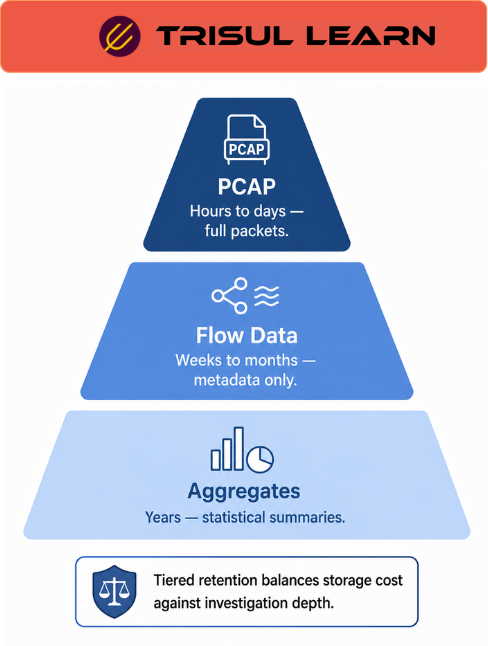

export const jsonLd = {
  "@context": "https://schema.org",
  "@type": "FAQPage",
  "mainEntity": [
    {
      "@type": "Question",
      "name": "What is long term traffic retention?",
      "acceptedAnswer": {
        "@type": "Answer",
        "text": "Long term traffic retention stores flow data for extended periods to enable historical analysis, capacity planning, compliance reporting, and forensic investigation. Trisul does not summarize or roll up any old data. Use retro analysis tools, long term traffic charts, monthly usage reports and other tools for historical analysis."
      }
    },
    {
      "@type": "Question",
      "name": "Why is long term retention important?",
      "acceptedAnswer": {
        "@type": "Answer",
        "text": "Long term retention enables capacity planning by tracking bandwidth growth trends over months and years. It supports compliance reporting for regulatory requirements. Forensic investigation requires historical data to analyze past security incidents. Monthly usage reports need long-term storage."
      }
    },
    {
      "@type": "Question",
      "name": "How long should traffic data be retained?",
      "acceptedAnswer": {
        "@type": "Answer",
        "text": "Retention period depends on use case. Flow data can be retained for weeks to months on the same hardware that stores PCAP for hours to days. Full fidelity retention of more than 7 to 14 days requires either heavy filtering or purpose-built storage infrastructure."
      }
    },
    {
      "@type": "Question",
      "name": "How do you draw long term bandwidth usage charts?",
      "acceptedAnswer": {
        "@type": "Answer",
        "text": "Select Tools, then Long Term Traffic. Choose Apps or Hosts from Counter Group and Total from meters. Enter port number or IP address in item box. Click Analyze to draw long term bandwidth usage chart for that port or host."
      }
    }
  ]
};

# What is long term traffic retention?

Long term traffic retention stores flow data for extended periods to enable historical analysis, capacity planning, compliance reporting, and forensic investigation. It provides visibility into traffic trends over weeks, months, and years. Trisul does not summarize or roll up any old data for historical analysis.

---

## How long term retention works

Flow data is collected continuously and stored in backend databases. Data is retained without summarization or rollup. Long term traffic charts query historical flow data to show bandwidth usage over time. Monthly usage reports summarize traffic for billing and capacity planning.

Aggregate statistics are stored at 1 minute resolution. Historical data is indexed for fast querying. Retro analysis tools apply new detection rules to historical data after the fact.

---

## Long term retention in network operations

In capacity planning, use long term traffic charts to track bandwidth growth trends. Identify seasonal patterns and peak utilization periods. Engineering uses historical data to plan network upgrades before links reach saturation. Compliance teams generate monthly usage reports for billing and regulatory requirements.

Forensic investigation uses historical data to analyze past security incidents. Retro analysis determines whether a host communicated with a newly-discovered malicious domain before the threat was known.

---

## Retention comparison

| Data Type | Retention Period | Storage |
|---|---|---|
| Full PCAP | Hours to days | Tens of TB per day |
| Flow data | Weeks to months | 1 to 2% of PCAP volume |
| Aggregate stats | Years | Minimal storage |

---

## What makes long term retention work in practice

Storage capacity determines retention period. Flow data is approximately 1 to 2 percent of equivalent PCAP volume enabling weeks or months of retention on the same hardware. Tiered storage moves old data to cheaper disks while keeping recent data on fast storage.

Query performance degrades with large archives. Indexing and aggregation enable fast queries even with terabytes of historical data. Without indexing, queries scan all files manually and become unusable at scale.

---

## How Trisul handles long term retention

Trisul stores flow data without summarization or rollup. Use retro analysis tools, long term traffic charts, and monthly usage reports for historical analysis. Select Tools, then Long Term Traffic to draw bandwidth usage charts. Full historical data is available for analysis. Retention is determined by storage capacity. Flow monitoring tracks millions of flows enabling long-term retention. Full documentation is at https://docs.trisul.org/docs/ug/cg/tasks/.

---

## Related terms

- [What is retro analysis?](/glossary/retro-analysis)
- [What is capacity planning?](/glossary/capacity-planning)
- [What is monthly usage reports?](/glossary/monthly-usage-reports)
- [What is flow monitoring?](/glossary/flow-monitoring)
- [What is storage?](/glossary/storage)

---

## Frequently asked questions

### What is long term traffic retention?

Long term traffic retention stores flow data for extended periods to enable historical analysis, capacity planning, compliance reporting, and forensic investigation. Trisul does not summarize or roll up any old data. Use retro analysis tools, long term traffic charts, monthly usage reports and other tools for historical analysis.

### Why is long term retention important?

Long term retention enables capacity planning by tracking bandwidth growth trends over months and years. It supports compliance reporting for regulatory requirements. Forensic investigation requires historical data to analyze past security incidents. Monthly usage reports need long-term storage.

### How long should traffic data be retained?

Retention period depends on use case. Flow data can be retained for weeks to months on the same hardware that stores PCAP for hours to days. Full fidelity retention of more than 7 to 14 days requires either heavy filtering or purpose-built storage infrastructure.

### How do you draw long term bandwidth usage charts?

Select Tools, then Long Term Traffic. Choose Apps or Hosts from Counter Group and Total from meters. Enter port number or IP address in item box. Click Analyze to draw long term bandwidth usage chart for that port or host.