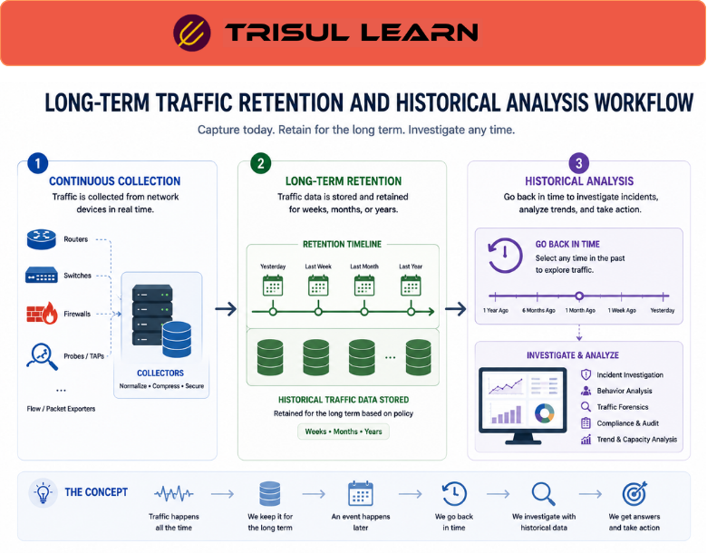

# What is Long-Term Traffic Retention?

Long-Term Traffic Retention is the practice of storing network traffic data for extended periods so organizations can analyze historical communication, investigate incidents, monitor trends, and support compliance requirements.

Instead of keeping only short-term visibility, long-term retention helps teams review traffic activity weeks, months, or even years after it occurred.

Organizations retain traffic data such as:
- flow records
- packet captures
- bandwidth statistics
- DNS activity
- application visibility
- subscriber logs
- traffic metadata

Long-term retention is especially important for:
- security investigations
- compliance monitoring
- capacity planning
- traffic forensics
- operational analytics

## **How Long-Term Traffic Retention Works**

Monitoring systems continuously collect traffic visibility data from:
- routers
- switches
- firewalls
- packet capture systems
- flow exporters
- DPI platforms

The collected data is:
1. indexed and compressed
2. stored in scalable databases or storage systems
3. retained according to operational or compliance policies
4. made searchable for future investigation

For example:

1. Traffic activity is recorded continuously
2. Data is retained for several months
3. A security incident is discovered later
4. Analysts review historical traffic behavior to reconstruct the event

Retention strategies may vary depending on:
- storage capacity
- compliance requirements
- traffic volume
- investigation needs
- operational goals

## **Why Long-Term Traffic Retention Matters**

Many operational and security issues are discovered long after they occur.

Without historical retention, organizations may struggle to:
- reconstruct attack timelines
- investigate subscriber activity
- analyze recurring anomalies
- troubleshoot intermittent issues
- support compliance investigations
- study long-term traffic trends

Long-term retention helps teams:
- improve forensic visibility
- support incident response
- analyze historical behavior
- maintain compliance records
- optimize capacity planning
- investigate stealthy attacks

It is especially important in:
- SOC environments
- ISP infrastructures
- enterprise networks
- telecom compliance systems
- cloud environments
- regulated industries

## **Common Operational Use Cases**

### Security Investigations

Reconstruct attack timelines and suspicious communication history.

### Compliance Monitoring

Retain historical records for audit and regulatory requirements.

### Capacity Planning

Analyze long-term bandwidth and application growth trends.

### Subscriber Traceability

Investigate historical subscriber and NAT activity.

### Traffic Forensics

Review historical communication patterns and anomalies.

## **Long-Term Traffic Retention vs Live Monitoring**

| Feature | Long-Term Traffic Retention | Live Monitoring |
|---|---|---|
| Time Scope | Historical visibility | Current visibility |
| Investigation Capability | Strong | Limited |
| Trend Analysis | Advanced | Moderate |
| Storage Requirement | High | Lower |
| Operational Focus | Retrospective analysis | Real-time awareness |

Long-term retention focuses on historical visibility, while live monitoring focuses on current network activity.

## **How Trisul Handles Long-Term Traffic Retention**

Trisul is designed for scalable long-term traffic analytics across enterprise and ISP environments.

Combined with:
- Retro Analysisᵀ
- Flow Analysis
- Packet Capture
- Top-K Analyticsᵀ
- Contextᵀ
- Multigraph Analyticsᵀ

Trisul helps teams:
- investigate historical traffic behavior
- reconstruct communication timelines
- analyze long-term trends
- retain scalable traffic visibility
- troubleshoot recurring issues
- support compliance workflows

Trisul can also integrate [Historical Traffic Analysis](/glossary/historical-traffic-analysis), [Flow Forensics](/glossary/flow-forensics), and [IPDR](/glossary/ipdr) workflows for deeper historical visibility.

## **Related Terms**

- [Historical Traffic Analysis](/glossary/historical-traffic-analysis)
- [Flow Forensics](/glossary/flow-forensics)
- [Retro Analysisᵀ](/glossary/retro-analysis)
- [Packet Capture](/glossary/packet-capture)
- [IPDR](/glossary/ipdr)
- [Traffic Investigation](/glossary/traffic-investigation)

---

## **FAQ**

### What is long-term traffic retention?

Long-term traffic retention is the practice of storing network traffic data for extended historical analysis and investigation.

### Why is long-term traffic retention important?

It helps organizations investigate incidents, analyze trends, support compliance, and maintain historical visibility.

### What types of data are commonly retained?

Common retained data includes flow records, packet captures, DNS logs, bandwidth metrics, and subscriber activity.

### How long is traffic data typically retained?

Retention periods vary depending on operational needs, storage capacity, and compliance requirements.

### Is long-term retention useful for security investigations?

Yes. It helps reconstruct attack timelines and investigate suspicious communication after incidents are discovered.

### Can long-term traffic retention support telecom compliance?

Yes. ISPs and telecom providers often retain historical traffic and subscriber activity for compliance and traceability requirements.