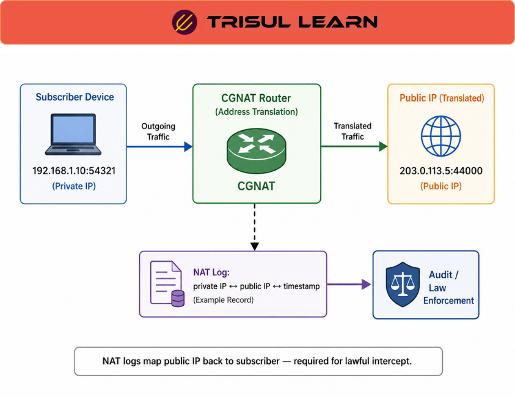

export const jsonLd = {
  "@context": "https://schema.org",
  "@type": "FAQPage",
  "mainEntity": [
    {
      "@type": "Question",
      "name": "What is NAT logging?",
      "acceptedAnswer": {
        "@type": "Answer",
        "text": "NAT logging records Network Address Translation events that occur on routers, firewalls, and NAT gateways. It tracks source and destination IP address mappings, port translations, and timestamps. NAT logging enables security auditing, troubleshooting, and compliance by providing a record of address translations."
      }
    },
    {
      "@type": "Question",
      "name": "Why is NAT logging important?",
      "acceptedAnswer": {
        "@type": "Answer",
        "text": "NAT logging is critical for security auditing and incident investigation. When NAT translates private IPs to public IPs, it becomes difficult to trace traffic back to the original source. NAT logs preserve the mapping so investigators can identify which internal host initiated external connections. It also supports compliance requirements for traffic logging."
      }
    },
    {
      "@type": "Question",
      "name": "What data does NAT logging capture?",
      "acceptedAnswer": {
        "@type": "Answer",
        "text": "NAT logging captures original source IP and port, translated source IP and port, original destination IP and port, translated destination IP and port, protocol type, timestamp of translation creation, timestamp of translation expiration, and bytes and packets transferred. This data enables complete reconstruction of NAT sessions."
      }
    },
    {
      "@type": "Question",
      "name": "How does NAT logging support security?",
      "acceptedAnswer": {
        "@type": "Answer",
        "text": "NAT logging supports security by enabling investigators to trace external threats back to internal hosts. When malicious traffic originates from inside the network, NAT logs show which internal IP initiated the connection. NAT logs also detect unauthorized NAT configurations and track suspicious translation patterns indicating compromise."
      }
    }
  ]
};

# What is NAT logging?

NAT logging records Network Address Translation events including source and destination IP address mappings, port translations, and timestamps. It tracks address translations for security auditing, troubleshooting, and compliance. NAT logging preserves the mapping between private and public IPs to enable traffic tracing.

---

## How NAT logging works

NAT logging occurs on routers, firewalls, and NAT gateways that perform address translation. When a packet is translated, the NAT device creates a translation entry and logs the event. Logs are sent to collectors via Syslog or stored locally. Each log entry includes original and translated addresses with timestamps.

---

## NAT logging in network operations

In the NOC, use NAT logs to troubleshoot connectivity issues caused by translation failures. Security teams analyze NAT logs to trace external threats back to internal hosts. Compliance teams use NAT logs for audit requirements showing who accessed what external resources from inside the network.

NAT logs help identify unauthorized NAT configurations. When internal hosts use unexpected external IPs, NAT logs reveal the translation and identify the source.

---

## NAT logging data fields

| Field | Description |
|---|---|
| Original source IP | Internal IP before translation |
| Translated source IP | Public IP after translation |
| Original source port | Internal port before translation |
| Translated source port | Public port after translation |
| Timestamp creation | When translation entry was created |
| Timestamp expiration | When translation entry was removed |
| Bytes transferred | Total bytes in the translation session |
| Packets transferred | Total packets in the translation session |

---

## What makes NAT logging work in practice

Log completeness determines investigation capability. Missing NAT logs mean lost translation history. Enable logging on all NAT devices and ensure logs reach the collector reliably. Retry logic handles temporary collector outages.

Log retention period must match compliance requirements. Some regulations require NAT logs for 90 days or longer. Storage capacity must support the retention period. NAT logging generates significant data during high translation volumes.

---

## How Trisul handles NAT logging

Trisul correlates NAT logging data with flow records to provide visibility into address translations. When NAT logs are available, Trisul maps translated IPs back to original internal IPs. This enables accurate traffic analysis even when NAT obscures the original source. Full documentation is at https://docs.trisul.org/docs/ug/flow/.

---

## Related terms

- [What is NetFlow?](/docs/glossary/netflow)
- [What is security auditing?](/docs/glossary/security-auditing)
- [What is firewall logging?](/docs/glossary/firewall-logging)
- [What is incident investigation?](/docs/glossary/incident-investigation)
- [What is Syslog?](/docs/glossary/syslog)

---

## Frequently asked questions

### What is NAT logging?

NAT logging records Network Address Translation events that occur on routers, firewalls, and NAT gateways. It tracks source and destination IP address mappings, port translations, and timestamps. NAT logging enables security auditing, troubleshooting, and compliance by providing a record of address translations.

### Why is NAT logging important?

NAT logging is critical for security auditing and incident investigation. When NAT translates private IPs to public IPs, it becomes difficult to trace traffic back to the original source. NAT logs preserve the mapping so investigators can identify which internal host initiated external connections. It also supports compliance requirements for traffic logging.

### What data does NAT logging capture?

NAT logging captures original source IP and port, translated source IP and port, original destination IP and port, translated destination IP and port, protocol type, timestamp of translation creation, timestamp of translation expiration, and bytes and packets transferred. This data enables complete reconstruction of NAT sessions.

### How does NAT logging support security?

NAT logging supports security by enabling investigators to trace external threats back to internal hosts. When malicious traffic originates from inside the network, NAT logs show which internal IP initiated the connection. NAT logs also detect unauthorized NAT configurations and track suspicious translation patterns indicating compromise.