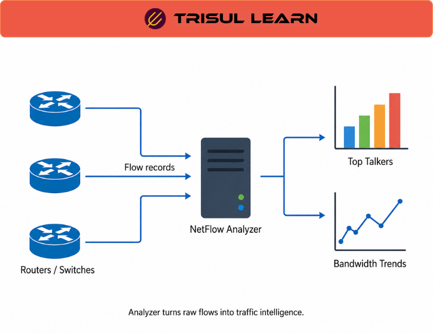

export const jsonLd = {
  "@context": "https://schema.org",
  "@type": "FAQPage",
  "mainEntity": [
    {
      "@type": "Question",
      "name": "What is NetFlow Analyzer?",
      "acceptedAnswer": {
        "@type": "Answer",
        "text": "NetFlow Analyzer is a network monitoring tool that collects and analyzes NetFlow data to provide bandwidth usage insights, traffic patterns, application visibility, and network utilization reports. It generates real-time traffic graphs as soon as NetFlow data is received. The Traffic tab shows real-time traffic graphs for incoming and outgoing traffic."
      }
    },
    {
      "@type": "Question",
      "name": "What does NetFlow Analyzer provide?",
      "acceptedAnswer": {
        "@type": "Answer",
        "text": "NetFlow Analyzer provides bandwidth utilization tracking, top talkers identification, application usage reports, traffic pattern analysis, network interface monitoring, capacity planning reports, and security anomaly detection. It enables detailed visibility into network traffic without packet capture."
      }
    },
    {
      "@type": "Question",
      "name": "How does NetFlow Analyzer work?",
      "acceptedAnswer": {
        "@type": "Answer",
        "text": "NetFlow Analyzer collects flow data from routers and switches via NetFlow, sFlow, J-Flow, or IPFIX. The collector receives flow records and aggregates them by interface, application, host, or protocol. Traffic graphs and reports are generated from aggregated data showing utilization patterns and trends."
      }
    },
    {
      "@type": "Question",
      "name": "What are the use cases for NetFlow Analyzer?",
      "acceptedAnswer": {
        "@type": "Answer",
        "text": "Use cases include bandwidth capacity planning, application usage tracking, top talkers identification, network utilization reports, security monitoring for anomalies, billing and chargeback based on bandwidth usage, and troubleshooting network performance issues through traffic pattern analysis."
      }
    }
  ]
};

# What is NetFlow Analyzer?

NetFlow Analyzer is a network monitoring tool that collects and analyzes NetFlow data to provide bandwidth usage insights, traffic patterns, application visibility, and network utilization reports for capacity planning and security monitoring. It generates real-time traffic graphs as soon as NetFlow data is received.

---

## How NetFlow Analyzer works

NetFlow Analyzer collects flow data from routers and switches via NetFlow, sFlow, J-Flow, or IPFIX. Flow exporters send records continuously to the collector. The collector aggregates flow data by interface, application, host, or protocol. Traffic graphs and reports are generated from aggregated data.

Real-time traffic graphs update within seconds of flow data arrival. Traffic Pattern Analysis empowers scrutiny of shifts in network interface behavior and identifies unusual traffic patterns as anomalies. Historical reports show trends over days, weeks, and months.

---

## NetFlow Analyzer in network operations

In the NOC, use NetFlow Analyzer to track bandwidth utilization and identify top talkers. Security teams detect anomalies through traffic pattern alerts generated in real-time. Capacity planning uses utilization reports to plan network upgrades before links reach saturation.

Generate monthly usage reports for billing and chargeback. Track application usage to understand what consumes bandwidth. Identify network bottlenecks through interface utilization analysis.

---

## NetFlow Analyzer capabilities

| Capability | Description |
|---|---|
| Bandwidth monitoring | Real-time and historical bandwidth utilization |
| Top talkers | Identify hosts and applications consuming most bandwidth |
| Traffic patterns | Analyze traffic patterns and detect anomalies |
| Application visibility | Identify applications using Layer 7 visibility |
| Capacity planning | Reports for network upgrade planning |
| Security monitoring | Detect anomalies through traffic pattern analysis |

---

## What makes NetFlow Analyzer work in practice

Accurate NetFlow export configuration is essential. Flow exporters must be enabled on all critical interfaces. Sampling rate must be configured correctly for accurate traffic estimation. Without proper configuration, NetFlow Analyzer shows incomplete data.

Real-time collection frequency determines monitoring accuracy. High-frequency collection provides more accurate real-time views but generates more load on network devices. Balance collection frequency against device CPU and network overhead.

---

## How Trisul handles NetFlow Analyzer

Trisul provides NetFlow Analyzer capabilities through flow collection and analysis. Trisul collects NetFlow, J-Flow, sFlow, and IPFIX data. Real-time traffic graphs show utilization within 1 to 3 seconds. Traffic Pattern Analysis empowers scrutiny of shifts in network interface behavior. Login as user, select Dashboards, then Real Time Traffic to view traffic graphs. Full documentation is at https://docs.trisul.org/docs/ug/cg/tasks/.

---

## Related terms

- [What is NetFlow?](/docs/glossary/netflow)
- [What is bandwidth monitoring?](/docs/glossary/bandwidth-monitoring)
- [What is traffic pattern analysis?](/docs/glossary/traffic-pattern-analysis)
- [What is flow monitoring?](/docs/glossary/flow-monitoring)
- [What is capacity planning?](/docs/glossary/capacity-planning)

---

## Frequently asked questions

### What is NetFlow Analyzer?

NetFlow Analyzer is a network monitoring tool that collects and analyzes NetFlow data to provide bandwidth usage insights, traffic patterns, application visibility, and network utilization reports. It generates real-time traffic graphs as soon as NetFlow data is received. The Traffic tab shows real-time traffic graphs for incoming and outgoing traffic.

### What does NetFlow Analyzer provide?

NetFlow Analyzer provides bandwidth utilization tracking, top talkers identification, application usage reports, traffic pattern analysis, network interface monitoring, capacity planning reports, and security anomaly detection. It enables detailed visibility into network traffic without packet capture.

### How does NetFlow Analyzer work?

NetFlow Analyzer collects flow data from routers and switches via NetFlow, sFlow, J-Flow, or IPFIX. The collector receives flow records and aggregates them by interface, application, host, or protocol. Traffic graphs and reports are generated from aggregated data showing utilization patterns and trends.

### What are the use cases for NetFlow Analyzer?

Use cases include bandwidth capacity planning, application usage tracking, top talkers identification, network utilization reports, security monitoring for anomalies, billing and chargeback based on bandwidth usage, and troubleshooting network performance issues through traffic pattern analysis.