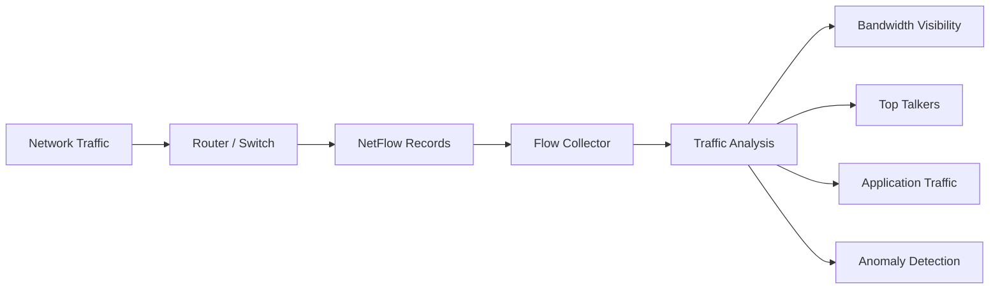

# What is NetFlow?

NetFlow is a network flow monitoring technology developed by Cisco that records and exports metadata about network traffic flowing through routers, switches, and firewalls.

Instead of capturing every packet, NetFlow summarizes communication into flow records that describe how devices, applications, and users interact across the network.

NetFlow helps organizations define traffic roles by identifying:
- who is communicating
- where traffic is going
- which applications are active
- how much bandwidth is being used
- how long communication lasts

NetFlow is widely used for:
- bandwidth monitoring
- traffic analysis
- security monitoring
- troubleshooting
- ISP analytics
- capacity planning

## How NetFlow Works

Network devices observe packets flowing through their interfaces and group related traffic into flows.

A flow is typically identified using attributes such as:
- source IP address
- destination IP address
- source port
- destination port
- protocol
- interface
- traffic direction

The device then creates and exports a flow record containing metadata such as:
- packet counts
- byte counts
- timestamps
- session duration
- application information

A typical NetFlow workflow looks like this:

1. Traffic passes through a router or switch
2. The device creates flow records
3. Flow records are exported to a collector
4. Analytics platforms process and visualize the traffic

```
Network Device → NetFlow Exporter → Flow Collector → Flow Analyzer
```



*Figure: NetFlow workflow showing traffic observation, flow export, collection, and traffic analytics visibility.*

## Why NetFlow Matters

Modern networks generate massive traffic volumes that are difficult to analyze packet-by-packet.

NetFlow helps organizations:

- monitor bandwidth usage
- identify top talkers
- analyze application traffic
- troubleshoot congestion
- detect anomalies
- investigate suspicious communication

Without NetFlow visibility, teams may struggle to:

- understand traffic behavior
- identify bandwidth consumers
- analyze network usage trends
- investigate traffic spikes
- optimize infrastructure planning

NetFlow is especially important in:

- enterprise networks
- ISP infrastructures
- cloud environments
- data centers
- SOC operations

## Common Operational Use Cases

### Bandwidth Monitoring

Analyze link utilization and traffic consumption.

### Application Visibility

Identify applications generating traffic across the network.

### Security Monitoring

Detect suspicious communication and abnormal traffic patterns.

### Capacity Planning

Monitor long-term traffic growth and infrastructure usage.

### ISP Traffic Analytics

Analyze subscriber behavior and backbone utilization.

## NetFlow vs Packet Capture

| Feature|  NetFlow | Packet Capture| 
|--------|---------|----------------|
| Visibility Type | Traffic metadata|   Full packet contents| 
| Storage Requirement|  Lower | Much higher| 
| Scalability|  High  | Moderate| 
| Payload Visibility  | Minimal or none | Full| 
| Common Use |  Traffic analytics|  Deep troubleshooting| 

NetFlow provides scalable traffic visibility, while packet capture provides deeper packet-level analysis.

## How Trisul Handles NetFlow Visibility

Trisul provides scalable NetFlow analytics for enterprise, ISP, and cloud environments.

Combined with:

- Flow Analysis
- Top-K Analyticsᵀ
- Flow Stitchingᵀ
- Contextᵀ
- Retro Analysisᵀ
- Long-Term Traffic Retention

Trisul helps teams:

- analyze traffic behavior
- monitor bandwidth utilization
- identify top talkers
- investigate anomalies
- visualize application traffic
- retain historical visibility

Trisul can also integrate IPFIX, Flow Monitoring, and Application Visibility workflows for deeper traffic analytics.

## Related Terms

- IPFIX
- Flow Monitoring
- Flow Collector
- Flow Analyzer
- Bandwidth Monitoring
- Application Visibility

## FAQ

### What is NetFlow?

NetFlow is a traffic monitoring technology that exports metadata about network communication flows.

### Why is NetFlow important?

It helps organizations monitor bandwidth usage, analyze traffic behavior, troubleshoot issues, and detect anomalies.

### What information does NetFlow provide?

NetFlow records may include IP addresses, ports, protocols, bandwidth usage, timestamps, and session duration.

### What's the difference between NetFlow and packet capture?

NetFlow summarizes traffic into metadata, while packet capture records full packet contents.

### Which devices support NetFlow?

Routers, switches, firewalls, probes, and virtual appliances commonly support NetFlow exports.

### Is NetFlow useful for security monitoring?

Yes. NetFlow helps identify suspicious communication, abnormal traffic behavior, and traffic anomalies.