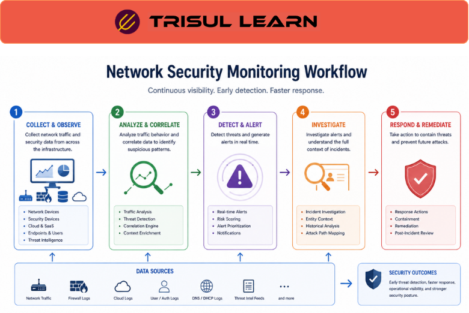

# What is Network Security Monitoring (NSM)?

Network Security Monitoring (NSM) is the continuous process of collecting, analyzing, and investigating network traffic and security-related data to detect threats, identify suspicious behavior, and respond to security incidents.

NSM helps organizations define security roles by continuously monitoring:
- traffic behavior
- suspicious communication
- anomalies
- malware activity
- lateral movement
- attack patterns
- security events

Unlike traditional perimeter-only security approaches, NSM focuses on maintaining ongoing visibility into how systems and users behave across the network.

## How Network Security Monitoring Works

NSM platforms collect visibility data from multiple sources such as:
- flow records
- packet captures
- IDS alerts
- DNS traffic
- endpoint telemetry
- firewall logs
- application visibility systems

Security analysts then:
1. monitor live traffic activity
2. investigate suspicious behavior
3. correlate alerts and communication patterns
4. reconstruct incidents using historical visibility

A typical NSM workflow looks like this:

```
Traffic Visibility → Detection → Investigation → Incident Response
```

For example:

- A system begins communicating with suspicious external hosts
- NSM platforms identify abnormal behavior
- Analysts correlate traffic and security events
- The communication is investigated and contained



## Why Network Security Monitoring Matters

Modern cyberattacks are often:

- stealthy
- distributed
- encrypted
- long-lived
- behavior-driven

Without continuous network visibility, organizations may struggle to:

- detect attacks early
- investigate suspicious traffic
- identify compromised systems
- monitor lateral movement
- reconstruct attack timelines

NSM helps organizations:

- improve threat visibility
- detect anomalies
- investigate attacks
- strengthen incident response
- analyze communication behavior
- improve security operations

It is especially important in:

- SOC environments
- enterprise security operations
- ISP infrastructures
- cloud environments
- hybrid networks
- regulated industries

## Common Operational Use Cases

### Threat Detection

Identify suspicious communication and attack behavior.

### Incident Response

Investigate security incidents using historical traffic visibility.

### Malware Investigation

Analyze command-and-control traffic and abnormal sessions.

### Lateral Movement Detection

Monitor east-west communication inside the network.

### Insider Threat Monitoring

Detect abnormal user or device behavior.

## Network Security Monitoring vs Traditional Security Monitoring

| Feature | Network Security Monitoring | Traditional Security Monitoring| 
|---------|-----------------------------|---------------------------------|
| Visibility Scope |  Continuous traffic analysis|  Event or perimeter-focused| 
| Behavioral Analysis | Strong |  Moderate| 
| Historical Investigation|   Supported | Often limited| 
| Threat Detection Depth |  High|   Moderate| 
| Operational Focus|  Ongoing visibility and investigation |  Alert handling| 

NSM focuses on continuous network visibility and behavioral investigation rather than only isolated alerts.

## How Trisul Supports Network Security Monitoring

Trisul provides deep traffic analytics and forensic visibility for NSM-driven security operations.

Combined with:

- Packet Capture
- Flow Analysis
- Retro Analysisᵀ
- Badfellasᵀ
- Contextᵀ
- Multigraph Analyticsᵀ

Trisul helps teams:

- investigate suspicious communication
- analyze network behavior
- reconstruct attack timelines
- detect anomalous traffic
- monitor east-west movement
- improve forensic visibility

Trisul can also integrate Incident Response, Network Forensics, and Anomaly Detection workflows for deeper threat visibility.

## Related Terms

- Incident Response
- Network Forensics
- Anomaly Detection
- IDS Integration
- Packet Capture
- Traffic Investigation

## FAQ

### What is Network Security Monitoring?

Network Security Monitoring is the continuous process of monitoring and analyzing network traffic for security threats and suspicious behavior.

### Why is NSM important?

It helps organizations detect attacks, investigate suspicious activity, and improve incident response.

### What data sources are used in NSM?

NSM commonly uses flow records, packet captures, IDS alerts, DNS logs, firewall logs, and endpoint telemetry.

### How does NSM differ from traditional security monitoring?

NSM focuses on continuous traffic visibility and behavioral analysis instead of only isolated alerts.

### Can NSM detect insider threats?

Yes. NSM can identify abnormal communication behavior and suspicious internal activity.

### Is NSM useful in cloud environments?

Yes. NSM helps maintain visibility across hybrid and cloud infrastructures where threats may move laterally.