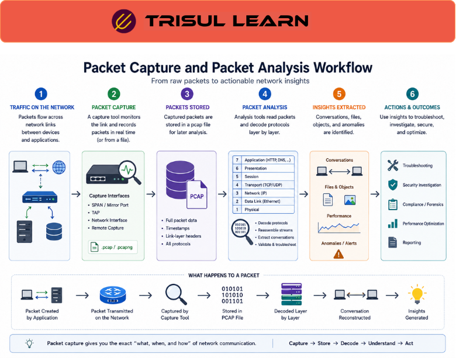

# What is Packet Capture?

Packet Capture is the process of collecting and storing network packets as they travel across a network for analysis, troubleshooting, security monitoring, and forensic investigation.

Packet capture helps organizations define communication roles by recording the actual traffic exchanged between systems instead of only summarized metadata.

Captured packets may contain:

- source and destination addresses
- protocol information
- application data
- session details
- payload content
- timing information

Packet capture is commonly referred to as:

- PCAP
- network capture
- traffic capture
- packet recording

It is widely used for:

- troubleshooting
- protocol analysis
- security investigations
- malware analysis
- application diagnostics
- network forensics

---

## How Packet Capture Works

Monitoring systems collect packets from observation points such as:

- network taps
- SPAN ports
- switches
- routers
- firewalls
- cloud traffic mirrors

A typical workflow looks like this:

Network Traffic → Packet Capture System → Packet Analysis

The capture system:

- observes network traffic
- records packets
- timestamps communication activity
- stores packets for analysis

Captured traffic can later be analyzed to investigate:

- failed connections
- protocol errors
- suspicious activity
- application latency
- malware communication
- traffic anomalies

---

## Why Packet Capture Matters

Flow monitoring provides summarized traffic visibility, but many issues require deeper inspection of the actual packets.

Without packet capture, organizations may struggle to:

- troubleshoot complex protocol issues
- investigate security incidents
- analyze payload behavior
- reconstruct attack activity
- diagnose intermittent failures
- inspect encrypted session metadata

Packet capture helps teams:

- perform deep traffic analysis
- investigate communication details
- troubleshoot application behavior
- reconstruct incidents
- improve forensic visibility
- analyze network performance accurately

It is especially important in:

- SOC environments
- enterprise networks
- ISP infrastructures
- data centers
- cloud environments
- troubleshooting operations

---

## Common Operational Use Cases

### Protocol Troubleshooting

Inspect failed sessions and protocol behavior.

### Security Investigations

Analyze suspicious traffic and attack communication.

### Malware Analysis

Inspect command-and-control traffic and exploit behavior.

### Application Diagnostics

Analyze application latency and transaction failures.

### Network Forensics

Reconstruct historical communication and attack timelines.

---

## Packet Capture vs Flow Monitoring

| Feature | Packet Capture | Flow Monitoring |
|---|---|---|
| Visibility Depth | Full packet contents | Traffic metadata |
| Storage Requirement | High | Lower |
| Scalability | Moderate | High |
| Payload Visibility | Full | Minimal or none |
| Common Use | Deep analysis and forensics | Traffic analytics |

Packet capture provides detailed visibility into communication contents, while flow monitoring provides scalable traffic summaries.

---

## How Trisul Handles Packet Capture

Trisul provides scalable packet capture and forensic traffic visibility for enterprise and ISP environments.

Combined with:

- Packet Analysis
- Flow Analysis
- Retro Analysisᵀ
- Contextᵀ
- Conversation View
- Network Forensics

Trisul helps teams:

- inspect packet-level communication
- troubleshoot protocol issues
- investigate suspicious traffic
- reconstruct attack timelines
- analyze application behavior
- improve forensic visibility

Trisul can also integrate:

- Packet Analysis
- Network Forensics
- Traffic Investigation

workflows for deeper packet-level investigation.

---

## Related Terms

- Packet Analysis
- Flow Analysis
- Network Forensics
- Traffic Investigation
- Deep Packet Inspection (DPI)
- Observation Point

---

## FAQ

### What is packet capture?

Packet capture is the process of collecting and storing network packets for analysis and investigation.

### Why is packet capture important?

It helps organizations troubleshoot issues, investigate security incidents, and analyze communication behavior deeply.

### What information does packet capture contain?

Captured packets may include addresses, protocols, payloads, session details, timestamps, and application data.

### What's the difference between packet capture and flow monitoring?

Packet capture records full packet contents, while flow monitoring summarizes communication into metadata.

### Is packet capture useful for security investigations?

Yes. It helps analyze malware communication, suspicious traffic, exploits, and attack timelines.

### Can packet capture troubleshoot application problems?

Yes. It helps identify latency, retransmissions, failed sessions, and protocol-level issues.

Humanity storing billions of packets just to discover one server was misconfigured three Tuesdays ago. Digital archaeology with extra storage invoices.