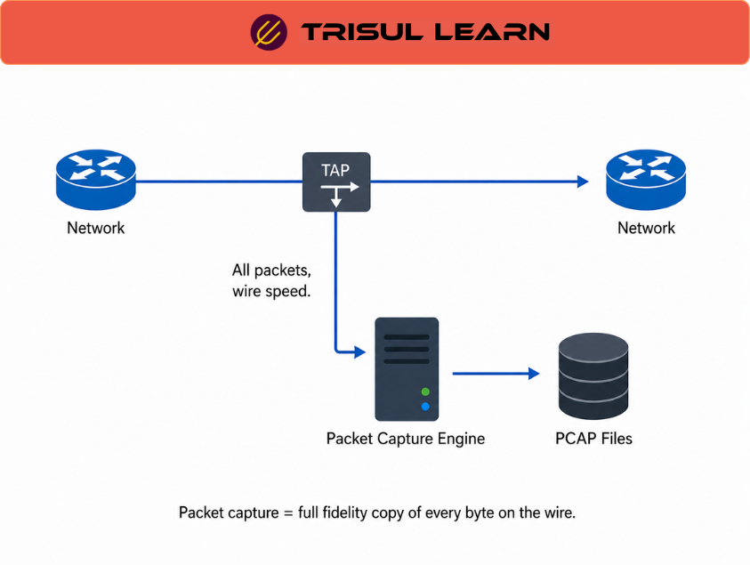

export const jsonLd = {
  "@context": "https://schema.org",
  "@type": "FAQPage",
  "mainEntity": [
    {
      "@type": "Question",
      "name": "What is packet capture?",
      "acceptedAnswer": {
        "@type": "Answer",
        "text": "Packet capture (PCAP) records every packet on a network link, both headers and payload, to persistent storage. Unlike flow monitoring which summarizes traffic into conversation records, PCAP preserves the complete wire-level data. It is the definitive record of what actually crossed the network."
      }
    },
    {
      "@type": "Question",
      "name": "How does packet capture work?",
      "acceptedAnswer": {
        "@type": "Answer",
        "text": "Packets are intercepted at a tap or SPAN port and written to disk in PCAP or PCAPNG format as a continuous ring buffer. Each frame is timestamped and the raw bytes from the Ethernet frame onwards are stored verbatim. At speeds above 1 Gbps, kernel-bypass frameworks such as PF_RING or AF_PACKET are required."
      }
    },
    {
      "@type": "Question",
      "name": "What is the difference between packet capture and flow monitoring?",
      "acceptedAnswer": {
        "@type": "Answer",
        "text": "Flow monitoring records who talked to whom, when, and how much. Packet capture records what was actually exchanged. Flow data tells you a host sent 2 GB over port 443 at 2AM; PCAP shows you what was in that transfer. The two are complementary: flow for detection, PCAP for investigation."
      }
    },
    {
      "@type": "Question",
      "name": "Does packet capture work on encrypted traffic?",
      "acceptedAnswer": {
        "@type": "Answer",
        "text": "PCAP captures the encrypted bytes as they appear on the wire. Headers are readable; TLS payloads are ciphertext. You still get flow metadata, TLS certificate details, and JA3 fingerprints from the handshake. To inspect payload content you need either a TLS inspection proxy inline or access to session keys."
      }
    }
  ]
};

# What is packet capture?

**Packet capture (PCAP)** records **every packet on a network link**, both **headers and payload**, to **persistent storage**. It provides **complete wire‑level data** for **forensic investigation, troubleshooting, and security analysis**, and is the **definitive record** of what actually crossed the network.

---

## How packet capture works

Packet capture:

- Intercepts packets at **TAPs or SPAN ports** and writes them to disk in **PCAP or PCAPNG format** as a **continuous ring buffer**.  
- Timestamps each frame and stores the **raw Ethernet‑through‑payload bytes** verbatim; on high‑speed links, **kernel‑bypass frameworks** (e.g., PF_RING or AF_PACKET) are used.  

Most platforms build a **per‑flow index** at write time, mapping each **5‑tuple** (source, destination, protocol, ports) to its **byte offsets** in the capture store. This lets analysts **retrieve all packets for a specific conversation** in seconds instead of scanning terabytes of raw files.

---

## Packet capture in network operations

In the **SOC**, PCAP is the **evidence layer**:

- **Flow data or IDS alerts** tell you *something suspicious happened*; **PCAP** shows you *what was exchanged*: commands, files, credentials, and application payloads.  
- For **incident confirmation and legal‑grade evidence**, there is no substitute for full‑fidelity packet capture.  

In the **NOC**, PCAP supports **application‑level root‑cause analysis**:

- **TCP retransmissions, window behavior, TLS handshake failures, and application‑level error codes** are only visible at the packet level.  
- Flow telemetry tells you *who talked to whom*; PCAP tells you *why the conversation was broken*.

---

## Packet capture vs flow monitoring

| Dimension | Packet capture | Flow monitoring |
|----------|----------------|-----------------|
| What it stores | Complete packet headers and payload | Flow‑level metadata (5‑tuple, byte counts, timestamps) |
| Investigative depth | Payload content, app behavior, file transfers | Who talked to whom, volume, duration |
| Storage footprint | Very high, scales with wire speed | Low, typically 1–2% of equivalent PCAP |
| Retention period | Hours to days at full fidelity | Weeks to months |
| Best fit | Forensic investigation, incident confirmation | Traffic trending, anomaly detection, compliance reporting |

The two are **complementary**: flow for **detection and aggregation**, PCAP for **deep investigation**.

---

## What makes packet capture work in practice

Packet capture works best when:

- The **capture point is lossless**:  
  - **SPAN ports** can **drop mirrored packets under load**, often without clear counters;  
  - **Passive optical TAPs** provide **full‑fidelity capture** but require per‑link hardware.  
- An **efficient indexing scheme** is in place:  
  - Without **per‑flow indexing**, analysts must **scan raw files manually**, which is slow and impractical at scale.  
  - With strong indexing, **any alert or flow** can pivot directly to the **relevant PCAP** in seconds, even on terabyte‑scale archives.  

Together, good capture and good indexing make PCAP a **practical, not just forensic**, capability.

---

## How Trisul handles packet capture

Trisul:

- Captures **raw packets continuously** using **PF_RING or AF_PACKET** and builds a **per‑flow index** at write time.  
- Allows analysts to **pivot from any alert, topper, or flow** in the dashboard directly to the **matching PCAP**, without manual file correlation.  
- Distributes the **capture store across multiple disks** to extend retention and uses **storage policies** to define what is written (e.g., by protocol, direction, or custom LUA rules).  

For implementation details, see Trisul documentation at [https://docs.trisul.org/docs/ug/caps/](https://docs.trisul.org/docs/ug/caps/).

---

## Related terms

- [What is full packet capture?](/docs/glossary/full-packet-capture)  
- [What is flow monitoring?](/docs/glossary/flow-monitoring)  
- [What is a network TAP?](/docs/glossary/network-tap)  
- [What is a SPAN port?](/docs/glossary/span-port)  
- [What is network forensics?](/docs/glossary/network-forensics)  

---

## Frequently asked questions

### What is packet capture?

Packet capture (PCAP) records every packet on a network link, both headers and payload, to persistent storage. Unlike flow monitoring which summarizes traffic into conversation records, PCAP preserves the complete wire-level data. It is the definitive record of what actually crossed the network.

### How does packet capture work?

Packets are intercepted at a tap or SPAN port and written to disk in PCAP or PCAPNG format as a continuous ring buffer. Each frame is timestamped and the raw bytes from the Ethernet frame onwards are stored verbatim. At speeds above 1 Gbps, kernel-bypass frameworks such as PF_RING or AF_PACKET are required.

### What is the difference between packet capture and flow monitoring?

Flow monitoring records who talked to whom, when, and how much. Packet capture records what was actually exchanged. Flow data tells you a host sent 2 GB over port 443 at 2AM; PCAP shows you what was in that transfer. The two are complementary: flow for detection, PCAP for investigation.

### Does packet capture work on encrypted traffic?

PCAP captures the encrypted bytes as they appear on the wire. Headers are readable; TLS payloads are ciphertext. You still get flow metadata, TLS certificate details, and JA3 fingerprints from the handshake. To inspect payload content you need either a TLS inspection proxy inline or access to session keys.