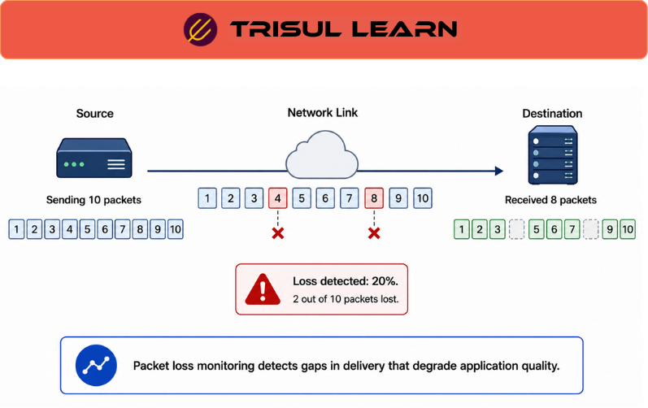

export const jsonLd = {
  "@context": "https://schema.org",
  "@type": "FAQPage",
  "mainEntity": [
    {
      "@type": "Question",
      "name": "What is packet loss?",
      "acceptedAnswer": {
        "@type": "Answer",
        "text": "Packet loss occurs when one or more packets traveling across a network fail to reach their destination. Packets are dropped due to network congestion, hardware failures, software bugs, or configuration errors. Packet loss degrades application performance causing poor voice quality, video buffering, and slow data transfers."
      }
    },
    {
      "@type": "Question",
      "name": "Why is packet loss monitoring important?",
      "acceptedAnswer": {
        "@type": "Answer",
        "text": "Packet loss monitoring is critical because even small loss rates significantly impact application performance. Real-time applications like VoIP and video conferencing are especially sensitive. Packet loss causes TCP retransmissions reducing throughput. Monitoring detects loss before users report problems."
      }
    },
    {
      "@type": "Question",
      "name": "How is packet loss measured?",
      "acceptedAnswer": {
        "@type": "Answer",
        "text": "Packet loss is measured by comparing sent and received packet counts. Flow monitoring tracks input and output packet counts on interfaces. The difference indicates loss. Packet capture detects loss by analyzing TCP sequence numbers for gaps. Active probes measure loss by sending test packets and counting missing responses."
      }
    },
    {
      "@type": "Question",
      "name": "What causes packet loss?",
      "acceptedAnswer": {
        "@type": "Answer",
        "text": "Packet loss is caused by network congestion where routers drop packets when buffers fill, hardware failures including bad cables and faulty NICs, software bugs in routers or switches, configuration errors including incorrect MTU settings, wireless interference in Wi-Fi networks, and security attacks including DoS flooding."
      }
    }
  ]
};

# What is packet loss monitoring?

Packet loss monitoring detects and measures packets that fail to reach their destination. It identifies network problems including congestion, hardware failures, and configuration errors that degrade application performance and user experience. Packet loss occurs when packets are dropped before reaching their destination.

---

## How packet loss monitoring works

Flow monitoring tracks input and output packet counts on interfaces. The difference between input and output indicates loss. Packet capture detects loss by analyzing TCP sequence numbers for gaps. Active probes measure loss by sending test packets and counting missing responses.

Loss rates are calculated as percentage of packets lost. A 1% loss rate means 1 packet out of 100 is dropped. Monitoring alerts when loss exceeds thresholds. Trend analysis identifies increasing loss patterns.

---

## Packet loss monitoring in network operations

In the NOC, monitor packet loss on critical links to detect problems before users report issues. Real-time applications like VoIP are especially sensitive to loss. Security teams detect loss patterns that might indicate attacks or network problems.

Capacity planning tracks loss trends. When loss increases consistently on a link, it signals congestion. Upgrade links before loss severely impacts application performance. Investigate sudden loss spikes immediately.

---

## Packet loss causes

| Cause | Description |
|---|---|
| Network congestion | Routers drop packets when buffers fill |
| Hardware failures | Bad cables, faulty NICs, router issues |
| Software bugs | Bugs in routers or switches |
| Configuration errors | Incorrect MTU, routing problems |
| Wireless interference | Wi-Fi signal interference and collisions |
| Security attacks | DoS flooding overwhelming buffers |

---

## What makes packet loss monitoring work in practice

Accurate measurement requires baseline knowledge. Normal networks have some loss. Monitor typical loss rates to establish baselines. Alert when loss exceeds baseline by significant margin. Without baselines, normal variation triggers false positives.

Interface counter reliability affects accuracy. Some interfaces reset counters on configuration changes. Monitor counter reset events. Track cumulative counts over long periods to detect trends. Short-term measurements may miss intermittent loss.

---

## How Trisul handles packet loss monitoring

Trisul monitors packet loss through flow data analysis tracking input and output packet counts on interfaces. The difference indicates loss. Packet capture detects loss by analyzing TCP sequence numbers for gaps. Loss rates are calculated and alerts trigger when thresholds are exceeded. Full documentation is at https://docs.trisul.org/docs/ug/flow/.

---

## Related terms

- [What is network congestion?](/docs/glossary/network-congestion)
- [What is flow monitoring?](/docs/glossary/flow-monitoring)
- [What is packet capture?](/docs/glossary/packet-capture)
- [What is network performance?](/docs/glossary/network-performance)
- [What is VoIP?](/docs/glossary/voip)

---

## Frequently asked questions

### What is packet loss?

Packet loss occurs when one or more packets traveling across a network fail to reach their destination. Packets are dropped due to network congestion, hardware failures, software bugs, or configuration errors. Packet loss degrades application performance causing poor voice quality, video buffering, and slow data transfers.

### Why is packet loss monitoring important?

Packet loss monitoring is critical because even small loss rates significantly impact application performance. Real-time applications like VoIP and video conferencing are especially sensitive. Packet loss causes TCP retransmissions reducing throughput. Monitoring detects loss before users report problems.

### How is packet loss measured?

Packet loss is measured by comparing sent and received packet counts. Flow monitoring tracks input and output packet counts on interfaces. The difference indicates loss. Packet capture detects loss by analyzing TCP sequence numbers for gaps. Active probes measure loss by sending test packets and counting missing responses.

### What causes packet loss?

Packet loss is caused by network congestion where routers drop packets when buffers fill, hardware failures including bad cables and faulty NICs, software bugs in routers or switches, configuration errors including incorrect MTU settings, wireless interference in Wi-Fi networks, and security attacks including DoS flooding.