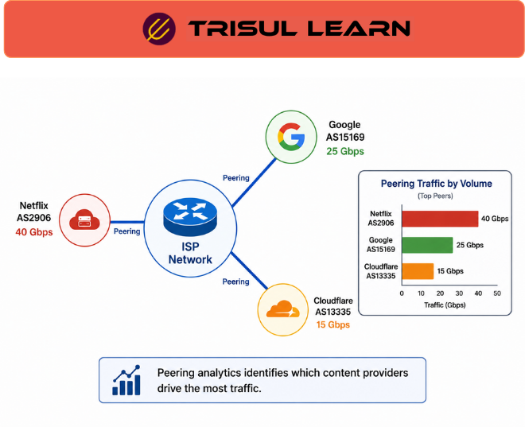

export const jsonLd = {
  "@context": "https://schema.org",
  "@type": "FAQPage",
  "mainEntity": [
    {
      "@type": "Question",
      "name": "What is peering traffic analysis?",
      "acceptedAnswer": {
        "@type": "Answer",
        "text": "Peering traffic analysis monitors and analyzes traffic exchanged with other networks at peering points. It provides visibility into peer AS traffic volumes, destinations, and patterns. Peering traffic analysis helps optimize peering relationships, supports peering decisions for cost savings, and identifies popular content providers for direct peering."
      }
    },
    {
      "@type": "Question",
      "name": "Why analyze peering traffic?",
      "acceptedAnswer": {
        "@type": "Answer",
        "text": "Peering traffic analysis is important for ISPs to understand traffic exchange with peers. It identifies high-volume peers for relationship optimization. Traffic analysis shows which content providers consume most bandwidth. Peering economics depends on accurate traffic measurement for settlement-free or paid peering negotiations."
      }
    },
    {
      "@type": "Question",
      "name": "What metrics does peering analysis track?",
      "acceptedAnswer": {
        "@type": "Answer",
        "text": "Peering analysis tracks traffic volume per peer AS, ingress and egress traffic per peering link, top destinations through each peer, traffic trends over time, utilization of peering links, cost per gigabyte for transit vs peering, and popular content providers. These metrics enable peering optimization."
      }
    },
    {
      "@type": "Question",
      "name": "How does peering analysis support peering decisions?",
      "acceptedAnswer": {
        "@type": "Answer",
        "text": "Peering analysis shows peer AS traffic volumes enabling informed peering decisions. When traffic to a content provider exceeds transit cost thresholds, establishing direct peering reduces costs. Analysis identifies underutilized peering links for optimization. Traffic patterns guide new peering partner selection."
      }
    }
  ]
};

# What is peering traffic analysis?

Peering traffic analysis monitors and analyzes traffic exchanged with other networks at peering points. It provides visibility into peer AS traffic volumes, helps optimize peering relationships, and supports peering decisions for cost savings and performance improvement. Peering analysis is critical for ISP network operations.

---

## How peering traffic analysis works

Flow data from peering interfaces is classified by peer AS using BGP information. Traffic volumes are aggregated per peer and per peering link. Ingress and egress traffic is tracked separately. Top destinations through each peer are identified. Trends are analyzed over time.

BGP peering analytics provides AS-level visibility. Flow records are enriched with peer AS information. Traffic is mapped to peering relationships. Utilization per peering link is calculated.

---

## Peering traffic analysis in network operations

In the NOC, use peering analysis to monitor peer AS traffic volumes and detect congestion on peering links. The peering team analyzes traffic patterns to optimize peering relationships and negotiate better terms. Capacity planning tracks peering link utilization to plan upgrades.

Engineering uses peering analysis to identify high-volume content providers for direct peering. When traffic to a provider exceeds thresholds, establishing direct peering reduces transit costs.

---

## Peering analysis metrics

| Metric | Description |
|---|---|
| Traffic per peer AS | Volume exchanged with each peer |
| Ingress per link | Traffic received on each peering link |
| Egress per link | Traffic sent on each peering link |
| Top destinations | Most visited destinations through each peer |
| Link utilization | Percentage of peering link capacity used |
| Cost per GB | Transit cost vs peering cost comparison |

---

## What makes peering analysis work in practice

BGP information accuracy determines peer classification. Flow records must be enriched with peer AS data from BGP tables. Without accurate BGP information, traffic appears unclassified. BGP route receivers keep route tables synchronized automatically.

Peering link monitoring is essential. Traffic volumes must be measured at each peering interface. Flow exporters must be enabled on peering links. Without per-link monitoring, peering traffic appears aggregated and peer-specific analysis is impossible.

---

## How Trisul handles peering traffic analysis

Trisul provides peering traffic analysis through ISP Analytics applications. Flow data is enriched with BGP attributes including peer AS. Traffic is mapped to peering relationships and aggregated per peer. Trisul shows peer AS, origin AS, downstream and upstream analytics with special tracking of popular content providers. Full documentation is at https://docs.trisul.org/.

---

## Related terms

- [What is BGP peering analytics?](/glossary/bgp-peering-analytics)
- [What is ASN?](/glossary/asn)
- [What is ISP traffic analytics?](/glossary/isp-traffic-analytics)
- [What is flow monitoring?](/glossary/flow-monitoring)
- [What is transit traffic?](/glossary/transit-traffic)

---

## Frequently asked questions

### What is peering traffic analysis?

Peering traffic analysis monitors and analyzes traffic exchanged with other networks at peering points. It provides visibility into peer AS traffic volumes, destinations, and patterns. Peering traffic analysis helps optimize peering relationships, supports peering decisions for cost savings, and identifies popular content providers for direct peering.

### Why analyze peering traffic?

Peering traffic analysis is important for ISPs to understand traffic exchange with peers. It identifies high-volume peers for relationship optimization. Traffic analysis shows which content providers consume most bandwidth. Peering economics depends on accurate traffic measurement for settlement-free or paid peering negotiations.

### What metrics does peering analysis track?

Peering analysis tracks traffic volume per peer AS, ingress and egress traffic per peering link, top destinations through each peer, traffic trends over time, utilization of peering links, cost per gigabyte for transit vs peering, and popular content providers. These metrics enable peering optimization.

### How does peering analysis support peering decisions?

Peering analysis shows peer AS traffic volumes enabling informed peering decisions. When traffic to a content provider exceeds transit cost thresholds, establishing direct peering reduces costs. Analysis identifies underutilized peering links for optimization. Traffic patterns guide new peering partner selection.